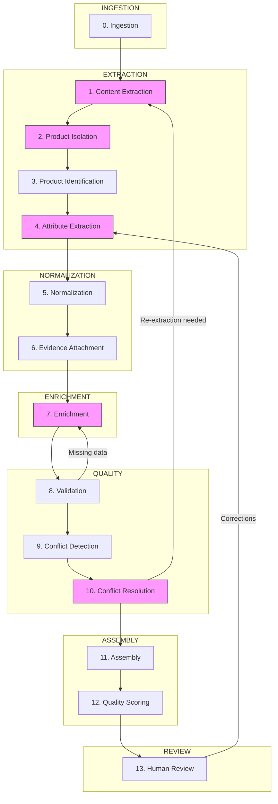
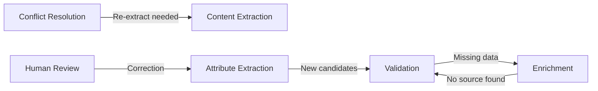
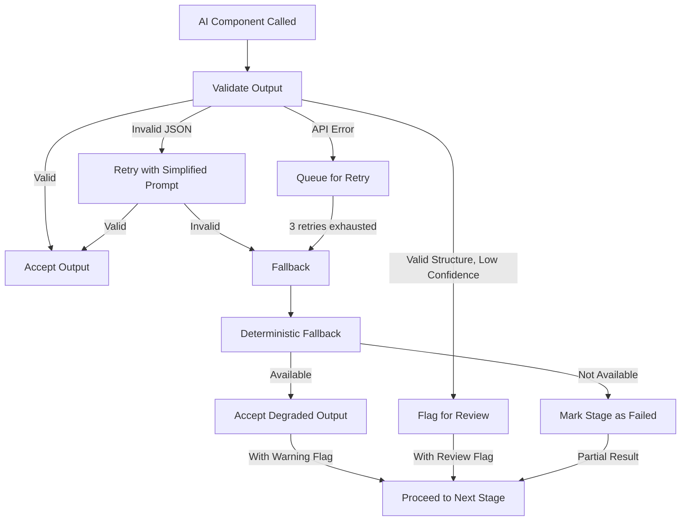

# AI Pipeline — Detailed Stage Specifications

> **Status:** Complete  
> **Module:** 3 — System Architecture & AI Strategy  
> **Purpose:** Define every pipeline stage with precise inputs, outputs, AI component specifications, failure handling, and evidence attachment points.  
> **Depends on:** `module-03-architecture.md`, `canonical-product-model.md`, `provenance-and-evidence-model.md`, `validation-and-lifecycle-model.md`, `attribute-taxonomy.md`

---

## 1. Pipeline Overview

### 1.1 Design Principles

1. **Deterministic core, AI at edges.** Normalization, validation, scoring, and assembly are rule-based. AI is used only where unstructured understanding is genuinely required.
2. **Every AI output is validated.** No LLM or VLM output enters the canonical record without passing through the deterministic validation layer.
3. **Every value has provenance.** The pipeline attaches evidence at every transformation point. No value floats without a source chain.
4. **Failure is explicit.** Every stage has defined failure behavior. The pipeline never silently drops data or silently passes bad data.
5. **Feedback loops are bounded.** Re-extraction loops have a maximum iteration count (3 cycles) to prevent infinite cycling.

### 1.2 End-to-End Flow



Stages highlighted in pink contain AI components. All others are deterministic.

### 1.3 Feedback Loops



Maximum iteration per loop: **3 cycles**. After 3 cycles, the pipeline halts and produces a partial result with explicit gaps flagged.

---

## 2. Stage 0 — Ingestion

| Property | Value |
|----------|-------|
| **Deterministic?** | Yes |
| **AI component** | None |

### 2.1 Purpose

Accept raw input, detect format, store the original file, and register a source document record.

### 2.2 Inputs

| Input | Type | Description |
|-------|------|-------------|
| Raw file or URL | `binary` / `string` | The uploaded document, image, CSV, Excel file, or web URL |
| Source metadata | `map` | Optional: supplier name, trust level hints, product category hints |

### 2.3 Processing

1. Detect file format (PDF, CSV, XLSX, HTML, image MIME type)
2. Store raw file in object storage with content-hash as key
3. Create `SourceDocument` record with: `source_id`, `source_type`, `trust_level` (default: `unknown`), `storage_path`, `content_hash` (SHA-256), `received_at`
4. Register processing job

### 2.4 Outputs

| Output | Type | Description |
|--------|------|-------------|
| `SourceDocument` | record | Registered source with metadata |
| `JobHandle` | record | Processing job reference |

### 2.5 Failure Handling

| Failure | Behavior |
|---------|----------|
| Unsupported format | Reject with clear error; log reason |
| Corrupted file | Reject; mark source as `corrupted` |
| File too large (>100MB) | Reject with size limit message |
| Duplicate (same `content_hash`) | Link to existing source; skip re-processing |
| Storage failure | Retry 3x with exponential backoff; then fail job |

### 2.6 Evidence Attachment

None at this stage. Evidence begins at Stage 1.

---

## 3. Stage 1 — Content Extraction

| Property | Value |
|----------|-------|
| **Deterministic?** | No |
| **AI components** | VLM (images/scans), LLM (table understanding fallback) |

### 3.1 Purpose

Convert raw source documents into structured content: text, tables with preserved structure, and extracted image regions. This is the first AI-dependent stage.

### 3.2 Inputs

| Input | Type | Description |
|-------|------|-------------|
| `SourceDocument` | record | The registered source from Stage 0 |
| Raw file | binary | The stored original file |

### 3.3 Processing by Source Type

#### 3.3.1 Text-based PDF

```
PDF -> pdfplumber/PymuPDF text extraction
    -> Table detection (heuristic + coordinate-based)
    -> Section identification (header heuristics)
    -> StructuredContent object
```

**No AI required.** Table structure is preserved through coordinate analysis and cell merging heuristics.

#### 3.3.2 Scanned PDF

```
Scanned PDF -> page-by-page rendering at 300 DPI
    -> VLM (page image -> structured text + table content)
    -> Confidence per page
    -> StructuredContent object
```

#### 3.3.3 CSV / Excel

```
CSV/XLSX -> column type detection
    -> Header row identification
    -> Row-by-row parsing
    -> StructuredContent object
```

**No AI required.** Pure deterministic parsing.

#### 3.3.4 Web Page

```
HTML -> DOM parsing (BeautifulSoup/Playwright)
    -> Boilerplate removal (readability algorithm)
    -> Table extraction from DOM
    -> StructuredContent object
```

**No AI required** for standard pages. JavaScript-rendered pages require headless browser.

#### 3.3.5 Product Image

```
Image -> VLM (image -> text/label extraction + visual attribute identification)
    -> StructuredContent object
```

#### 3.3.6 Technical Drawing

```
Drawing image -> VLM (dimension extraction from annotated drawings)
    -> StructuredContent object
```

### 3.4 AI Component: VLM — Page Understanding

| Property | Specification |
|----------|---------------|
| **What it does** | Renders each page/image as a 300 DPI image and extracts text, tables, and visual elements into a structured JSON representation |
| **Model** | GPT-4o or Claude Sonnet (multimodal) |
| **Input** | Page image (PNG at 300 DPI), page number, document context |
| **Output** | `{ text: string, tables: [{ headers: string[], rows: string[][], confidence: float }], images: [{ bbox: [x1,y1,x2,y2], description: string }], confidence: float }` |
| **Prompt strategy** | System prompt defining the output schema. Few-shot examples of industrial document pages. Instruct the model to preserve exact text (no paraphrasing). Request confidence score per table. |
| **Output validation** | Structural JSON validation; text non-empty check; table row-column consistency check; confidence score in [0, 1] range |
| **Failure behavior** | If JSON parsing fails: retry once with simplified prompt. If still fails: return raw OCR text with low confidence flag. If VLM API is unavailable: fall back to traditional OCR (Tesseract) with degraded confidence. |

### 3.5 AI Component: LLM — Table Understanding (Fallback)

| Property | Specification |
|----------|---------------|
| **What it does** | When table structure cannot be parsed deterministically (merged cells, spanning rows, complex headers), the LLM restructures the raw table text into a clean tabular format |
| **Model** | GPT-4o-mini or Claude Haiku (cost-efficient for structural tasks) |
| **Input** | Raw table text (no clear structure), page context, document title |
| **Output** | `{ headers: string[], rows: string[][], merge_map: [{ row: int, col: int, spans_to: int }], confidence: float }` |
| **Prompt strategy** | Provide the raw text block. Ask: "This is a table from an industrial document. Restructure it into headers and rows. Identify merged cells." Include surrounding text for context. |
| **Output validation** | JSON schema validation; row count matches expected (raw text line count +/- 1); header count matches column count; confidence > 0.5 |
| **Failure behavior** | If output invalid or confidence < 0.5: return raw text as `parse_status: "unstructured"`. Downstream treats it as unstructured text for LLM extraction. |

### 3.6 Structured Content Output Model

```json
{
  "source_id": "uuid",
  "pages": [
    {
      "page_number": 1,
      "text": "Full extracted text...",
      "tables": [
        {
          "id": "table-1",
          "headers": ["Attribute", "Value", "Unit"],
          "rows": [
            ["Bore Diameter", "1-3/16", "in"],
            ["Load Rating", "15.9", "kN"]
          ],
          "confidence": 0.95,
          "source_location": { "page": 1, "region": "table", "bbox": [100, 200, 500, 400] }
        }
      ],
      "images": [
        {
          "id": "img-1",
          "bbox": [10, 10, 100, 100],
          "description": "Product photo of pillow block bearing"
        }
      ],
      "extraction_method": "pdf_text",
      "extraction_confidence": 0.92
    }
  ]
}
```

### 3.7 Failure Handling

| Failure | Behavior |
|---------|----------|
| PDF has no extractable text layer | Route to VLM/scanned PDF path |
| VLM returns invalid JSON | Retry once with simplified prompt; then fall back to raw OCR |
| VLM API rate limited | Queue and retry with backoff; max 3 retries |
| VLM confidence < 0.5 for a page | Flag page as `low_confidence`; continue processing; flag for review |
| Table extraction fails completely | Return raw text with `unstructured` flag |
| Image cannot be processed | Skip image; log warning; continue with text content |
| Empty document (no content) | Mark source as `empty`; stop pipeline for this source |

### 3.8 Evidence Attachment

| What is attached | Value |
|------------------|-------|
| Extraction method | `pdf_text`, `ocr`, `vlm_page`, `csv_parse`, `html_parse` |
| Extraction confidence | Per-page confidence score |
| Source location | Page number, bbox coordinates for tables/images |

---

## 4. Stage 2 — Product Isolation

| Property | Value |
|----------|-------|
| **Deterministic?** | No |
| **AI component** | LLM for boundary detection in multi-product documents |

### 4.1 Purpose

Determine where one product ends and another begins in documents that contain multiple products (catalogs, comparison sheets, multi-product datasheets).

### 4.2 Inputs

| Input | Type | Description |
|-------|------|-------------|
| `StructuredContent` | record | Output from Stage 1 |
| `SourceDocument` | record | Source metadata |

### 4.3 Processing

#### 4.3.1 Single-Product Documents

If the document contains only one product (single datasheet, single product page), skip LLM call entirely. Use heuristic: if only one MPN/part number is found, treat as single-product.

#### 4.3.2 Multi-Product Documents

For documents with multiple products:

1. **Anchor detection:** Scan for part number patterns (MPN, SKU) in text and tables
2. **If anchors found:** Map each table row / text section to its nearest anchor using positional proximity
3. **If anchors insufficient or ambiguous:** Invoke LLM for boundary detection

### 4.4 AI Component: LLM — Product Boundary Detection

| Property | Specification |
|----------|---------------|
| **What it does** | Identifies boundaries between products in a multi-product document, returning a segmentation map |
| **Model** | GPT-4o-mini or Claude Haiku |
| **Input** | Structured content (pages, text, tables), anchor part numbers found by heuristic |
| **Output** | `{ segments: [{ product_anchor: string, pages: int[], table_rows: [{ table_id: string, row_indices: int[] }], text_regions: [string], confidence: float }] }` |
| **Prompt strategy** | Provide document structure overview. List discovered part numbers. Ask: "Segment this document by product. For each product, identify which pages, table rows, and text regions belong to it. Use part number anchors where available." |
| **Output validation** | Every table row must appear in exactly one segment (no overlap, no orphan rows); every discovered part number must appear in exactly one segment; confidence scores in [0, 1] |
| **Failure behavior** | If output invalid or has overlapping segments: fall back to heuristic (nearest-anchor) assignment. If heuristic also fails: process entire document as single product with warning. |

### 4.5 Output Model

```json
{
  "segments": [
    {
      "segment_id": "seg-1",
      "product_anchor": "UCF209-28",
      "pages": [1, 2],
      "table_rows": [
        { "table_id": "table-1", "row_indices": [0, 1, 2] }
      ],
      "text_regions": ["page-1-header", "page-2-section-3"],
      "confidence": 0.93
    }
  ]
}
```

### 4.6 Failure Handling

| Failure | Behavior |
|---------|----------|
| LLM returns overlapping segments | Fall back to heuristic (nearest-anchor) assignment |
| Orphan table rows (not assigned) | Assign to nearest product anchor; flag for review |
| Zero products detected | Treat entire document as single unnamed product; flag for identification |
| Conflicting anchor assignments | Flag segment as `ambiguous`; route to human review |
| LLM API failure | Fall back to heuristic-only segmentation |

### 4.7 Evidence Attachment

| What is attached | Value |
|------------------|-------|
| Segment assignment | Which segment each piece of content belongs to |
| Boundary confidence | Confidence in the segmentation |
| Method | `heuristic` or `llm_boundary_detection` |

---

## 5. Stage 3 — Product Identification

| Property | Value |
|----------|-------|
| **Deterministic?** | Yes |
| **AI component** | None |

### 5.1 Purpose

Determine the product identity — MPN, brand, and optional GTIN — for each isolated product segment. Fully deterministic: pattern matching and lookup.

### 5.2 Inputs

| Input | Type | Description |
|-------|------|-------------|
| Product segment | record | One segment from Stage 2 |
| Structured content for segment | record | Pages, tables, text for this product |

### 5.3 Processing

1. **MPN extraction:** Regex pattern matching against known part number formats per brand (if brand known). Search in headers, first table row, product title areas.
2. **Brand extraction:** Match against known brand list. Check document header/footer. Check explicit brand labels.
3. **GTIN extraction:** Match GS1 barcode patterns (GTIN-8, GTIN-12, GTIN-13, GTIN-14).
4. **Confidence scoring:** Based on pattern match quality and number of matching identifiers found.

### 5.4 Output Model

```json
{
  "product_identity": {
    "mpn": "UCF209-28",
    "brand": "ASAHI",
    "gtin": null,
    "confidence": 0.98,
    "match_method": "pattern_exact",
    "source_locations": [
      { "page": 1, "region": "title", "text": "UCF209-28" },
      { "page": 1, "table": "table-1", "row": 0, "col": 0 }
    ]
  }
}
```

### 5.5 Failure Handling

| Failure | Behavior |
|---------|----------|
| No MPN found | Mark identity as `unidentified`; flag for human review |
| MPN found but brand unknown | Proceed with MPN only; attempt brand resolution in enrichment |
| Multiple conflicting MPNs in one segment | Choose highest-confidence match; flag others as `conflicting_identity` |
| Pattern match confidence < 0.7 | Flag for human review |

### 5.6 Evidence Attachment

| What is attached | Value |
|------------------|-------|
| Source locations | Page, region, table row where MPN/brand was found |
| Match method | `pattern_exact`, `pattern_partial`, `known_list_match` |
| Confidence | Identity confidence score |

---

## 6. Stage 4 — Attribute Extraction

| Property | Value |
|----------|-------|
| **Deterministic?** | No |
| **AI component** | LLM for structured extraction from unstructured text |

### 6.1 Purpose

Extract candidate attribute values from the product segment's structured content. This is the highest-value AI stage: it converts human-readable product information into structured candidate attributes.

### 6.2 Inputs

| Input | Type | Description |
|-------|------|-------------|
| Product segment content | record | Text, tables, images for one product |
| Product identity | record | MPN and brand from Stage 3 |
| Category schema (if available) | record | Expected attributes for this product category |

### 6.3 Processing

#### 6.3.1 Table-Based Extraction (Primary)

For content parsed into structured tables, use deterministic column mapping:

1. Match table headers to known attribute names (fuzzy match with threshold 0.8)
2. Extract values from mapped columns
3. Preserve original text alongside parsed values
4. Record source location (table ID, row, column)

#### 6.3.2 Text-Based Extraction (LLM)

For unstructured text, invoke the LLM (see section 6.4).

### 6.4 AI Component: LLM — Attribute Extraction

| Property | Specification |
|----------|---------------|
| **What it does** | Reads unstructured product text and extracts structured attribute key-value pairs with value types and confidence scores |
| **Model** | GPT-4o (highest accuracy for extraction tasks) |
| **Input** | Product segment text, product identity (MPN, brand), available category schema, extraction instructions |
| **Output** | `{ candidates: [{ attribute_name: string, value: any, value_type: string, unit: string, confidence: float, extraction_evidence: { text_span: string, page: int, location: string } }] }` |
| **Prompt strategy** | See section 6.5 |
| **Output validation** | JSON schema validation; every candidate has non-empty `attribute_name` and non-null `value`; confidence in [0, 1]; value_type matches value structure; no duplicate attribute names |
| **Failure behavior** | If JSON parsing fails: retry with simplified prompt (fewer attributes). If still fails: return empty candidates list. Never return partial/malformed data. |

### 6.5 Prompt Strategy — Attribute Extraction

**System prompt structure:**

```
You are an industrial product data extraction system.

PRODUCT CONTEXT:
- MPN: {mpn}
- Brand: {brand}
- Category: {category} (if known)

CATEGORY SCHEMA (if available):
{schema_attributes_with_types}

EXTRACTION RULES:
1. Extract ONLY values explicitly present in the provided text.
2. Do NOT infer, guess, or complete values that are not stated.
3. Preserve exact numerical values and units as written.
4. If a value is ambiguous or unclear, set confidence < 0.5.
5. For each extracted attribute, provide the exact text span from the source.
6. Use the category schema attribute names when they match.
7. For unknown attributes, use descriptive snake_case names.

OUTPUT FORMAT:
{json_schema}

DOCUMENT CONTENT:
{text_content}
```

**Key prompt engineering decisions:**

- **Explicit "do not infer" instruction** reduces hallucination
- **Category schema in prompt** guides the LLM to use correct attribute names
- **Text span requirement** forces the LLM to ground every value in source text
- **Confidence calibration** with instruction to set low confidence for ambiguous values
- **JSON schema enforcement** via structured output mode (OpenAI) or tool use (Anthropic)

### 6.6 Output Model

```json
{
  "candidates": [
    {
      "attribute_name": "mechanical_bore_diameter",
      "value": { "value": 30.163, "unit": "mm" },
      "value_type": "measurement",
      "raw_value": "1-3/16 in",
      "confidence": 0.95,
      "extraction_evidence": {
        "source_id": "uuid",
        "page": 1,
        "table_id": "table-1",
        "row": 0,
        "col": 1,
        "text_span": "1-3/16 in"
      }
    },
    {
      "attribute_name": "material_housing",
      "value": "Cast iron",
      "value_type": "string",
      "raw_value": "Cast iron housing",
      "confidence": 0.88,
      "extraction_evidence": {
        "source_id": "uuid",
        "page": 2,
        "text_span": "Cast iron housing with anti-corrosion finish"
      }
    }
  ]
}
```

### 6.7 Failure Handling

| Failure | Behavior |
|---------|----------|
| LLM returns invalid JSON | Retry once with simplified prompt (top 5 attributes only) |
| LLM returns empty candidates | Log warning; proceed to enrichment with empty attribute set |
| LLM confidence < 0.3 for all candidates | Flag segment as `low_quality_extraction`; route to human review |
| LLM API timeout | Retry 2x with 10s, 30s backoff; then fail with partial results |
| LLM API unavailable | Queue job; retry later; do not produce results without LLM |
| Category schema mismatch | Attempt fuzzy remapping; flag unmapped attributes for review |
| Duplicate attribute names in output | Deduplicate by keeping highest confidence; flag duplicates |

### 6.8 Evidence Attachment

| What is attached | Value |
|------------------|-------|
| Extraction method | `table_column_mapping` or `llm_extraction` |
| Source location | Page, table, row, column, or text span |
| Extraction confidence | Per-attribute confidence score |
| Raw value | Original text before any normalization |

---

## 7. Stage 5 — Normalization

| Property | Value |
|----------|-------|
| **Deterministic?** | Yes |
| **AI component** | None |

### 7.1 Purpose

Convert extracted raw values into canonical representations: unit conversion, terminology mapping, format standardization. The original raw value is always preserved.

### 7.2 Inputs

| Input | Type | Description |
|-------|------|-------------|
| Candidate attributes | list | Output from Stage 4 |
| Category schema | record | Defines target units and terminology per attribute |

### 7.3 Processing

#### 7.3.1 Unit Conversion

For measurement, range, and dimension types:

1. Detect source unit (regex matching against known unit patterns)
2. Look up conversion factor to target unit (from category schema or unit registry)
3. Convert value; preserve original alongside converted value
4. Record transformation: `{ type: "unit_conversion", from: "in", to: "mm", factor: 25.4 }`

**Unit registry examples:**

| From | To | Factor |
|------|----|--------|
| `in` | `mm` | 25.4 |
| `ft` | `m` | 0.3048 |
| `lb` | `kg` | 0.453592 |
| `psi` | `bar` | 0.0689476 |
| `psi` | `MPa` | 0.00689476 |
| `deg F` | `deg C` | (F-32) x 5/9 |

#### 7.3.2 Fractional to Decimal

Convert fractional inch values (e.g., `1-3/16 in`) to decimal.

#### 7.3.3 Terminology Mapping

Map variant terms to canonical terms:

| Variant | Canonical |
|---------|-----------|
| `cast iron`, `CI`, `grey cast iron` | `cast_iron` |
| `stainless steel`, `SS`, `304 SS` | `stainless_steel` |
| `IP65`, `IP 65`, `NEMA 4X` | `IP65` |

#### 7.3.4 Format Standardization

- Dates to ISO 8601
- Certifications to normalized list format
- Boolean expressions to `true`/`false`

### 7.4 Output Model

For each normalized attribute, the output preserves both original and canonical:

```json
{
  "attribute_name": "mechanical_bore_diameter",
  "value": { "value": 30.163, "unit": "mm" },
  "value_type": "measurement",
  "raw_value": "1-3/16 in",
  "transformations": [
    {
      "type": "unit_conversion",
      "from_unit": "in",
      "to_unit": "mm",
      "factor": 25.4,
      "applied_at": "2025-01-15T10:30:00Z",
      "engine": "unit-conversion-engine-v1"
    },
    {
      "type": "fraction_to_decimal",
      "from": "1-3/16",
      "to": 1.1875
    }
  ],
  "lifecycle_state": "normalized"
}
```

### 7.5 Failure Handling

| Failure | Behavior |
|---------|----------|
| Unknown source unit | Keep original value; mark as `unconvertible`; flag for review |
| No conversion factor found | Keep original value; mark as `no_conversion_available` |
| Ambiguous unit | Use document context to resolve; if ambiguous, keep both representations |
| Conversion produces implausible value | Flag as `implausible_conversion`; keep original; route to review |
| Terminology not in mapping | Pass through unchanged; log as `unmapped_term` |

### 7.6 Evidence Attachment

| What is attached | Value |
|------------------|-------|
| Transformation record | Type, from/to values, engine/timestamp |
| Original raw value | Preserved in `raw_value` field |
| Lifecycle state | `normalized` |

---

## 8. Stage 6 — Evidence Attachment

| Property | Value |
|----------|-------|
| **Deterministic?** | Yes |
| **AI component** | None |

### 8.1 Purpose

Consolidate all provenance information gathered through Stages 1-5 into a complete evidence chain for each attribute. This is not a transformation stage — it assembles evidence already collected.

### 8.2 Inputs

| Input | Type | Description |
|-------|------|-------------|
| Normalized candidates | list | Output from Stage 5 |
| Source metadata | record | From Stage 0 |
| Extraction metadata | record | From Stages 1-4 |

### 8.3 Processing

For each candidate attribute, assemble the complete `Evidence` record:

1. **Source reference:** Link to `SourceDocument` with `source_id`
2. **Source location:** Page, table, row, column, text span, bbox coordinates
3. **Extraction method:** How the value was obtained
4. **Extraction confidence:** Numeric confidence from extraction stage
5. **Transformations:** All normalization transformations applied
6. **Fact type classification:** Determine fact type based on provenance fields
7. **Source freshness:** Calculate age of source document
8. **Source trust score:** Look up trust level of source

### 8.4 Output Model

```json
{
  "attribute_name": "mechanical_bore_diameter",
  "value": { "value": 30.163, "unit": "mm" },
  "value_type": "measurement",
  "raw_value": "1-3/16 in",
  "lifecycle_state": "normalized",
  "fact_type": "normalized",
  "evidence": {
    "source": {
      "source_id": "uuid",
      "source_type": "pdf",
      "trust_level": "manufacturer_official",
      "trust_score": 0.95,
      "received_at": "2025-01-10T00:00:00Z",
      "freshness_days": 5,
      "content_hash": "sha256:..."
    },
    "location": {
      "page": 1,
      "table_id": "table-1",
      "row": 0,
      "col": 1,
      "text_span": "1-3/16 in",
      "bbox": [120, 250, 180, 270]
    },
    "extraction": {
      "method": "table_column_mapping",
      "confidence": 0.95,
      "extracted_at": "2025-01-15T10:30:00Z"
    },
    "transformations": [
      { "type": "unit_conversion", "from": "in", "to": "mm", "factor": 25.4 }
    ],
    "classification": {
      "fact_type": "normalized",
      "reason": "Source-supported value after unit conversion"
    }
  }
}
```

### 8.5 Failure Handling

| Failure | Behavior |
|---------|----------|
| Missing source reference | Block attribute from proceeding; cannot have evidence without source |
| Missing extraction location | Flag as `incomplete_provenance`; allow with warning |
| Source trust level unknown | Default to `unknown`; trust_score = 0.5 |
| Source freshness unknown | Set `freshness_days` to null; flag for review |

### 8.6 Evidence Attachment Points Summary

| Pipeline Stage | What is Attached | Example |
|----------------|-----------------|---------|
| Content Extraction (Stage 1) | Extraction method, per-page confidence | "VLM extraction at 0.92 confidence" |
| Product Isolation (Stage 2) | Segment assignment, boundary confidence | "Row 4 belongs to UCF209-28 (0.93)" |
| Product Identification (Stage 3) | MPN/brand source locations, match method | "MPN found at page 1 title (pattern_exact)" |
| Attribute Extraction (Stage 4) | Source location, text span, extraction confidence | "Page 2, table row 1: '1-3/16 in' (0.95)" |
| Normalization (Stage 5) | Transformation record, original value | "1-3/16 in -> 30.163 mm (unit-conversion-engine)" |
| Evidence Attachment (Stage 6) | Full provenance assembly | Consolidation of all above |
| Enrichment (Stage 7) | New source reference, enrichment method | "Retrieved from manufacturer website (0.90)" |

---

## 9. Stage 7 — Enrichment

| Property | Value |
|----------|-------|
| **Deterministic?** | No |
| **AI components** | LLM for query generation + LLM for extraction from retrieved content |

### 9.1 Purpose

Fill missing attributes by retrieving information from external sources. Uses RAG to find relevant content, then extracts attribute values from retrieved results.

### 9.2 Inputs

| Input | Type | Description |
|-------|------|-------------|
| Partial product record | record | Product identity + extracted attributes so far |
| Missing attribute list | list | Attributes in category schema that have no value |
| Source registry | list | Previously ingested sources available for retrieval |

### 9.3 Processing

#### 9.3.1 Retrieval Phase

1. **Query generation:** Construct search queries from product identity + missing attributes
2. **Vector search:** Search indexed source content for relevant passages
3. **Keyword search:** Parallel keyword search for exact MPN/brand matches
4. **Result ranking:** Combine vector similarity + keyword relevance + source trust

### 9.4 AI Component: LLM — Enrichment Query Generation

| Property | Specification |
|----------|---------------|
| **What it does** | Generates effective search queries from partial product data to find missing attributes |
| **Model** | GPT-4o-mini (cost-efficient for query generation) |
| **Input** | Product identity (MPN, brand), missing attribute names, known attributes for context |
| **Output** | `{ queries: [{ query: string, target_attributes: string[], priority: int }] }` |
| **Prompt strategy** | "Generate search queries to find the following missing attributes for this product: {missing_attrs}. Product: {brand} {mpn}. Known attributes: {known_attrs}. Generate 2-3 queries of varying specificity." |
| **Output validation** | Non-empty queries; each query is a string; target_attributes are valid attribute names |
| **Failure behavior** | If LLM fails: fall back to keyword-only search using "{brand} {mpn}" |

### 9.5 AI Component: LLM — Enrichment Extraction

| Property | Specification |
|----------|---------------|
| **What it does** | Reads retrieved content passages and extracts the specific missing attribute values |
| **Model** | GPT-4o-mini (cost-efficient; input is short retrieved passages) |
| **Input** | Retrieved content passages (top 5), product identity, target attribute names |
| **Output** | `{ enriched: [{ attribute_name: string, value: any, value_type: string, confidence: float, source_passage: string, source_url: string }] }` |
| **Prompt strategy** | Provide retrieved passages with source labels. Ask: "From these sources, extract values for: {target_attrs}. Only extract values explicitly stated. If not found, omit the attribute." |
| **Output validation** | JSON schema validation; each enriched attribute has non-null value; confidence in [0, 1]; source reference present |
| **Failure behavior** | If extraction returns empty: mark attributes as `NOT_DISCOVERED`. If API fails: queue and retry. Never fabricate values. |

### 9.6 Processing Continuation

After LLM extraction:

4. **Evidence attachment:** Attach source reference, extraction method, confidence for each enriched value
5. **Normalization:** Re-run Stage 5 normalization on enriched values
6. **Validation:** Enriched values go through the same validation pipeline

### 9.7 Output Model

```json
{
  "enriched_attributes": [
    {
      "attribute_name": "material_housing",
      "value": "cast_iron",
      "value_type": "string",
      "confidence": 0.90,
      "lifecycle_state": "enriched",
      "fact_type": "enriched",
      "evidence": {
        "source": {
          "source_id": "uuid-web",
          "source_type": "web_page",
          "trust_level": "manufacturer_official",
          "url": "https://manufacturer.com/products/ucf209-28",
          "retrieved_at": "2025-01-15T10:35:00Z"
        },
        "extraction": {
          "method": "llm_enrichment_extraction",
          "confidence": 0.90,
          "source_passage": "Housing material: Cast iron with anti-corrosion coating"
        }
      }
    }
  ],
  "still_missing": [
    {
      "attribute_name": "electrical_insulation_class",
      "reason": "NOT_DISCOVERED",
      "reason_detail": "No source found containing insulation class for this product"
    }
  ]
}
```

### 9.8 Failure Handling

| Failure | Behavior |
|---------|----------|
| No indexed sources available | Mark all missing as `NOT_DISCOVERED`; skip enrichment |
| Vector search returns irrelevant results | Filter by relevance threshold; proceed with what passes |
| LLM enrichment extraction fails | Retry once; then mark target attributes as `NOT_DISCOVERED` |
| Retrieved source is stale (>2 years) | Still use but reduce confidence by 0.15; flag freshness concern |
| Retrieved source contradicts existing value | Create conflict record; do not overwrite |
| All queries return zero results | Mark all missing as `NOT_DISCOVERED` |

### 9.9 Evidence Attachment

| What is attached | Value |
|------------------|-------|
| Source reference | URL, source type, trust level |
| Retrieval method | `vector_search`, `keyword_search`, `combined` |
| Extraction method | `llm_enrichment_extraction` |
| Extraction confidence | Per-attribute confidence |
| Source passage | The exact text passage the value was extracted from |

---

## 10. Stage 8 — Validation

| Property | Value |
|----------|-------|
| **Deterministic?** | Yes |
| **AI component** | None |

### 10.1 Purpose

Run all attributes through multi-layer validation checks. Every attribute must pass validation before it can be assembled into the final record.

### 10.2 Inputs

| Input | Type | Description |
|-------|------|-------------|
| Complete attribute set | list | All candidates (extracted + enriched), with evidence |
| Category schema | record | Expected attributes, types, ranges, required flags |
| Product identity | record | For cross-field consistency checks |

### 10.3 Validation Layers (in order)

#### Layer 1: Schema Validation

- All required attributes present (from category schema)
- No unknown attributes (not in schema and not in allowlist)

#### Layer 2: Type Validation

- `number` values are numeric
- `measurement` values have `{value, unit}` structure
- `range` values have `{min, max, unit}` with min < max
- `enum` values are within allowed values
- `boolean` values are true/false

#### Layer 3: Unit Validation

- All measurement units are recognized
- Units match expected unit family (length: mm/in/m; force: kN/N/lb)

#### Layer 4: Range Validation

- Values within physically possible ranges (from category schema)
- Example: bearing bore > 0 and < 1000mm; load rating > 0 and < 10000 kN

#### Layer 5: Cross-Field Consistency

- Related attributes agree (e.g., bore_type matches bore_shape)
- Dimension attributes are internally consistent
- Material attributes are consistent with application

#### Layer 6: Provenance Completeness

- Every attribute has at least one evidence chain
- No orphan values (value without source)

#### Layer 7: Freshness Check

- Source is within acceptable age for this attribute type
- Flag stale sources but do not block

### 10.4 Validation Result Model

```json
{
  "attribute_name": "mechanical_bore_diameter",
  "validation_status": "passed",
  "checks": [
    { "layer": "schema", "passed": true },
    { "layer": "type", "passed": true },
    { "layer": "unit", "passed": true },
    { "layer": "range", "passed": true, "value": 30.163, "range": [0.5, 1000] },
    { "layer": "cross_field", "passed": true },
    { "layer": "provenance", "passed": true },
    { "layer": "freshness", "passed": true, "source_age_days": 5 }
  ],
  "overall": "passed"
}
```

### 10.5 Failure Handling

| Failure | Behavior |
|---------|----------|
| Schema validation fails (missing required) | Mark attribute as `NOT_PROVIDED`; continue |
| Type validation fails | Reject attribute; record rejection reason |
| Unit validation fails | Reject attribute; record rejection reason |
| Range validation fails (clear violation) | Reject attribute; record as `out_of_range` |
| Range validation fails (soft warning) | Flag for review; reduce confidence |
| Cross-field inconsistency | Flag as `inconsistent`; do not auto-reject |
| Provenance incomplete | Block attribute from assembly; require evidence |
| Freshness concern | Flag for review; reduce confidence |

### 10.6 Evidence Attachment

| What is attached | Value |
|------------------|-------|
| Validation results | Per-layer pass/fail with details |
| Overall validation status | `passed`, `failed`, `warning` |
| Rejection reasons | If rejected, specific failure details |

---

## 11. Stage 9 — Conflict Detection

| Property | Value |
|----------|-------|
| **Deterministic?** | Yes |
| **AI component** | None |

### 11.1 Purpose

Identify when multiple sources provide different values for the same attribute.

### 11.2 Inputs

| Input | Type | Description |
|-------|------|-------------|
| Validated candidates | list | All candidates that passed validation |
| Source registry | list | All sources used for this product |

### 11.3 Processing

1. **Group by attribute name:** Collect all candidate values for each attribute
2. **Compare values:** For each attribute with multiple candidates:
   - If values are identical (after normalization): no conflict
   - If values differ: classify conflict type
3. **Classify conflict type:**
   - `value_mismatch`: Same units, different numeric/text values
   - `unit_mismatch`: Same numeric value, different units (not convertible)
   - `source_contradiction`: Sources explicitly contradict each other
   - `stale_vs_current`: Old source vs new source disagree

### 11.4 Conflict Record Model

```json
{
  "conflict_id": "uuid",
  "attribute_name": "mechanical_bore_diameter",
  "conflict_type": "value_mismatch",
  "candidates": [
    {
      "candidate_id": "uuid-1",
      "value": { "value": 30.163, "unit": "mm" },
      "source_id": "uuid-src-1",
      "source_trust": "manufacturer_official",
      "extraction_confidence": 0.95,
      "freshness_days": 5
    },
    {
      "candidate_id": "uuid-2",
      "value": { "value": 30.2, "unit": "mm" },
      "source_id": "uuid-src-2",
      "source_trust": "authorized_distributor",
      "extraction_confidence": 0.88,
      "freshness_days": 30
    }
  ],
  "difference_pct": 0.12,
  "auto_resolvable": false,
  "resolution_method": null
}
```

### 11.5 Failure Handling

| Failure | Behavior |
|---------|----------|
| Cannot compare values (incompatible types) | Flag as `uncompareable`; route to human review |
| All candidates identical | No conflict; proceed with single value |

### 11.6 Evidence Attachment

| What is attached | Value |
|------------------|-------|
| Conflict type | Classification of disagreement |
| All candidate evidence | Preserved with original sources |
| Difference percentage | Magnitude of disagreement |

---

## 12. Stage 10 — Conflict Resolution

| Property | Value |
|----------|-------|
| **Deterministic?** | Partially |
| **AI component** | LLM for complex conflict analysis |

### 12.1 Purpose

Resolve detected conflicts using automated rules where safe, and escalate to human review where automated resolution is not trustworthy.

### 12.2 Inputs

| Input | Type | Description |
|-------|------|-------------|
| Conflict records | list | Output from Stage 9 |
| Resolution rules | config | Configurable resolution rules per conflict type |

### 12.3 Automated Resolution Rules

| Conflict Type | Rule | Auto-resolvable? |
|--------------|------|-----------------|
| `unit_mismatch` | Normalize units (Stage 5 re-run) | Yes |
| `value_mismatch` (difference < 5%) | Take mean of values | Yes |
| `value_mismatch` (difference 5-20%) | Source priority (manufacturer > distributor > third-party) | Yes |
| `value_mismatch` (difference > 20%) | Escalate to human | No |
| `stale_vs_current` (same source type) | Prefer newest | Yes |
| `stale_vs_current` (different source types) | Escalate to human | No |
| `source_contradiction` | Always escalate | No |

### 12.4 AI Component: LLM — Complex Conflict Analysis

| Property | Specification |
|----------|---------------|
| **What it does** | Analyzes complex conflicts where automated rules are insufficient, providing a recommendation with reasoning |
| **Model** | GPT-4o (high accuracy for reasoning tasks) |
| **Input** | Conflict record with all candidates, source metadata, category context |
| **Output** | `{ recommendation: { selected_candidate_id: string, confidence: float, reasoning: string }, requires_human: boolean }` |
| **Prompt strategy** | Present the conflict with full context. Ask: "Analyze this conflict. Which value is most likely correct and why? Consider source authority, extraction confidence, and physical plausibility. If you cannot determine with high confidence, recommend human review." |
| **Output validation** | `selected_candidate_id` exists in conflict candidates; confidence in [0, 1]; reasoning is non-empty |
| **Failure behavior** | If output is invalid or confidence < 0.7: escalate to human. Never auto-resolve on low-confidence LLM recommendation. |

### 12.5 Resolution Record Model

```json
{
  "conflict_id": "uuid",
  "resolution": {
    "method": "source_priority",
    "selected_candidate_id": "uuid-1",
    "reason": "Manufacturer source preferred over distributor source",
    "resolved_by": "automated_rule",
    "resolved_at": "2025-01-15T10:40:00Z",
    "rejection_candidates": ["uuid-2"],
    "rejection_reasons": ["Lower source trust level"]
  }
}
```

### 12.6 Failure Handling

| Failure | Behavior |
|---------|----------|
| LLM recommendation confidence < 0.7 | Escalate to human review |
| No automated rule applies | Escalate to human review |
| LLM API unavailable | Escalate all conflicts to human review |
| Resolution contradicts safety rules | Override with human escalation |

### 12.7 Evidence Attachment

| What is attached | Value |
|------------------|-------|
| Resolution method | `source_priority`, `confidence_based`, `llm_analysis`, `human_decision` |
| Resolution reasoning | Why this candidate was selected |
| Rejected candidates | Which candidates were rejected and why |
| Resolved by | `automated_rule`, `llm_analysis`, or human reviewer ID |

---

## 13. Stage 11 — Assembly

| Property | Value |
|----------|-------|
| **Deterministic?** | Yes |
| **AI component** | None |

### 13.1 Purpose

Construct the canonical product intelligence record from all validated, normalized, conflict-resolved attributes.

### 13.2 Inputs

| Input | Type | Description |
|-------|------|-------------|
| Product identity | record | MPN, brand, GTIN from Stage 3 |
| Resolved attributes | list | All attributes after validation + conflict resolution |
| Evidence chains | list | Complete provenance for each attribute |
| Source registry | list | All sources used for this product |

### 13.3 Processing

1. **Create Product record:** Populate core identity fields
2. **Create Attribute records:** One per resolved attribute, with full evidence
3. **Classify fact types:** Assign fact_type based on provenance
4. **Create CandidateValue records:** Preserve all candidates (including rejected) for auditability
5. **Compute metadata:** Record sources used, processing timestamps, pipeline version
6. **Create Conflict records:** Attach resolved conflicts for audit trail

### 13.4 Output Model

The assembled record conforms to the canonical product model defined in `canonical-product-model.md`. Key sections:

```json
{
  "product": {
    "id": "uuid",
    "mpn": "UCF209-28",
    "brand": "ASAHI",
    "name": "UCF209-28 Pillow Block Bearing",
    "primary_category": "Mounted Bearings > Pillow Block",
    "category_confidence": 0.92,
    "lifecycle_status": "active",
    "completeness_score": 0.0,
    "confidence": 0.0,
    "validation_status": "pending",
    "review_status": "not_required"
  },
  "attributes": [
    {
      "id": "uuid",
      "name": "mechanical_bore_diameter",
      "domain": "mechanical",
      "value": { "value": 30.163, "unit": "mm" },
      "value_type": "measurement",
      "raw_value": "1-3/16 in",
      "fact_type": "normalized",
      "lifecycle_state": "validated",
      "confidence": 0.91,
      "conflict_status": "none",
      "evidence": { "..." },
      "validation_results": { "..." }
    }
  ],
  "sources": [
    {
      "source_id": "uuid",
      "source_type": "pdf",
      "trust_level": "manufacturer_official",
      "attributes_contributed": ["mechanical_bore_diameter", "material_housing"]
    }
  ],
  "conflicts": [],
  "processing_metadata": {
    "pipeline_version": "1.0.0",
    "processed_at": "2025-01-15T10:45:00Z",
    "stages_completed": [
      "ingestion", "extraction", "isolation", "identification",
      "attribute_extraction", "normalization", "evidence", "enrichment",
      "validation", "conflict_detection", "conflict_resolution", "assembly"
    ]
  }
}
```

### 13.5 Failure Handling

| Failure | Behavior |
|---------|----------|
| No attributes extracted | Create product record with empty attributes; flag as `no_data` |
| Identity incomplete (no MPN) | Create record with `mpn: null`; flag for human identification |
| Evidence chains incomplete | Block affected attributes from assembly |

---

## 14. Stage 12 — Quality Scoring

| Property | Value |
|----------|-------|
| **Deterministic?** | Yes |
| **AI component** | None |

### 14.1 Purpose

Compute quality metrics for the assembled product record. These metrics drive human review prioritization and downstream trust decisions.

### 14.2 Inputs

| Input | Type | Description |
|-------|------|-------------|
| Assembled product record | record | Output from Stage 11 |
| Category schema | record | Defines expected attributes and weights |

### 14.3 Metrics Computed

#### 14.3.1 Completeness Score

```
completeness = (weight_of_present_attrs) / (weight_of_all_required_attrs)
```

Weights come from the category schema. Required attributes have higher weights.

#### 14.3.2 Record Confidence

```
confidence = (0.3 * source_trust_avg)
           + (0.3 * extraction_confidence_avg)
           + (0.2 * corroboration_score)
           + (0.2 * validation_score)
```

#### 14.3.3 Consistency Score

Percentage of attributes that pass cross-field consistency checks.

#### 14.3.4 Freshness Score

Based on age of sources relative to the most recent source.

#### 14.3.5 Evidence Coverage

Percentage of attributes with complete evidence chains.

### 14.4 Review Routing Decision

| Condition | Action |
|-----------|--------|
| confidence >= 0.9 AND completeness >= 0.8 AND no conflicts | Auto-approve |
| confidence >= 0.7 AND no safety-critical gaps | Auto-approve with monitoring flag |
| confidence < 0.7 OR safety-critical gaps OR unresolved conflicts | Route to human review |
| completeness < 0.3 | Flag as `insufficient_data`; may need source augmentation |

### 14.5 Failure Handling

| Failure | Behavior |
|---------|----------|
| Category schema unavailable | Use generic scoring (presence-based, no weights) |
| All attributes missing | Score = 0; flag as `empty_record` |

---

## 15. Stage 13 — Human Review

| Property | Value |
|----------|-------|
| **Deterministic?** | N/A (human decision) |
| **AI component** | None |

### 15.1 Purpose

Present evidence-based review interface for attributes that require human judgment. The human is the final authority.

### 15.2 Review Triggers

| Trigger | Source Stage |
|---------|-------------|
| Low confidence (< 0.7) | Stage 12 |
| Safety-critical attribute | Stage 12 |
| Unresolved conflict | Stage 10 |
| Certification claim | Stage 4 or 7 |
| Derived or inferred value | Stage 4 or 7 |
| Stale source concern | Stage 6 |
| Human correction feedback | Any stage |

### 15.3 Review Interface Data

For each attribute under review, the system presents:

1. Attribute name and domain
2. All candidate values with their sources
3. Source locations (page, section, text span)
4. Extraction confidence for each candidate
5. Source trust scores
6. Freshness status
7. Validation results
8. Related attributes for context
9. Conflict information (if applicable)

### 15.4 Review Actions

| Action | Effect |
|--------|--------|
| **Approve** | Attribute moves to `approved` state |
| **Reject** | Attribute moves to `rejected` state; reason required |
| **Correct** | New value entered; re-enters normalization -> validation pipeline |
| **Override** | Selected candidate chosen from conflict; recorded with rationale |
| **Defer** | Attribute remains in review queue; no state change |

### 15.5 Post-Review Processing

- Approved attributes: `lifecycle_state` -> `approved`
- Corrected attributes: Re-enter Stage 5 (normalization) -> Stage 6 (evidence) -> Stage 8 (validation)
- Rejected attributes: `lifecycle_state` -> `rejected`; excluded from final record
- All human decisions are recorded in audit trail

### 15.6 Failure Handling

| Failure | Behavior |
|---------|----------|
| Review queue overflow | Priority routing: safety > certification > conflict > low-confidence |
| Reviewer inaction (>48h) | Escalate to secondary reviewer |
| Conflicting reviewer decisions | Third reviewer arbitration |

---

## 16. AI Component Summary

### 16.1 Complete AI Component Registry

| ID | Component | Stage | Model Tier | Purpose | Auto-Validated? |
|----|-----------|-------|------------|---------|-----------------|
| AI-01 | VLM Page Understanding | Content Extraction | GPT-4o / Claude Sonnet | Scan/image to structured text | Structural + confidence |
| AI-02 | LLM Table Understanding | Content Extraction | GPT-4o-mini / Claude Haiku | Re-structure complex tables | Structural + row-col consistency |
| AI-03 | LLM Product Boundary Detection | Product Isolation | GPT-4o-mini / Claude Haiku | Segment multi-product docs | Segment overlap + anchor checks |
| AI-04 | LLM Attribute Extraction | Attribute Extraction | GPT-4o | Text to structured attributes | JSON schema + type + confidence |
| AI-05 | LLM Enrichment Query Generation | Enrichment | GPT-4o-mini | Generate search queries | Non-empty + valid targets |
| AI-06 | LLM Enrichment Extraction | Enrichment | GPT-4o-mini | Extract from retrieved content | JSON schema + source ref |
| AI-07 | LLM Conflict Analysis | Conflict Resolution | GPT-4o | Analyze complex conflicts | Candidate exists + confidence |

### 16.2 AI Component Failure Cascade



### 16.3 Cost Controls

| Component | Cost Strategy |
|-----------|---------------|
| AI-01 (VLM) | Only called for scanned/image sources; skip for text PDFs |
| AI-02 (Table LLM) | Only called when heuristic table parsing fails |
| AI-03 (Boundary LLM) | Only called for multi-product documents; skip for single-product |
| AI-04 (Extraction LLM) | Primary cost driver; batch multiple products in one prompt where possible |
| AI-05 (Query Gen LLM) | Cost-efficient model; only called when missing attributes exist |
| AI-06 (Enrichment LLM) | Cost-efficient model; input limited to top 5 retrieved passages |
| AI-07 (Conflict LLM) | Only called for non-auto-resolvable conflicts |

---

## 17. End-to-End Traceability

### 17.1 Complete Evidence Chain Example

For a single attribute `mechanical_bore_diameter` on product `UCF209-28`:

```
Stage 0: Source registered (UCF209-datasheet.pdf, manufacturer_official)
  |
Stage 1: Page 1, Table 1 parsed (text_extraction, confidence: 0.95)
  |
Stage 2: Assigned to segment "UCF209-28" (heuristic, confidence: 0.98)
  |
Stage 3: MPN "UCF209-28" found at page 1 title (pattern_exact, confidence: 0.99)
  |
Stage 4: Extracted "1-3/16 in" from Table 1, Row 0, Col 1
         (table_column_mapping, confidence: 0.95)
  |
Stage 5: Converted 1-3/16 in -> 30.163 mm
         (unit-conversion-engine, factor: 25.4)
  |
Stage 6: Evidence assembled: source + location + extraction + transformation
  |
Stage 7: Enrichment: value confirmed from manufacturer website (confidence: 0.92)
  |
Stage 8: Validation passed: schema, type, unit, range, cross-field,
         provenance, freshness
  |
Stage 9: No conflict (single value, corroborated by enrichment source)
  |
Stage 11: Assembled into canonical record with full provenance
  |
Stage 12: Confidence = 0.91 (high trust source + high extraction confidence
          + corroboration + validation pass)
  |
Stage 13: Auto-approved (confidence >= 0.9)
```

### 17.2 Queryable Provenance

Every attribute in the system can answer:

1. **Where did this value come from?** -> Source document, page, table, cell
2. **How was it extracted?** -> Method, confidence
3. **Was it transformed?** -> Transformation record with before/after
4. **Is it corroborated?** -> Other sources supporting this value
5. **Was it validated?** -> Per-layer validation results
6. **Was it reviewed?** -> Human reviewer decision and rationale
7. **Is it current?** -> Source freshness, last verification date

---

## 18. Pipeline Performance Characteristics

### 18.1 Expected Latency (Single Product)

| Stage | Latency | Bottleneck |
|-------|---------|------------|
| Ingestion | < 1s | File I/O |
| Content Extraction (text PDF) | 2-5s | PDF parsing |
| Content Extraction (scanned PDF) | 10-30s/page | VLM API |
| Product Isolation | 1-3s | Heuristic (no LLM for single-product) |
| Product Identification | < 1s | Pattern matching |
| Attribute Extraction | 3-8s | LLM API |
| Normalization | < 1s | Deterministic |
| Evidence Attachment | < 1s | Deterministic |
| Enrichment | 5-15s | RAG retrieval + LLM |
| Validation | < 1s | Deterministic |
| Conflict Detection | < 1s | Deterministic |
| Conflict Resolution | 1-5s | LLM (if complex conflict) |
| Assembly | < 1s | Deterministic |
| Quality Scoring | < 1s | Deterministic |
| **Total (text PDF, no conflicts)** | **~15-30s** | |
| **Total (scanned PDF, with enrichment)** | **~60-120s** | |

### 18.2 Batch Processing

For batch processing of multiple products:

- Stages 0-3 can process documents in parallel
- Stage 4 (extraction) can batch multiple product segments in one LLM call
- Stages 5-6, 8-9, 11-12 are CPU-bound and parallelize easily
- Stage 7 (enrichment) is I/O-bound (API calls); parallelize with rate limiting
- Stage 13 (human review) is the bottleneck; batch review UI recommended
