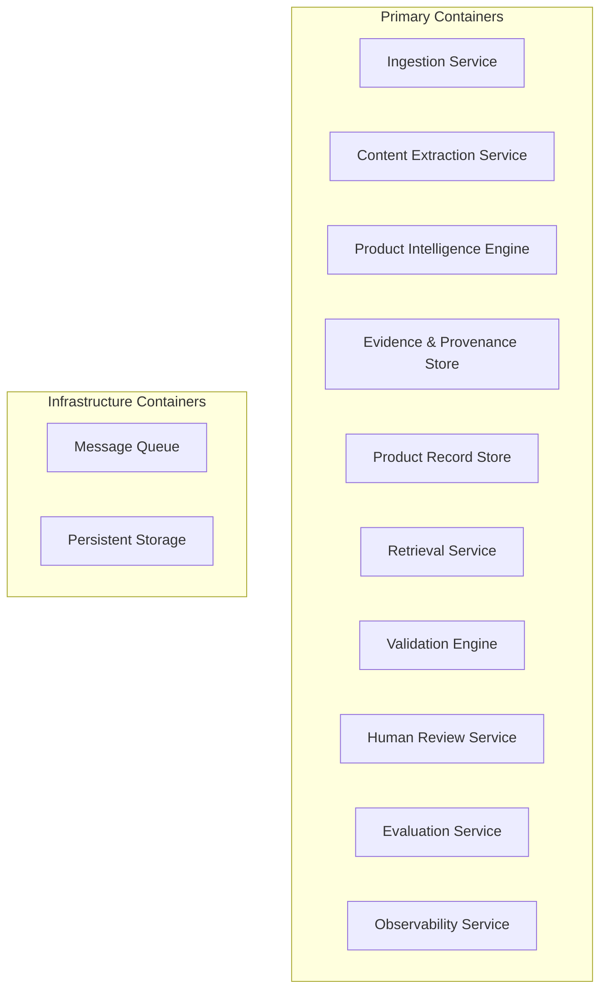
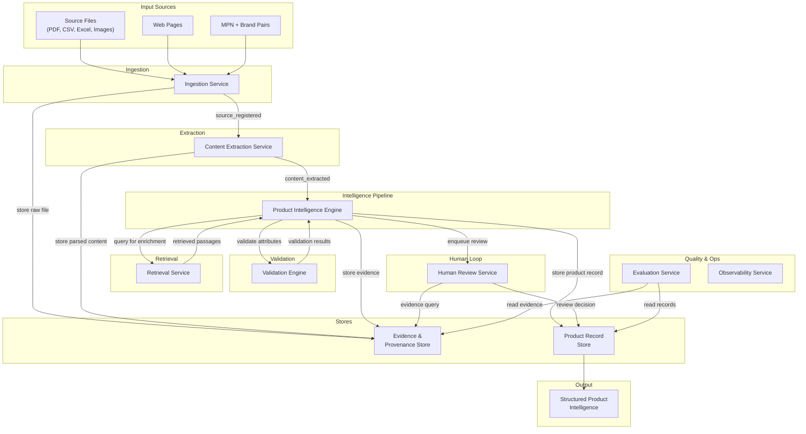
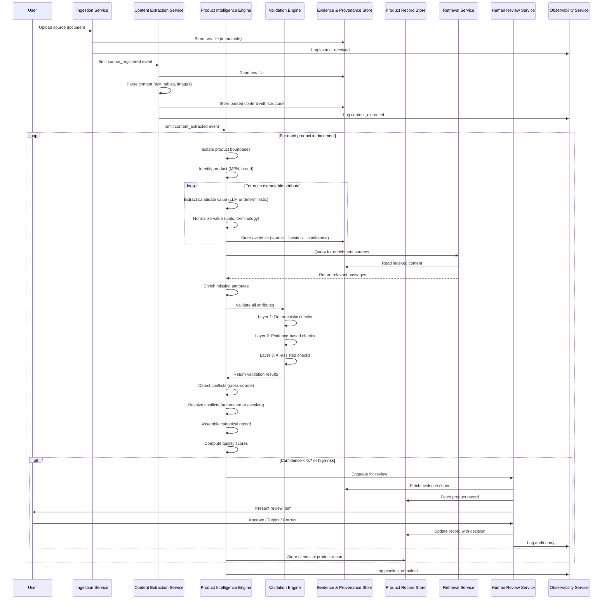
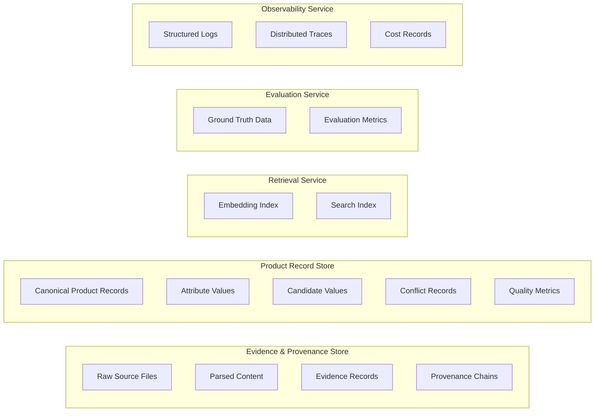

# Container Architecture

> **Status:** Complete  
> **Module:** 3 — System Architecture & AI Strategy  
> **Purpose:** Define the major system containers, their responsibilities, interactions, and data flow in technology-agnostic terms.  
> **Depends on:** `module-03-architecture.md`, `canonical-product-model.md`, `validation-and-lifecycle-model.md`

---

## 1. Purpose

This document defines the high-level decomposition of the Product Intelligence System into major containers (deployable units of functionality). It answers:

> "What are the major parts of the system, what does each part do, how do they communicate, and what data flows between them?"

This is **not** a deployment architecture. This is **not** an API specification. This defines the logical boundaries and responsibilities of each container so that implementation decisions (language, framework, infrastructure) can be made independently per container.

---

## 2. Design Principles

### 2.1 Single Responsibility

Each container has one clear responsibility. A container either ingests, extracts, stores, validates, reviews, retrieves, evaluates, or observes — it does not do multiple unrelated things.

### 2.2 Data Ownership

Each container owns its data. No container directly reads or writes another container's internal storage. All data exchange happens through defined interfaces.

### 2.3 Technology Agnosticism

Containers are defined by their behavior, not their implementation. A container may be a microservice, a module within a monolith, a serverless function, or a library — the choice is deferred to Module 4.

### 2.4 Observable Interactions

Every container interaction is traceable. Data flowing between containers carries correlation identifiers so that the processing of a single source document or product can be traced end-to-end.

### 2.5 Graceful Degradation

Each container must define what happens when it fails or is unavailable. No container failure should silently produce trusted output.

---

## 3. Container Inventory

### 3.1 Overview

The system is decomposed into **10 primary containers** and **2 infrastructure containers**.



### 3.2 Container Summary

| # | Container | Capability Ref | Responsibility |
|---|-----------|---------------|----------------|
| 1 | **Ingestion Service** | C-01 | Accept, detect, validate, and store source documents |
| 2 | **Content Extraction Service** | C-02, C-03 | Parse documents into structured content (text, tables, images) |
| 3 | **Product Intelligence Engine** | C-04, C-05, C-06, C-07, C-09, C-11, C-12, C-13, C-14 | Core pipeline orchestration: identify, extract, normalize, enrich, detect conflicts, resolve, assemble, score |
| 4 | **Evidence & Provenance Store** | C-07 | Persist source documents, evidence chains, provenance data |
| 5 | **Product Record Store** | C-13 | Persist canonical product records, attributes, quality metrics |
| 6 | **Retrieval Service** | C-08 | RAG-based retrieval for enrichment; search over products |
| 7 | **Validation Engine** | C-10 | Deterministic and rule-based validation of attribute values |
| 8 | **Human Review Service** | C-15 | Review queue, evidence presentation, decision recording |
| 9 | **Evaluation Service** | C-17 | Metrics computation, ground truth comparison, reporting |
| 10 | **Observability Service** | C-18 | Logging, metrics, tracing, cost tracking |

---

## 4. Container Definitions

### 4.1 Ingestion Service

**Responsibility:** Accept source documents in any supported format, detect format, validate structural integrity, register the source, and persist the raw document.

**Capabilities served:** C-01 (Input Ingestion)

| Aspect | Detail |
|--------|--------|
| **Inputs** | Raw files (PDF, CSV, Excel, images), URLs (web pages), MPN+brand pairs |
| **Outputs** | Registered SourceDocument record with metadata, format classification, and storage reference |
| **Deterministic?** | Yes — no AI involved |
| **Storage interaction** | Writes raw source files to Evidence & Provenance Store; writes SourceDocument metadata to Product Record Store |

**Responsibilities:**

1. Accept files via upload, URL, or batch import
2. Detect file format (PDF, CSV, Excel, HTML, image, etc.)
3. Validate file integrity (not corrupted, not empty, within size limits)
4. Register the source document with metadata:
   - Source type (pdf, csv, web_page, image, etc.)
   - Source trust level (manufacturer_official, third_party_unverified, etc.)
   - Acquisition timestamp
   - Content hash (for deduplication)
5. Store the raw file (immutable — never modified)
6. Emit a `source_registered` event to the message queue

**Failure behavior:**

- Corrupted file → reject with error, log to Observability
- Unsupported format → reject with error, log to Observability
- Duplicate source (same content hash) → skip, log warning

---

### 4.2 Content Extraction Service

**Responsibility:** Transform raw source documents into structured content that downstream containers can process. Handles format-specific parsing, table extraction, OCR, and multimodal understanding.

**Capabilities served:** C-02 (Content Extraction), C-03 (Multimodal Understanding)

| Aspect | Detail |
|--------|--------|
| **Inputs** | SourceDocument reference from message queue |
| **Outputs** | ParsedContent record (text segments, table structures, image regions, document structure) |
| **Deterministic?** | Partially — PDF/table parsing is deterministic; OCR and VLM are not |
| **Storage interaction** | Reads raw files from Evidence & Provenance Store; writes parsed content to Evidence & Provenance Store |

**Responsibilities:**

1. Select extraction path based on source format:
   - **Text-based PDF:** Text extraction with structure preservation
   - **Scanned PDF:** OCR / VLM → text extraction
   - **CSV/Excel:** Tabular parser → structured rows and columns
   - **Web page:** HTML parser → content extraction (text, images, tables)
   - **Image:** VLM → text/label extraction
   - **Mixed content:** Parallel text + image extraction
2. Extract text with structural metadata (headings, paragraphs, lists)
3. Extract tables with row/column structure, header identification, and cell-level content
4. Extract images and diagrams with VLM-based understanding (when applicable)
5. Preserve document structure (page numbers, sections, table of contents)
6. Associate all extracted content with precise source locations (page, section, table, row, column, text span)
7. Emit `content_extracted` event with ParsedContent reference

**Failure behavior:**

- PDF parsing failure → retry with alternative parser; mark source as `extraction_failed` if all parsers fail
- OCR failure → flag source as `requires_manual_extraction`
- VLM failure → skip visual extraction, proceed with text-only content
- Partial extraction → emit partial results, log gaps

---

### 4.3 Product Intelligence Engine

**Responsibility:** Orchestrate the core intelligence pipeline — product identification, attribute extraction, normalization, enrichment, conflict detection, conflict resolution, record assembly, and quality scoring. This is the central orchestrator of the system.

**Capabilities served:** C-04 (Product Identification), C-05 (Attribute Extraction), C-06 (Normalization), C-09 (Enrichment), C-11 (Conflict Detection), C-12 (Conflict Resolution), C-13 (Assembly), C-14 (Quality Scoring)

| Aspect | Detail |
|--------|--------|
| **Inputs** | ParsedContent references from message queue |
| **Outputs** | Canonical ProductRecord with attributes, provenance, conflicts, quality scores |
| **Deterministic?** | Mixed — extraction and enrichment use AI; normalization, conflict detection, assembly, scoring are deterministic |
| **Storage interaction** | Reads parsed content from Evidence & Provenance Store; reads/writes product records to Product Record Store; queries Retrieval Service for enrichment; submits validation requests to Validation Engine |

**Responsibilities:**

#### 4.3.1 Product Isolation (C-04)
1. Identify individual products within multi-product documents
2. Associate content segments with specific products
3. Detect product boundaries using document structure, part numbers, and table structure

#### 4.3.2 Product Identification (C-04)
4. Resolve product identity from MPN, brand, GTIN, or other identifiers
5. Detect duplicate products across sources
6. Assign or match canonical product records

#### 4.3.3 Attribute Extraction (C-05)
7. Extract candidate attribute values from parsed content using LLM
8. Extract structured attributes from tables (deterministic mapping)
9. Attach extraction confidence to each candidate value
10. Preserve original text spans as evidence

#### 4.3.4 Normalization (C-06)
11. Convert units to canonical representations (deterministic)
12. Map terminology to controlled vocabulary (deterministic)
13. Standardize value formats (dates, numbers, enumerations)
14. Preserve original values alongside normalized values

#### 4.3.5 Enrichment (C-09)
15. Identify missing or low-confidence attributes
16. Query Retrieval Service for relevant source material
17. Extract additional attribute values from retrieved sources
18. Attach enrichment provenance (new source + extraction method)

#### 4.3.6 Conflict Detection (C-11)
19. Compare attribute values across sources for the same product
20. Detect value mismatches, unit mismatches, source contradictions, freshness conflicts
21. Create Conflict records with all candidate values preserved

#### 4.3.7 Conflict Resolution (C-12)
22. Apply automated resolution rules when safe (source priority, newest wins)
23. Escalate complex conflicts to Human Review Service
24. Record resolution rationale

#### 4.3.8 Assembly (C-13)
25. Construct canonical ProductRecord from validated attributes
26. Apply category-specific attribute schemas
27. Compute completeness scores against schema
28. Set attribute lifecycle states

#### 4.3.9 Quality Scoring (C-14)
29. Compute completeness score (weighted by attribute importance)
30. Compute confidence scores per attribute and per record
31. Compute consistency metrics
32. Determine review routing (which attributes need human review)

**Failure behavior:**

- Product isolation failure → process as single-product document; log warning
- Attribute extraction failure → retry with different prompt; mark failed attributes as `NOT_DISCOVERED`
- Enrichment failure → continue with available data; mark missing attributes as `NOT_DISCOVERED`
- Conflict resolution failure → escalate all conflicts to human review

---

### 4.4 Evidence & Provenance Store

**Responsibility:** Persist all source documents (raw and parsed), evidence chains, provenance records, and extraction metadata. This is the system's memory of where every value came from.

**Capabilities served:** C-07 (Evidence Management)

| Aspect | Detail |
|--------|--------|
| **Inputs** | Write requests from Ingestion Service, Content Extraction Service, Product Intelligence Engine |
| **Outputs** | Source documents, parsed content, evidence records, provenance queries |
| **Deterministic?** | N/A — this is a data store, not a processing component |
| **Storage interaction** | Manages its own persistent storage |

**Data owned:**

| Data Type | Description | Access Pattern |
|-----------|-------------|----------------|
| **Raw source files** | Original uploaded files (immutable) | Write-once, read for audit |
| **Parsed content** | Extracted text, tables, images with structure | Write-once, read during extraction |
| **Evidence records** | Source location + extraction method + confidence | Write-once, read during review |
| **Provenance chains** | Full traceability from attribute to source | Write-once, read for explainability |
| **Source metadata** | Trust level, freshness, acquisition date | Write-once, read for authority scoring |

**Key operations:**

1. `store_raw_source(file, metadata)` → stores immutable raw file, returns reference
2. `store_parsed_content(source_ref, content)` → stores extracted content with structure
3. `store_evidence(evidence_record)` → stores evidence linking an attribute to its source
4. `get_source(source_ref)` → retrieves raw source file
5. `get_content(source_ref)` → retrieves parsed content
6. `get_evidence_chain(attribute_id)` → retrieves full provenance chain for an attribute
7. `get_source_location(location_ref)` → retrieves exact source location for human verification

**Data integrity:**

- Raw source files are never modified after storage
- Evidence records are append-only
- Content hashes prevent silent corruption
- All writes are idempotent

---

### 4.5 Product Record Store

**Responsibility:** Persist canonical product records including all attributes, their values, lifecycle states, conflict statuses, quality metrics, and review statuses.

**Capabilities served:** C-13 (Product Intelligence Assembly)

| Aspect | Detail |
|--------|--------|
| **Inputs** | Write requests from Product Intelligence Engine, Human Review Service |
| **Outputs** | Canonical product records, attribute queries, search results |
| **Deterministic?** | N/A — this is a data store, not a processing component |
| **Storage interaction** | Manages its own persistent storage |

**Data owned:**

| Data Type | Description | Access Pattern |
|-----------|-------------|----------------|
| **Product records** | Canonical product identity and metadata | Read/write frequently |
| **Attributes** | Per-product attribute values with lifecycle states | Read/write with filtering |
| **Candidate values** | Multiple values per attribute (pre-resolution) | Read during conflict resolution |
| **Conflicts** | Conflict records with candidate values and resolution | Read/write during resolution |
| **Quality metrics** | Completeness, confidence, consistency scores | Read/write with product records |
| **Review statuses** | Per-attribute and per-record review states | Read/write during review |

**Key operations:**

1. `create_product_record(record)` → creates new canonical product
2. `update_attributes(product_id, attributes)` → updates attribute values with lifecycle states
3. `add_candidate_value(product_id, attribute_name, candidate)` → adds candidate value for conflict resolution
4. `set_conflict_status(product_id, attribute_name, status)` → updates conflict status
5. `get_product_record(product_id)` → retrieves full product record
6. `query_products(filters)` → searches products by attributes, category, identity
7. `get_pending_review()` → retrieves attributes requiring human review

---

### 4.6 Retrieval Service

**Responsibility:** Provide search and retrieval capabilities for enrichment. Indexes source documents and product data for both structured queries and semantic retrieval (RAG).

**Capabilities served:** C-08 (Retrieval), C-16 (Search)

| Aspect | Detail |
|--------|--------|
| **Inputs** | Queries from Product Intelligence Engine (enrichment), external consumers (search) |
| **Outputs** | Retrieved source passages, product search results |
| **Deterministic?** | Mixed — index updates are deterministic; semantic retrieval uses embeddings |
| **Storage interaction** | Reads from Evidence & Provenance Store (for indexing); manages its own index storage |

**Responsibilities:**

1. Index parsed content for retrieval (embeddings + structured metadata)
2. Index product records for search (structured fields + embeddings)
3. Support exact queries (MPN, brand, category)
4. Support semantic queries (similarity search over embeddings)
5. Return retrieval results with source references and relevance scores
6. Filter results by source trust level and freshness
7. Support enrichment queries: "find additional sources for this product"
8. Support search queries: "find products matching these specifications"

**Key operations:**

1. `index_source(source_ref, parsed_content)` → adds source content to index
2. `index_product(product_record)` → adds product to search index
3. `retrieve_for_enrichment(product_identity, missing_attributes)` → retrieves relevant sources for enrichment
4. `search_products(query, filters)` → searches products by structured and semantic criteria
5. `get_related_products(product_id)` → finds similar or compatible products

---

### 4.7 Validation Engine

**Responsibility:** Validate attribute values against deterministic rules. Implements the four-layer validation architecture (deterministic, evidence-based, AI-assisted, human-required).

**Capabilities served:** C-10 (Validation)

| Aspect | Detail |
|--------|--------|
| **Inputs** | Attribute values + provenance from Product Intelligence Engine |
| **Outputs** | Validation results (pass/fail/warn per attribute per rule) |
| **Deterministic?** | Mostly — Layers 1-2 are deterministic; Layer 3 uses AI; Layer 4 routes to human |
| **Storage interaction** | Reads validation rules from configuration; writes validation results to Product Record Store |

**Validation layers:**

| Layer | What it checks | Blocking? |
|-------|---------------|-----------|
| **Layer 1: Deterministic** | Schema conformance, data types, units, value ranges, cross-field consistency | Yes — blocks publication |
| **Layer 2: Evidence-based** | Source existence, source freshness, cross-source agreement, provenance completeness | Warning — may block |
| **Layer 3: AI-assisted** | Semantic consistency, category fit, anomaly detection | Warning — flagged for review |
| **Layer 4: Human-required** | High-risk attributes, low-confidence values, detected conflicts | Decision required |

> **MVP note:** Layer 3 (AI-assisted) is optional for MVP. When implemented, the Validation Engine delegates to the Product Intelligence Engine's LLM capabilities for semantic checks. For MVP, Layers 1-2 (deterministic + evidence-based) provide sufficient validation coverage. Layer 4 (human review) handles the remaining cases. Layer 3 can be added in V1.

**Key operations:**

1. `validate_attribute(attribute, provenance)` → runs all applicable validation layers, returns result
2. `validate_record(product_record)` → validates all attributes in a record
3. `check_cross_field_consistency(product_record)` → validates related fields agree
4. `check_cross_source_agreement(attribute_candidates)` → checks if sources agree
5. `get_validation_rules(category)` → retrieves applicable rules for a product category

---

### 4.8 Human Review Service

**Responsibility:** Manage the review queue, present evidence to reviewers, record decisions, and maintain an audit trail of all human interventions.

**Capabilities served:** C-15 (Human Review)

| Aspect | Detail |
|--------|--------|
| **Inputs** | Review requests from Product Intelligence Engine, Validation Engine, Conflict Resolution |
| **Outputs** | Review decisions (approve/reject/correct), audit trail entries |
| **Deterministic?** | Yes — routing is deterministic; decisions are human |
| **Storage interaction** | Reads product records and evidence from Product Record Store and Evidence & Provenance Store; writes decisions to Product Record Store; writes audit entries to Observability Service |

**Responsibilities:**

1. Maintain a prioritized review queue (by confidence, risk, urgency)
2. Present evidence to reviewers:
   - Current attribute value
   - Full provenance chain (source, location, extraction method)
   - Confidence score
   - Conflicting sources (if any)
   - Source freshness
3. Accept reviewer decisions: approve, reject, or correct
4. Record decision with rationale and audit metadata
5. Trigger re-validation after corrections
6. Compute review metrics (time-to-review, approval rate, correction rate)

**Review routing rules:**

| Condition | Route to review? | Priority |
|-----------|------------------|----------|
| Confidence < 0.7 | Yes | High |
| Safety-critical attribute | Yes | Critical |
| Certification attribute | Yes | High |
| Conflict detected | Yes | High |
| Derived value | Yes | Medium |
| Inference | Yes | Medium |
| Confidence >= 0.9 + validation pass | No (auto-approve) | N/A |

**Key operations:**

1. `enqueue_review(attribute_id, reason, priority)` → adds item to review queue
2. `get_review_item(reviewer_id)` → retrieves next review item with full evidence
3. `record_decision(review_item_id, decision, rationale)` → records reviewer decision
4. `get_review_queue(filters)` → retrieves queue filtered by priority, category, reason
5. `get_audit_trail(product_id)` → retrieves full review history for a product

---

### 4.9 Evaluation Service

**Responsibility:** Measure system performance against ground truth, compute quality metrics, and generate evaluation reports.

**Capabilities served:** C-17 (Evaluation)

| Aspect | Detail |
|--------|--------|
| **Inputs** | System output (product records, extraction results), ground truth data |
| **Outputs** | Evaluation metrics, comparison reports, quality trends |
| **Deterministic?** | Yes — metrics computation is deterministic |
| **Storage interaction** | Reads product records from Product Record Store; reads evidence from Evidence & Provenance Store; manages its own ground truth and metrics storage |

**Evaluation dimensions:**

| Dimension | What it measures | How |
|-----------|-----------------|-----|
| **Extraction accuracy** | % of extracted values matching ground truth | Compare extracted vs. verified values |
| **Completeness** | % of required attributes populated | Compare against category schema |
| **Consistency** | Cross-field and cross-source agreement | Automated consistency checks |
| **Validation accuracy** | % of errors correctly caught by validation | Test with known-error datasets |
| **Contradiction detection** | % of conflicts correctly identified | Test with known-conflict datasets |
| **Evidence coverage** | % of values with traceable provenance | Measure from system state |
| **Hallucination rate** | % of enriched/inferred values that are fabricated | Human verification |
| **Processing time** | End-to-end and per-stage latency | Measure from system state |
| **Cost** | API calls and compute cost per product | Measure from system state |

**Key operations:**

1. `run_evaluation(dataset, ground_truth)` → executes full evaluation cycle
2. `compare_extracted_vs_ground_truth(extracted, ground_truth)` → computes accuracy metrics
3. `compute_completeness(product_records, schemas)` → computes completeness scores
4. `generate_report(evaluation_results)` → produces human-readable evaluation report
5. `get_metrics_history(dimension)` → retrieves metric trends over time

---

### 4.10 Observability Service

**Responsibility:** Collect, aggregate, and expose logs, metrics, traces, and cost data from all containers. Provides operational visibility into system health, performance, and cost.

**Capabilities served:** C-18 (Observability)

| Aspect | Detail |
|--------|--------|
| **Inputs** | Log entries, metrics, traces, cost records from all containers |
| **Outputs** | Dashboards, alerts, aggregated metrics, audit logs |
| **Deterministic?** | Yes — collection and aggregation are deterministic |
| **Storage interaction** | Manages its own log/metric storage (append-only) |

**Observability dimensions:**

| Dimension | Metrics | Purpose |
|-----------|---------|---------|
| **Processing** | Success/failure rate, throughput, latency per stage | Operational health |
| **Extraction** | Confidence distribution, method usage, error rates | Quality monitoring |
| **Validation** | Pass/fail rate per layer, rule hit rates | Quality improvement |
| **Conflicts** | Conflict rate, resolution rate, escalation rate | Data quality insight |
| **Human Review** | Queue depth, review time, approval/correction rates | Review efficiency |
| **Cost** | API calls per product, cost by stage, cost by model | Cost management |
| **Quality** | Completeness trends, accuracy trends, hallucination rate | Continuous improvement |
| **Audit** | All human decisions, all state changes, all errors | Accountability and debugging |

**Key operations:**

1. `log_event(container, event_type, payload)` → records a structured log event
2. `record_metric(name, value, tags)` → records a metric data point
3. `record_trace(correlation_id, span_name, duration, status)` → records a distributed trace span
4. `record_cost(correlation_id, operation, model, tokens, cost)` → records an API cost event
5. `get_metrics(name, time_range, filters)` → queries aggregated metrics
6. `get_traces(correlation_id)` → retrieves full trace for a processing pipeline run
7. `get_audit_log(filters)` → retrieves audit entries

---

## 5. Container Interaction Diagram

### 5.1 Primary Data Flow

The following diagram shows the primary data flow between containers during a typical processing pipeline run.



### 5.2 Detailed Interaction Flow

The following diagram traces a single source document through the entire pipeline.



---

## 6. Data Flow Matrix

### 6.1 Inter-Container Data Flows

| Source Container | Target Container | Data | Trigger | Synchronous? |
|-----------------|-----------------|------|---------|--------------|
| **Ingestion Service** | **Content Extraction Service** | SourceDocument reference | `source_registered` event | Async (queue) |
| **Ingestion Service** | **Evidence & Provenance Store** | Raw source file | File upload | Sync |
| **Content Extraction Service** | **Product Intelligence Engine** | ParsedContent reference | `content_extracted` event | Async (queue) |
| **Content Extraction Service** | **Evidence & Provenance Store** | Parsed content with structure | After extraction | Sync |
| **Product Intelligence Engine** | **Evidence & Provenance Store** | Evidence records (per attribute) | During extraction | Sync |
| **Product Intelligence Engine** | **Evidence & Provenance Store** | Provenance chains | During assembly | Sync |
| **Product Intelligence Engine** | **Product Record Store** | Canonical product records | After assembly | Sync |
| **Product Intelligence Engine** | **Retrieval Service** | Enrichment queries | During enrichment | Sync |
| **Retrieval Service** | **Product Intelligence Engine** | Retrieved passages + scores | Query response | Sync |
| **Product Intelligence Engine** | **Validation Engine** | Attribute values + provenance | During validation | Sync |
| **Validation Engine** | **Product Intelligence Engine** | Validation results | After validation | Sync |
| **Product Intelligence Engine** | **Human Review Service** | Review requests + evidence | When review needed | Async (queue) |
| **Human Review Service** | **Product Record Store** | Updated attributes (approved/corrected) | After decision | Sync |
| **Human Review Service** | **Evidence & Provenance Store** | Evidence queries | During review | Sync |
| **All Containers** | **Observability Service** | Logs, metrics, traces, costs | Continuous | Async (fire-and-forget) |
| **Product Record Store** | **Evaluation Service** | Product records + metrics | On evaluation run | Sync |
| **Evidence & Provenance Store** | **Evaluation Service** | Evidence data | On evaluation run | Sync |

### 6.2 Event Types

| Event | Producer | Consumers | Payload |
|-------|----------|-----------|---------|
| `source_registered` | Ingestion Service | Content Extraction Service | SourceDocument ID, format, metadata |
| `content_extracted` | Content Extraction Service | Product Intelligence Engine | ParsedContent ID, product segments |
| `attributes_extracted` | Product Intelligence Engine | Validation Engine | Attribute candidates with provenance |
| `validation_complete` | Validation Engine | Product Intelligence Engine | Validation results per attribute |
| `review_requested` | Product Intelligence Engine | Human Review Service | Review item ID, evidence, reason |
| `review_decided` | Human Review Service | Product Record Store, Product Intelligence Engine | Decision, corrected values |
| `pipeline_complete` | Product Intelligence Engine | Observability Service | Job summary, metrics |

---

## 7. Container Communication Patterns

### 7.1 Pattern: Event-Driven Pipeline

The primary pipeline (Ingestion → Extraction → Intelligence → Output) uses **event-driven communication** via a message queue. This provides:

- **Decoupling:** Containers can fail independently without blocking the pipeline
- **Retry:** Failed events can be retried without losing work
- **Scalability:** Events can be processed in parallel across workers
- **Auditability:** Every event is logged and traceable

### 7.2 Pattern: Synchronous Query-Response

Validation, enrichment retrieval, and provenance queries use **synchronous request-response** within a pipeline stage. This is appropriate when:

- The result is needed before the next step can proceed
- The operation is fast (sub-second)
- The caller needs to handle the response

### 7.3 Pattern: Fire-and-Forget

Observability events use **fire-and-forget** publishing. Logs, metrics, and traces are sent asynchronously and are never blocking. If the Observability Service is unavailable, events are buffered and delivered later (or lost — observability loss does not affect data correctness).

### 7.4 Pattern: Direct Store Access

The Evidence & Provenance Store and Product Record Store are accessed **directly** by containers that need data. There is no intermediary — containers read and write to stores directly with proper authorization. This keeps data access fast and simple.

---

## 8. Failure Modes and Degradation

### 8.1 Container Failure Matrix

| Container | Failure Impact | Degradation Strategy |
|-----------|---------------|---------------------|
| **Ingestion Service** | Cannot accept new sources | Existing pipeline runs continue; new uploads are queued and processed when recovered |
| **Content Extraction Service** | Cannot parse new sources | Sources are queued; parsed sources are still processable |
| **Product Intelligence Engine** | Cannot process new products | Existing products in pipeline continue; new products are queued |
| **Evidence & Provenance Store** | Cannot store or retrieve evidence | **Critical failure** — pipeline pauses; no attributes can be processed without evidence |
| **Product Record Store** | Cannot store or retrieve products | **Critical failure** — pipeline pauses; assembled records cannot be persisted |
| **Retrieval Service** | Cannot retrieve for enrichment | Enrichment is skipped; products proceed with available data only |
| **Validation Engine** | Cannot validate attributes | Validation is skipped; attributes flagged as `validation_skipped` requiring manual review |
| **Human Review Service** | Cannot process review requests | Review queue accumulates; no auto-approval occurs; pipeline output is delayed |
| **Evaluation Service** | Cannot compute metrics | Evaluation is delayed; no impact on pipeline processing |
| **Observability Service** | Cannot collect telemetry | Operations continue without visibility; events are buffered |

### 8.2 Critical Path

The critical path (failure blocks all processing):

```
Evidence & Provenance Store → Product Record Store → Message Queue
```

All other containers can fail with graceful degradation.

---

## 9. Data Ownership and Boundaries

### 9.1 Store Ownership



### 9.2 No Shared Mutable State

Containers never directly modify another container's data. All state changes flow through defined interfaces:

- The Product Intelligence Engine writes product records to the Product Record Store — it does not write to the Retrieval Service's index directly. The Retrieval Service re-indexes independently after detecting new records.
- The Human Review Service updates attributes in the Product Record Store through the store's defined update interface — it does not bypass the store to modify internal state.
- The Validation Engine writes validation results through the Product Record Store's defined interface.

---

## 10. Scalability Considerations

### 10.1 Independent Scaling

Each container can scale independently based on its bottleneck:

| Container | Scaling Bottleneck | Scaling Strategy |
|-----------|-------------------|-----------------|
| **Ingestion Service** | File I/O throughput | Add workers; parallel uploads |
| **Content Extraction Service** | CPU (parsing) + API calls (OCR/VLM) | Add workers; queue-based parallelism |
| **Product Intelligence Engine** | API calls (LLM) per product | Add workers; batch prompts; cache common extractions |
| **Evidence & Provenance Store** | Storage capacity + read throughput | Horizontal storage scaling; read replicas |
| **Product Record Store** | Read/write throughput | Horizontal scaling; sharding by product ID |
| **Retrieval Service** | Index size + query latency | Distributed index; tiered storage |
| **Validation Engine** | Rule evaluation throughput | Add workers; rules are fast |
| **Human Review Service** | Human throughput | Confidence-based routing reduces load; batch review |
| **Evaluation Service** | Compute for metrics | Run asynchronously; not on critical path |
| **Observability Service** | Write throughput for logs/metrics | Async writes; buffering; sampling |

### 10.2 Parallelism Opportunities

- **Within pipeline:** Different products can be processed in parallel (independent pipeline runs)
- **Within product:** Some extraction steps can be parallelized (text extraction + image extraction)
- **Cross-source:** Multiple sources for the same product can be extracted in parallel
- **Enrichment:** Multiple enrichment queries can run in parallel per product

---

## 11. Security Boundaries

### 11.1 Trust Boundaries

| Boundary | From | To | Control |
|----------|------|----|---------|
| **External → Ingestion** | User/external source | Ingestion Service | File validation, size limits, format detection |
| **Ingestion → Internal** | Ingestion Service | All internal containers | Source content treated as data, not instructions |
| **AI Model → System** | LLM/VLM API | Product Intelligence Engine | Output validation; no direct trust of AI output |
| **Human → System** | Reviewer | Human Review Service | Authentication; authorization; audit logging |
| **System → External** | Product Record Store | Downstream consumers | Data export validation; no internal state exposure |

### 11.2 Data Sensitivity

| Data | Sensitivity | Handling |
|------|-------------|----------|
| Source files | Medium | Stored immutably; access controlled |
| Product records | Medium | Access controlled; audit logged |
| API keys / credentials | Critical | Environment variables only; never in data stores |
| Audit logs | High | Append-only; access controlled; retained per policy |

---

## 12. Container Interface Summary

### 12.1 Minimal Interface Contracts

| Interface | Consumer → Provider | Request | Response |
|-----------|--------------------|---------| --------|
| **Ingest** | User → Ingestion Service | File or URL | SourceDocument reference |
| **Register Source** | Ingestion Service → Evidence Store | File + metadata | Storage reference |
| **Parse Content** | Content Extraction Service → Evidence Store | Source reference | ParsedContent reference |
| **Enrich** | PIE → Retrieval Service | Product identity + missing attrs | Retrieved passages |
| **Validate** | PIE → Validation Engine | Attributes + provenance | Validation results |
| **Review** | PIE → Human Review Service | Review item + evidence | Decision |
| **Store Record** | PIE → Product Record Store | Canonical record | Confirmation |
| **Store Evidence** | PIE → Evidence Store | Evidence records | Confirmation |
| **Query Products** | External → Product Record Store | Search filters | Product records |
| **Query Provenance** | Any → Evidence Store | Attribute ID | Evidence chain |

---

## 13. Relationship to Module 03 Architecture

This container architecture directly implements the capabilities defined in `module-03-architecture.md`:

| Architecture Section | Container(s) Implementing |
|---------------------|---------------------------|
| §4 End-to-End Pipeline | Ingestion → Content Extraction → Product Intelligence Engine → Output |
| §5 System Capabilities (C-01–C-18) | Distributed across all containers (see §3.2) |
| §6 AI Technology Placement | AI used in Content Extraction (VLM) and Product Intelligence Engine (LLM) |
| §7 Extraction Strategy | Content Extraction Service (paths by input type) |
| §8 Source-of-Truth Strategy | Product Intelligence Engine (authority rules) + Evidence Store (source metadata) |
| §9 Evidence Architecture | Evidence & Provenance Store + Product Intelligence Engine (evidence attachment) |
| §10 Validation Architecture | Validation Engine (four layers) |
| §11 Conflict Detection | Product Intelligence Engine (conflict detection + resolution) |
| §12 Confidence Architecture | Product Intelligence Engine (confidence calculation) + Validation Engine (thresholds) |
| §13 Human-in-the-Loop | Human Review Service |
| §14 Orchestration Model | Product Intelligence Engine (pipeline orchestration) + Message Queue (job lifecycle) |
| §16 Data Storage Strategy | Evidence & Provenance Store + Product Record Store |
| §17 Search Strategy | Retrieval Service |
| §19 Observability | Observability Service |
| §20 Evaluation Architecture | Evaluation Service |

---

*This document is the foundation for Module 04 (Implementation). Each container will be implemented as a discrete module with defined interfaces, enabling independent development and testing.*
