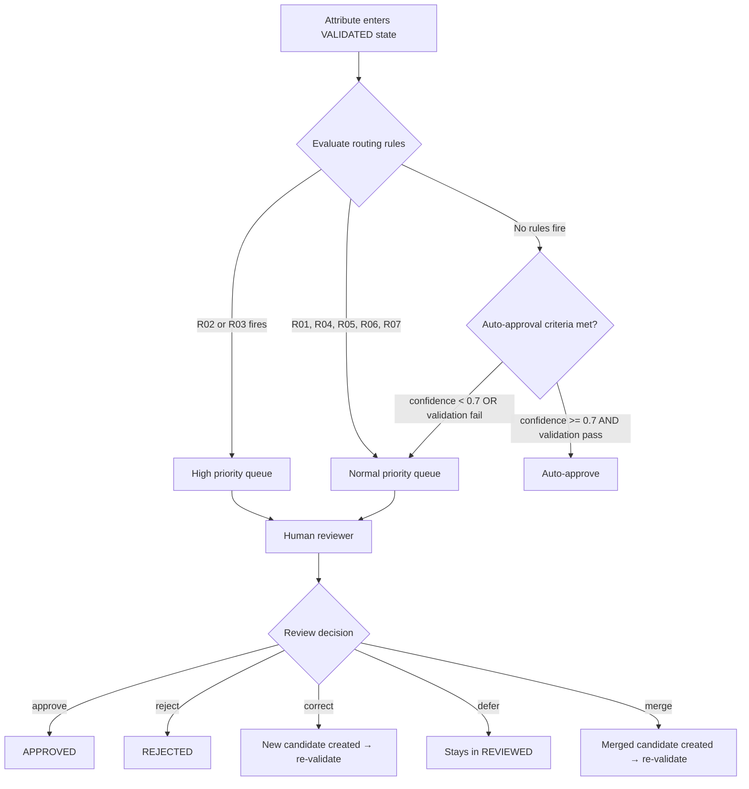
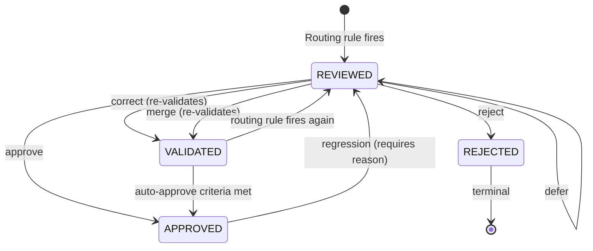
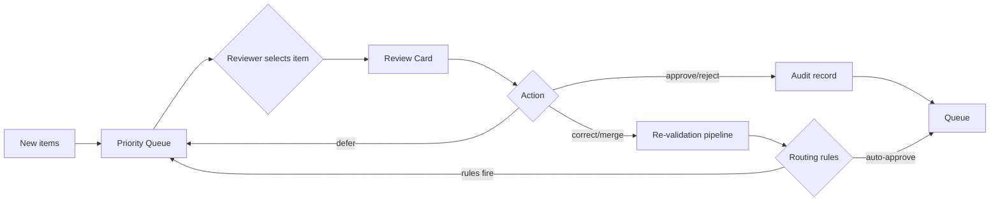
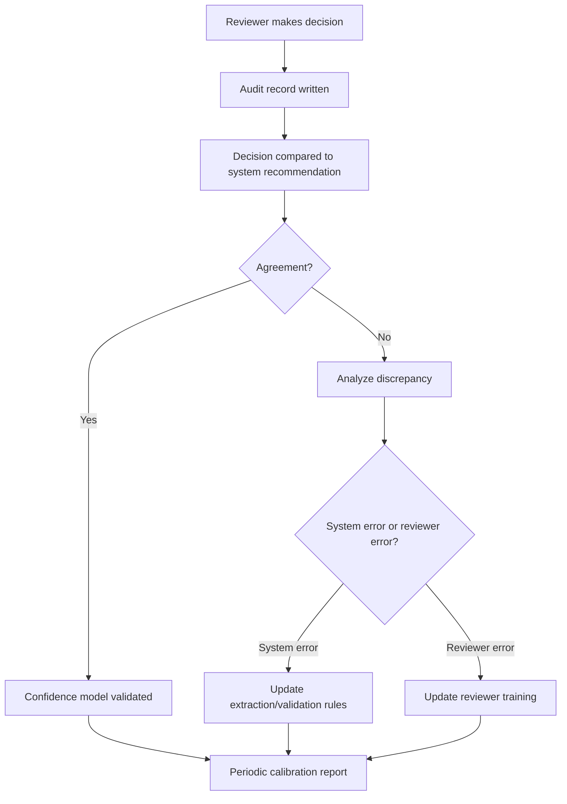
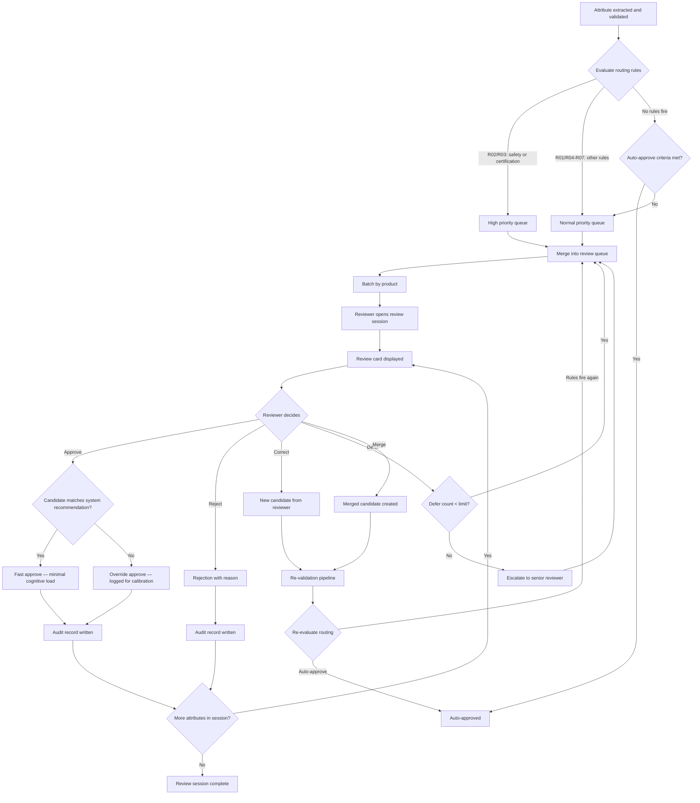

# Human-in-the-Loop Review Model

> **Status:** Complete
> **Module:** 3 — Architecture
> **Purpose:** Define when human review is required, what the reviewer sees, what actions are available, and how review quality is measured.
> **Depends on:** `validation-and-lifecycle-model.md`, `provenance-and-evidence-model.md`, `canonical-product-model.md`

---

## 1. Overview

Human review is the mechanism by which uncertain, conflicting, or safety-critical product information is verified by a person. It is not a fallback — it is a first-class capability of the system.

The goal is not to have humans review everything. The goal is to route the right attributes to humans at the right time, give them sufficient context to make a fast and correct decision, and learn from their decisions to reduce future review load.

---

## 2. When Human Review Is Required

### 2.1 Routing Rules

An attribute is routed to human review when **any** of the following conditions is true:

| Rule ID | Condition | Trigger | Priority |
|---------|-----------|---------|----------|
| `R01` | Low confidence | `confidence < 0.7` | Normal |
| `R02` | Safety-critical attribute | `information_category == safety` | **High** |
| `R03` | Certification attribute | `information_category == certification` | **High** |
| `R04` | Conflict detected | `conflict_status == pending_resolution` | Normal |
| `R05` | Derived value | `extraction_method == inference` and `transformations` includes derivation | Normal |
| `R06` | AI inference | `extraction_method == inference` and no derivation transformation | Normal |
| `R07` | Freshness concern | `freshness_status == outdated` or `requires_reverification` | Normal |

### 2.2 Routing Priority

When multiple rules fire, the highest priority wins:

```
High:    R02 (safety), R03 (certification)
Normal:  R01, R04, R05, R06, R07
```

Attributes with `High` priority are placed at the top of the review queue and cannot be deferred more than once.

### 2.3 Routing Logic



### 2.4 Auto-Approval Criteria

An attribute bypasses human review **only** when **all** of the following are true:

1. `confidence >= 0.7`
2. `validation_status == auto_validated`
3. `conflict_status == none`
4. `information_category` is not `safety` or `certification`
5. `freshness_status` is `current` or `unknown`
6. `extraction_method` is not `inference` (unless it is a derivation with high confidence)

---

## 3. Review Interface Design

### 3.1 Interface Principles

The review interface exists to minimize the time a reviewer needs to make a correct decision. Every element shown must serve one of these purposes:

1. **Understand** — what is this attribute and why does it matter?
2. **Evaluate** — what values exist and where did they come from?
3. **Decide** — what action should be taken?

### 3.2 What the Reviewer Sees

The interface presents a **review card** for each attribute requiring review. The card contains:

#### Section A: Attribute Identity

| Field | Source | Description |
|-------|--------|-------------|
| Attribute name | `Attribute.name` | Canonical name (e.g., "bore_diameter") |
| Domain | `Attribute.domain` | Domain classification (e.g., "specification") |
| Information category | `Attribute.information_category` | What type of information (e.g., "safety") |
| Product context | `Product.mpn`, `Product.brand` | Which product this belongs to |
| Review reason | `Attribute.review_reason` | Why it was routed to review (which rule fired) |

#### Section B: Candidate Values

For each `CandidateValue` in `Attribute.candidates`:

| Field | Source | Description |
|-------|--------|-------------|
| Value | `CandidateValue.value` | The extracted/obtained value |
| Unit | `CandidateValue.unit` | Unit of measurement (if applicable) |
| Source document | `SourceDocument.name`, `SourceDocument.type` | Where this value came from |
| Source trust level | `SourceDocument.trust_level` | How trustworthy the source is |
| Extraction confidence | `CandidateValue.extraction_confidence` | How certain the extraction was |
| Extraction method | `CandidateValue.extraction_method` | How the value was obtained |
| Source location | `CandidateValue.source_location` | Page, section, table, row, text span |
| Freshness | `CandidateValue.freshness.freshness_status` | How current the evidence is |
| Transformations | `CandidateValue.transformations` | What processing was applied |

#### Section C: Source Location Details

The `source_location` is expanded to give the reviewer enough context to verify:

- **PDF:** Page number, section heading, table ID, row, column, highlighted text span
- **Web page:** URL, section, CSS context, highlighted text span
- **Image:** Bounding box overlay on the image, zoom capability
- **Table:** Table rendered inline with the relevant cell highlighted
- **API:** Endpoint, response field path, raw response snippet

#### Section D: Validation Results

| Field | Source | Description |
|-------|--------|-------------|
| Validation status | `Attribute.validation_status` | Overall validation result |
| Failed checks | Validation results where `passed == false` | Which checks failed and why |
| Passed checks | Validation results where `passed == true` | Which checks passed |
| Warnings | Validation results with `severity == warning` | Non-blocking concerns |

#### Section E: Related Attributes

For cross-field context, the interface shows:

- Attributes in the same product that depend on or relate to this attribute
- Any attributes that conflict with or contradict this value
- The product's current quality metrics

### 3.3 Review Card Layout

```mermaid
block-beta
    columns 2

    block:header:2
        columns 2
        A["Attribute: bore_diameter\nDomain: specification\nCategory: specification"]
        B["Product: UCF209 / IPTCI\nReview reason: R01 — Low confidence (0.58)"]
    end

    block:candidates:2
        columns 2
        C["CANDIDATE 1\nValue: 1-3/16 in (30.163 mm)\nSource: UCF209-datasheet.pdf\nTrust: manufacturer_official\nConfidence: 0.95\nLocation: Page 2, Table 1, Row 4\nText: \"Bore: 1-3/16 in (30.163 mm)\"\nFreshness: current"]
        D["CANDIDATE 2\nValue: 30.2 mm\nSource: bearing-catalog-2024.pdf\nTrust: authorized_distributor\nConfidence: 0.72\nLocation: Page 15, Section 3.2\nText: \"Bore diameter: 30.2 mm\"\nFreshness: current"]
    end

    block:validation:2
        E["VALIDATION RESULTS\nSchema: PASS\nType: PASS\nUnit: PASS\nRange: PASS\nCross-field: PASS"]
        F["RELATED ATTRIBUTES\nhousing_style: pillow_block\nload_rating: 15.9 kN\nseal_type: without seal"]
    end

    block:actions:2
        G["APPROVE | REJECT | CORRECT | DEFER | MERGE"]
    end
```

---

## 4. Review Actions

### 4.1 Action Definitions

| Action | Description | Effect on Attribute | When to Use |
|--------|-------------|---------------------|-------------|
| `approve` | Accept the selected candidate value | `lifecycle_state → approved`, `validation_status → human_validated` | Value is correct and supported by evidence |
| `reject` | Reject the value entirely | `lifecycle_state → rejected` | Value is wrong or unsupported |
| `correct` | Provide a corrected value | New `CandidateValue` created (source: `manual_entry`), attribute re-enters validation | Extracted value is wrong but the reviewer knows the correct value |
| `defer` | Postpone the decision | Attribute stays in `reviewed` state | Reviewer cannot decide now, needs more information |
| `merge` | Combine values from multiple sources | New `CandidateValue` created from merged inputs, attribute re-enters validation | Different sources each have part of the answer |

### 4.2 Action Details

#### Approve

```
Reviewer selects a candidate → clicks "Approve"
Effect:
  Attribute.selected_candidate_id = selected candidate
  Attribute.lifecycle_state = approved
  Attribute.validation_status = human_validated
  Attribute.last_reviewed_at = now
  Audit record created
```

The reviewer may optionally:
- Override the selected candidate by choosing a different one than the system recommended
- Add notes explaining the decision

#### Reject

```
Reviewer selects "Reject"
Effect:
  Attribute.lifecycle_state = rejected
  Attribute.validation_status = rejected
  Attribute.last_reviewed_at = now
  Audit record created (with rejection reason)
```

Rejected attributes require a rejection reason. They cannot be re-approved without a new extraction or correction.

#### Correct

```
Reviewer selects "Correct" and enters a new value
Effect:
  New CandidateValue created:
    value = reviewer-provided value
    extraction_method = manual_entry
    extraction_confidence = 1.0
    source_trust_score = 1.0
    source = reviewer's identity
  Attribute.selected_candidate_id = new candidate
  Attribute.lifecycle_state = validated (re-enters validation)
  Audit record created
```

The corrected value goes through the same validation pipeline as any other value.

#### Defer

```
Reviewer selects "Defer"
Effect:
  Attribute.lifecycle_state stays in reviewed
  Defer count incremented
  Audit record created
```

Deferral limits:
- Maximum 3 deferrals per attribute
- After 3 deferrals, the attribute is escalated to a senior reviewer
- `High` priority attributes (safety, certification) can only be deferred once

#### Merge

```
Reviewer selects "Merge" and specifies how to combine values
Effect:
  New CandidateValue created from merged inputs
  Merge record tracks which candidates were combined and how
  Attribute.lifecycle_state = validated (re-enters validation)
  Audit record created
```

Example: Source A has the bore diameter, Source B has the material. Merge creates a composite value with evidence from both.

### 4.3 Action Flow



---

## 5. Audit Trail

### 5.1 What Is Recorded

Every review action produces an immutable audit record:

| Field | Type | Description |
|-------|------|-------------|
| `attribute_id` | UUID | Which attribute was reviewed |
| `product_id` | UUID | Which product the attribute belongs to |
| `reviewer_id` | string | Who performed the review |
| `action` | enum | `approve`, `reject`, `correct`, `defer`, `merge` |
| `previous_state` | enum | What `lifecycle_state` the attribute was in before the action |
| `new_state` | enum | What `lifecycle_state` the attribute moved to after the action |
| `selected_candidate_id` | UUID | Which candidate was selected (for approve/merge) |
| `corrected_value` | Value | The corrected value (for correct action, null otherwise) |
| `notes` | string | Reviewer's explanation of the decision |
| `timestamp` | timestamp | When the review occurred |
| `review_duration_ms` | integer | How long the reviewer spent on this attribute |
| `rule_fired` | string | Which routing rule triggered the review |
| `validation_snapshot` | map | Validation state at time of review |

### 5.2 Audit Trail Properties

1. **Immutable.** Once written, audit records are never modified or deleted.
2. **Complete.** Every state transition has a corresponding audit record.
3. **Queryable.** Audit records can be filtered by reviewer, product, attribute, action, date range, and rule.
4. **Exportable.** Audit records can be exported for compliance reporting.

### 5.3 Audit Trail Use Cases

| Use case | What is queried |
|----------|-----------------|
| Debugging | Find all rejections for a specific attribute to understand why |
| Compliance | Demonstrate that safety-critical attributes were human-reviewed |
| Improvement | Identify which rules produce the most review load |
| Accountability | Track who approved what and when |
| Training | Find examples of correct and incorrect system routing |

---

## 6. Review Queue Management

### 6.1 Queue Structure



### 6.2 Queue Prioritization

Items in the review queue are ordered by:

1. **Priority** — `High` (safety, certification) before `Normal`
2. **Age** — oldest first (FIFO within priority)
3. **Product completeness** — attributes that unblock a product's readiness score are prioritized
4. **Review reason** — conflicts are prioritized over low-confidence extractions

### 6.3 Review Efficiency Strategies

| Strategy | Description | Expected impact |
|----------|-------------|-----------------|
| **Batch review by product** | Group all pending attributes for a single product into one review session | Reduces context-switching; reviewer sees the full product picture |
| **Confidence-based ordering** | Show highest-confidence candidates first as the "system recommendation" | Faster approval when the system is right |
| **Source-grouped review** | Group attributes extracted from the same source document | Reviewer can verify source quality once, approve many |
| **Conflict-first review** | Prioritize conflicts over low-confidence single candidates | Conflicts are harder and need fresh attention |
| **Smart defaults** | Pre-select the system's recommended candidate; reviewer confirms or overrides | Reduces clicks for common cases |
| **Bulk actions** | Allow approving/rejecting multiple attributes at once when they share the same source and quality profile | Faster for high-volume, low-risk attributes |
| **Reviewer specialization** | Route safety/certification attributes to domain experts | Faster, more accurate decisions on critical attributes |
| **Escalation rules** | Auto-escalate items deferred more than N times | Prevents items from stalling in the queue |

### 6.4 Review Time Targets

| Attribute type | Target review time | Notes |
|----------------|-------------------|-------|
| Low confidence, single candidate | < 30 seconds | Approve or reject the obvious candidate |
| Conflict between 2 candidates | < 2 minutes | Compare sources and decide |
| Safety-critical | < 5 minutes | Requires careful evidence examination |
| Certification | < 3 minutes | Verify against known certification databases |
| Derived/inferred value | < 1 minute | Check derivation logic or inference basis |

---

## 7. Review Quality Measurement

### 7.1 Metrics

| Metric | Formula | Target |
|--------|---------|--------|
| **Review accuracy** | % of reviewed attributes that are not later reversed | ≥ 95% |
| **Review throughput** | Attributes reviewed per reviewer-hour | ≥ 40/hour (normal), ≥ 15/hour (safety/certification) |
| **Review latency** | Time from routing to first review action | < 24 hours (normal), < 4 hours (high priority) |
| **Defer rate** | % of reviews that result in defer | < 10% |
| **Override rate** | % of approvals where reviewer selected a different candidate than the system recommended | Track for calibration |
| **False routing rate** | % of reviews where auto-approval would have been correct | < 5% |
| **Missed routing rate** | % of errors that should have been routed to review but were not | < 2% |

### 7.2 Reviewer Calibration

The system tracks whether reviewer decisions align with the system's recommendations:

- **Agreement rate:** How often the reviewer approves the system's top candidate
- **Override pattern:** Which attributes the reviewer consistently overrides (indicates system weakness)
- **Consistency:** How often the same reviewer makes the same decision for similar attributes

This data feeds back into routing rules and confidence model calibration.

### 7.3 Feedback Loop



---

## 8. Review Flow — End-to-End



---

## 9. Edge Cases

### 9.1 Attribute with No Candidates

If an attribute has `lifecycle_state == discovered` but no candidates, it cannot be reviewed. The reviewer sees a "No candidate values" message and can:
- Provide a value manually (creates a candidate via `manual_entry`)
- Mark as `NOT_APPLICABLE` or `NOT_PROVIDED`

### 9.2 Conflicting Candidates During Review

When a conflict is routed to review, the reviewer sees all conflicting candidates side-by-side. The review action resolves the conflict:
- **Approve** selects one candidate and resolves the conflict
- **Correct** provides a new value that replaces all candidates
- **Merge** combines candidates into a new value

### 9.3 Regression

If an approved attribute needs to be re-reviewed (e.g., new source contradicts it), the system:
1. Creates a new candidate from the new source
2. Detects the conflict
3. Routes to review with reason: `Regression: new source contradicts approved value`
4. The reviewer sees both the approved value and the new candidate

### 9.4 Stale Review

If an attribute has been in the review queue for more than 7 days (normal) or 48 hours (high priority):
1. The item is flagged as `stale_review`
2. A notification is sent to the review queue manager
3. The item is escalated one priority level

---

*This human-in-the-loop model ensures that uncertain product information receives appropriate human oversight while minimizing review burden. See `validation-and-lifecycle-model.md` for the lifecycle states that trigger review, and `provenance-and-evidence-model.md` for the evidence model that supports reviewer decisions.*
