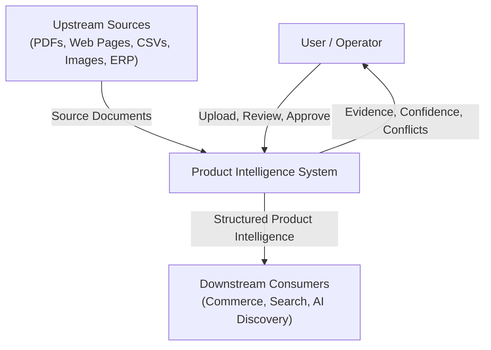
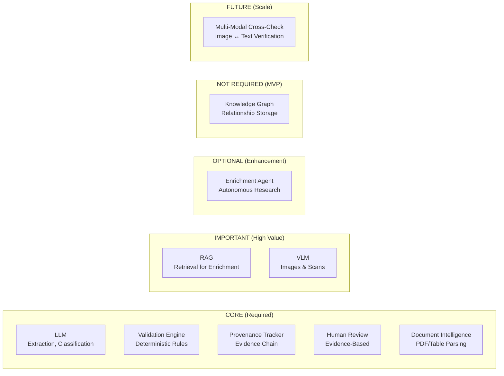
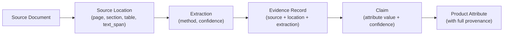
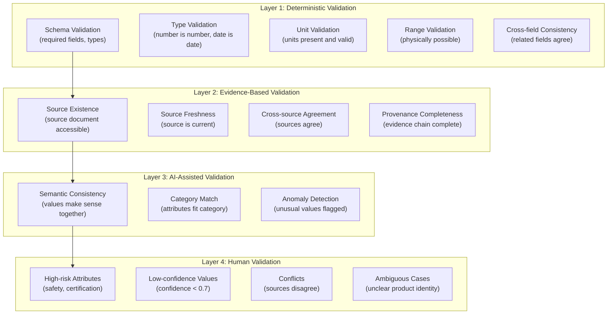
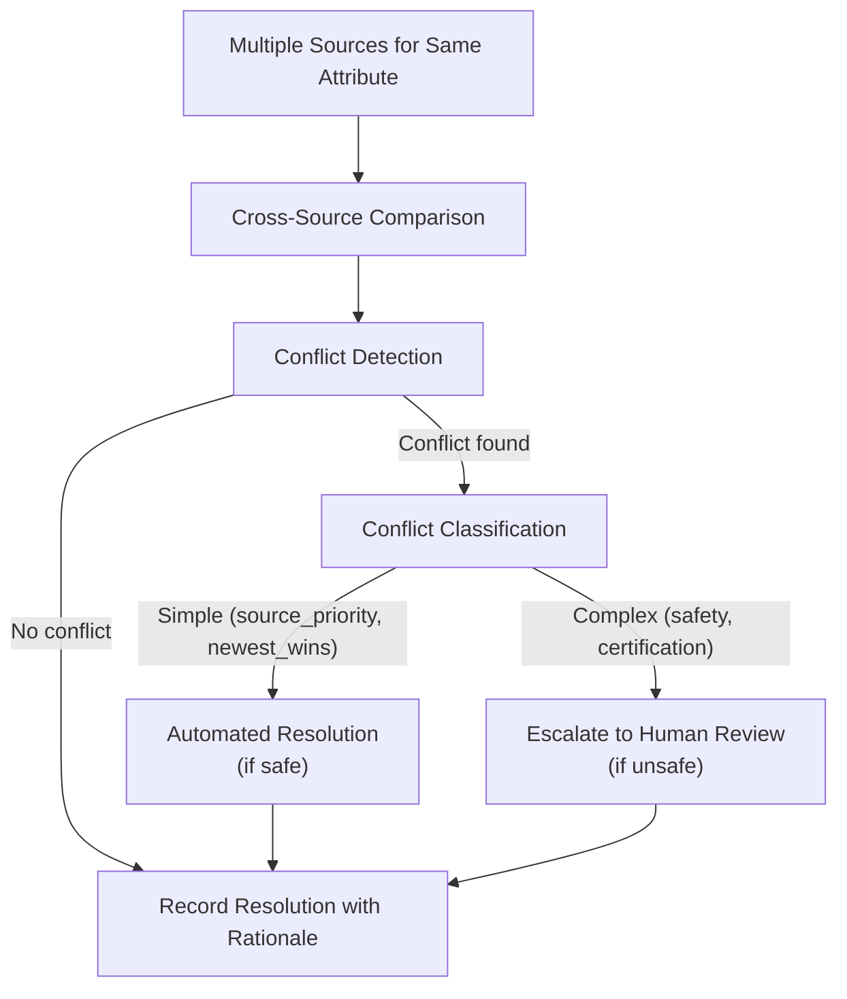
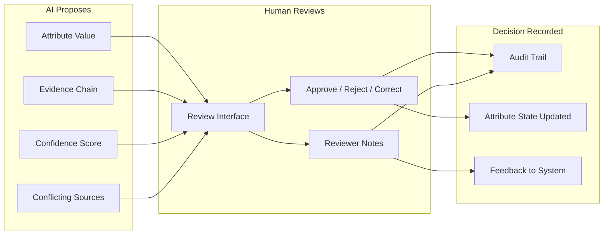
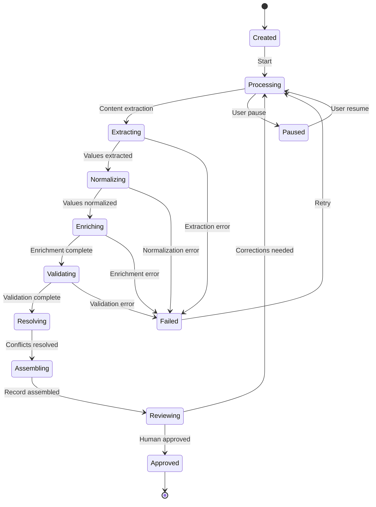

# Module 03 — System Architecture & AI Strategy

> **Status:** Complete  
> **Module:** 3 — System Architecture & AI Strategy  
> **Purpose:** Transform the approved problem definition and product-intelligence contract into a rigorous, production-oriented architecture.  
> **Depends on:** All Module 1 and Module 2 documents

---

## 1. Architecture Philosophy

This architecture is designed around one principle:

**Every component must answer: What problem does it solve? Why is this approach appropriate? How do we know it works? What happens when it fails?**

We are not building the most complicated AI system. We are building the most **credible, trustworthy, explainable, measurable, and efficient** system that solves the challenge.

AI is used where it provides genuine value. Deterministic logic is used where correctness is paramount. Human review is used where uncertainty has business risk.

---

## 2. System Context

### 2.1 What the System Does

The system transforms fragmented, incomplete, multimodal industrial product information into structured, validated, provenance-tracked, commerce-ready product intelligence.

### 2.2 System Boundaries



### 2.3 Users and Roles

| Role | Interaction | What they need |
|------|------------|----------------|
| **Catalog Manager** | Uploads sources, monitors processing | Batch status, quality metrics, review queue |
| **Data Steward / Reviewer** | Reviews flagged attributes | Evidence, source location, confidence, approve/reject |
| **Engineer / Buyer** | Searches products | Filterable specs, accurate data, provenance |
| **AI System** | Consumes structured data | Machine-readable attributes with units and provenance |

---

## 3. Architectural Alternatives Analysis

### 3.1 Architecture A: Simple LLM Pipeline

```text
Input → LLM Extract → JSON Output
```

| Dimension | Assessment |
|-----------|------------|
| Correctness | Low — no validation, no cross-referencing |
| Traceability | None — no provenance tracking |
| Validation | None — output is unverified |
| Multimodal | Limited — LLM handles text only |
| Complexity | Very low |
| Latency | Low |
| Cost | Low |
| Scalability | Poor — one product at a time |
| Maintainability | High |
| Explainability | Low — black box |
| Hackathon feasibility | High |

**Verdict:** REJECTED. This is the "generate JSON from text" approach that the problem definition explicitly identifies as insufficient. No provenance, no validation, no trustworthiness.

### 3.2 Architecture B: RAG-Centric Pipeline

```text
Input → Index → Retrieve → LLM Generate with Context → Output
```

| Dimension | Assessment |
|-----------|------------|
| Correctness | Medium — retrieval grounds the LLM |
| Traceability | Partial — can trace to retrieved chunks |
| Validation | Minimal — LLM judges its own output |
| Multimodal | Limited — primarily text retrieval |
| Complexity | Medium |
| Latency | Medium |
| Cost | Medium |
| Scalability | Good — retrieval scales |
| Maintainability | Medium |
| Explainability | Medium — can show retrieved sources |
| Hackathon feasibility | Medium |

**Verdict:** REJECTED as primary architecture. RAG is a valuable tool for enrichment but is insufficient as the entire architecture. It doesn't solve extraction from structured documents, unit normalization, conflict detection, or multi-layer validation.

### 3.3 Architecture C: Fully Agentic System

```text
Input → Agent decides what to do → Tools → Agent decides next step → ... → Output
```

| Dimension | Assessment |
|-----------|------------|
| Correctness | Variable — depends on agent decisions |
| Traceability | Partial — agent actions logged |
| Validation | Ad-hoc — agent decides when to validate |
| Multimodal | Good — agents can use multiple tools |
| Complexity | Very high |
| Latency | High — multi-step reasoning |
| Cost | High — many LLM calls |
| Scalability | Poor — agent state management |
| Maintainability | Low — non-deterministic behavior |
| Explainability | Low — agent reasoning is opaque |
| Hackathon feasibility | Low |

**Verdict:** REJECTED. The problem definition explicitly warns against this: "Agent behavior is non-deterministic and hard to audit." For a system where correctness and traceability are paramount, a fully agentic approach introduces unacceptable unpredictability.

### 3.4 Architecture D: Hybrid Pipeline with Selective AI (RECOMMENDED)

```text
Deterministic Pipeline + AI at Decision Points + Validation Layer + Human Review
```

| Dimension | Assessment |
|-----------|------------|
| Correctness | High — deterministic validation + AI extraction |
| Traceability | High — provenance-first design |
| Validation | High — multi-layer validation architecture |
| Multimodal | Good — separate paths for different modalities |
| Complexity | Medium-high |
| Latency | Medium |
| Cost | Medium — AI calls at specific points only |
| Scalability | Good — pipeline parallelizes |
| Maintainability | High — deterministic core, AI at edges |
| Explainability | High — provenance chain, validation results |
| Hackathon feasibility | Medium-high |

**Verdict:** SELECTED. This architecture uses deterministic logic for the core pipeline (ingestion, normalization, validation, quality scoring) and AI where it genuinely adds value (extraction from unstructured text, classification, enrichment, conflict analysis). Every AI output is validated before it enters the canonical record.

---

## 4. End-to-End Pipeline

### 4.1 Pipeline Overview

```mermaid
graph TD
    Input["INPUT<br/>PDF, CSV, Web, Image, MPN+Brand"]
    Ingestion["INGESTION<br/>Format detection, storage, source registration"]
    ContentExtraction["CONTENT EXTRACTION<br/>Text, tables, images → structured content"]
    ProductIsolation["PRODUCT ISOLATION<br/>Multi-product docs → individual products"]
    ProductIdentification["PRODUCT IDENTIFICATION<br/>MPN, brand, GTIN matching"]
    AttributeExtraction["ATTRIBUTE EXTRACTION<br/>Structured content → candidate attributes"]
    Normalization["NORMALIZATION<br/>Unit conversion, terminology mapping"]
    EvidenceAttachment["EVIDENCE ATTACHMENT<br/>Source, location, confidence, freshness"]
    Enrichment["ENRICHMENT<br/>Retrieval + external sources for missing attributes"]
    Validation["VALIDATION<br/>Schema, type, range, cross-field, cross-source"]
    ConflictDetection["CONFLICT DETECTION<br/>Cross-source comparison"]
    ConflictResolution["CONFLICT RESOLUTION<br/>Automated rules + human escalation"]
    Assembly["PRODUCT INTELLIGENCE ASSEMBLY<br/>Canonical record construction"]
    QualityScoring["QUALITY SCORING<br/>Completeness, accuracy, consistency, freshness"]
    HumanReview["HUMAN REVIEW<br/>Evidence-based review for flagged items"]
    Approved["APPROVED PRODUCT INTELLIGENCE"]
    Output["OUTPUT<br/>JSON, search index, commerce channels"]
    
    Input --> Ingestion
    Ingestion --> ContentExtraction
    ContentExtraction --> ProductIsolation
    ProductIsolation --> ProductIdentification
    ProductIdentification --> AttributeExtraction
    AttributeExtraction --> Normalization
    Normalization --> EvidenceAttachment
    EvidenceAttachment --> Enrichment
    Enrichment --> Validation
    Validation --> ConflictDetection
    ConflictDetection --> ConflictResolution
    ConflictResolution --> Assembly
    Assembly --> QualityScoring
    QualityScoring --> HumanReview
    HumanReview --> Approved
    Approved --> Output
    
    HumanReview -->|"Corrections"| AttributeExtraction
    ConflictResolution -->|"Needs re-extraction"| ContentExtraction
    Validation -->|"Missing data"| Enrichment
```



### 4.2 Pipeline Stage Details

| Stage | Input | Output | AI Usage | Deterministic? |
|-------|-------|--------|----------|---------------|
| **Ingestion** | Raw files, URLs | Stored source documents with metadata | None | Yes |
| **Content Extraction** | Source documents | Parsed text, tables, images | VLM for images/scans | Partially |
| **Product Isolation** | Parsed content | Per-product content segments | LLM for boundary detection | No |
| **Product Identification** | Product segments | Product identity (MPN, brand) | None (pattern matching) | Yes |
| **Attribute Extraction** | Product segments + identity | Candidate attributes with provenance | LLM for unstructured text | No |
| **Normalization** | Raw attribute values | Normalized values with original preserved | None (deterministic rules) | Yes |
| **Evidence Attachment** | Raw extractions + source metadata | Attributes with full provenance | None | Yes |
| **Enrichment** | Partial records + retrieval | Additional attributes from external sources | LLM for web search + extraction | No |
| **Validation** | Complete records | Validation results per attribute | None (rule-based) | Yes |
| **Conflict Detection** | Multi-source attributes | Conflict records | None (comparison) | Yes |
| **Conflict Resolution** | Conflict records | Resolved attributes or escalation | LLM for complex analysis | Partially |
| **Assembly** | Validated attributes | Canonical product record | None | Yes |
| **Quality Scoring** | Complete record + validation | Quality metrics | None (computed) | Yes |
| **Human Review** | Flagged attributes + evidence | Approved/rejected/corrected values | None (human decision) | Yes |

### 4.3 Iterative Refinement

The pipeline is not strictly linear. These feedback loops exist:

1. **Validation failure → Re-extraction:** If validation detects an implausible value, the system can request re-extraction from the source.
2. **Enrichment failure → Re-extraction:** If enrichment cannot find a value, the system may try a different extraction approach.
3. **Conflict resolution → Re-extraction:** If conflict analysis determines a value may be mis-extracted, it triggers re-extraction.
4. **Human correction → Re-validation:** When a human corrects a value, it re-enters the validation pipeline.

---

## 5. System Capabilities Map

### 5.1 Capability Identification

Based on the requirements analysis, the system needs these logical capabilities:

| # | Capability | Purpose | Priority |
|---|-----------|---------|----------|
| C-01 | **Input Ingestion** | Accept and store source documents in any format | P0 |
| C-02 | **Content Extraction** | Extract text, tables, and structured content from documents | P0 |
| C-03 | **Multimodal Understanding** | Process images, scanned documents, diagrams | P1 |
| C-04 | **Product Identification** | Determine which products exist in the input | P0 |
| C-05 | **Attribute Extraction** | Extract candidate attribute values from content | P0 |
| C-06 | **Normalization** | Convert units, map terminology, standardize formats | P0 |
| C-07 | **Evidence Management** | Track provenance, source location, confidence, freshness | P0 |
| C-08 | **Retrieval** | Search indexed sources for enrichment data | P0 |
| C-09 | **Enrichment** | Fill missing attributes from additional sources | P0 |
| C-10 | **Validation** | Multi-layer validation of attribute values | P0 |
| C-11 | **Conflict Detection** | Identify when sources disagree | P0 |
| C-12 | **Conflict Resolution** | Resolve or escalate conflicts | P0 |
| C-13 | **Product Intelligence Assembly** | Build canonical product records | P0 |
| C-14 | **Quality Scoring** | Compute completeness, accuracy, consistency metrics | P0 |
| C-15 | **Human Review** | Evidence-based review for flagged items | P0 |
| C-16 | **Search** | Exact and semantic search over products | P1 |
| C-17 | **Evaluation** | Measure system performance against ground truth | P1 |
| C-18 | **Observability** | Monitor processing, errors, costs | P1 |

### 5.2 Capability-to-Requirement Mapping

| Capability | Requirements Satisfied |
|-----------|----------------------|
| C-01 Input Ingestion | R-01, R-02, R-03, R-04, R-05 |
| C-02 Content Extraction | R-06, R-07, R-08 |
| C-03 Multimodal Understanding | R-04, R-05 |
| C-04 Product Identification | R-09, R-10 |
| C-05 Attribute Extraction | R-06, R-07, R-08 |
| C-06 Normalization | R-17, R-18 |
| C-07 Evidence Management | R-25, R-26, R-27, R-28 |
| C-08 Retrieval | R-15 |
| C-09 Enrichment | R-15, R-16 |
| C-10 Validation | R-19, R-20, R-21 |
| C-11 Conflict Detection | R-16, CC-07 |
| C-12 Conflict Resolution | R-16, CC-07 |
| C-13 Assembly | R-32, R-33 |
| C-14 Quality Scoring | R-22, R-23, R-34 |
| C-15 Human Review | R-24, R-29, R-30, R-31, CC-08 |
| C-16 Search | R-33 |
| C-17 Evaluation | Evaluation framework metrics |
| C-18 Observability | CC-06 |

---

## 6. AI Technology Placement

### 6.1 AI Technology Assessment

For each AI technology mentioned in the challenge, we explicitly answer:

#### Large Language Models (LLMs)

| Question | Answer |
|----------|--------|
| What problem does it solve? | Extracting structured attributes from unstructured text; classifying products; generating enrichment queries |
| Is it required? | **CORE** — essential for extraction from unstructured industrial documents |
| Where does it sit? | Attribute Extraction (C-05), Product Isolation (C-04), Enrichment (C-09), Conflict Analysis (C-12) |
| Inputs? | Parsed text, tables, product identity |
| Outputs? | Candidate attributes with confidence scores; classification results; search queries |
| Failure modes? | Hallucination, incorrect extraction, unit confusion, wrong product association |
| How is output validated? | Deterministic validation layer (C-10); provenance attachment (C-07); cross-source comparison |
| Fallback? | Re-extraction with different prompt; human review; mark as "requires verification" |
| Why better than simpler approach? | Industrial documents contain complex layouts, ambiguous terminology, and mixed content that rule-based extraction cannot handle |

#### Vision-Language Models (VLMs)

| Question | Answer |
|----------|--------|
| What problem does it solve? | Understanding images, scanned documents, technical drawings, labels |
| Is it required? | **IMPORTANT** — needed for P1 requirements (images, scanned documents) but not for core text-based extraction |
| Where does it sit? | Content Extraction (C-02) — multimodal path |
| Inputs? | Image files, scanned PDF pages |
| Outputs? | Extracted text, structured content from visual elements |
| Failure modes? | OCR errors, misinterpretation of diagrams, low-resolution failures |
| How is output validated? | Cross-reference with other sources; confidence scoring; human review for low-confidence |
| Fallback? | Flag for manual extraction; mark as "requires manual processing" |
| Why better than simpler approach? | Scanned documents and images cannot be processed by text-based extraction |

#### RAG (Retrieval-Augmented Generation)

| Question | Answer |
|----------|--------|
| What problem does it solve? | Finding existing product information for enrichment; locating similar products for cross-reference |
| Is it required? | **IMPORTANT** — critical for enrichment (R-15) when input is minimal |
| Where does it sit? | Enrichment (C-09), Retrieval (C-08) |
| Inputs? | Product identity (MPN, brand); attribute queries; category context |
| Outputs? | Retrieved source documents, passages, structured data |
| Failure modes? | Retrieval of wrong product; outdated sources; irrelevant results |
| How is output validated? | Source trust scoring; freshness checking; cross-reference validation |
| Fallback? | Mark attribute as "NOT_DISCOVERED"; flag for manual research |
| Why better than simpler approach? | Enables enrichment from indexed knowledge base without manual lookup |

#### Knowledge Graphs

| Question | Answer |
|----------|--------|
| What problem does it solve? | Representing product relationships (replaces, compatible-with, equivalent-to) |
| Is it required? | **NOT REQUIRED** for MVP — product relationships can be stored as structured data with the canonical model |
| Where would it sit? | Product Intelligence Assembly (C-13) — relationship storage |
| Inputs? | Product records, cross-reference data |
| Outputs? | Relationship queries, compatibility lookups |
| Failure modes? | Inconsistent relationships; stale graph; maintenance burden |
| How is output validated? | Relationship validation against source evidence |
| Fallback? | Structured relationship table in the database |
| Why simpler approach is better? | The canonical product model already includes `ProductRelationship` entity. A graph database adds complexity without proportional value for the hackathon scope. Relationships can be stored in a relational/document store and queried efficiently. |
| When to add? | When relationship queries become complex (multi-hop traversal, compatibility chains) at catalog scale |

#### AI Agents

| Question | Answer |
|----------|--------|
| What problem does it solve? | Autonomous multi-step reasoning for enrichment research and conflict analysis |
| Is it required? | **OPTIONAL** — a single enrichment agent adds value; multi-agent orchestration does not |
| Where does it sit? | Enrichment (C-09) — as an optional enhancement |
| Inputs? | Partial product record, missing attributes, search context |
| Outputs? | Enriched attributes with provenance |
| Failure modes? | Non-deterministic behavior; excessive API calls; wrong source selection |
| How is output validated? | Same validation pipeline as other extraction; provenance required |
| Fallback? | Deterministic enrichment (lookup-based, without agent reasoning) |
| Why limited? | The core pipeline is deterministic. An agent is only justified for enrichment research where autonomous search and multi-step reasoning genuinely help. Multi-agent systems add complexity without proportional value for the hackathon. |

#### Human-in-the-Loop

| Question | Answer |
|----------|--------|
| What problem does it solve? | Resolving uncertainty that automation cannot handle safely |
| Is it required? | **CORE** — essential for trustworthiness |
| Where does it sit? | Human Review (C-15) — as a dedicated capability |
| Inputs? | Flagged attributes, evidence, conflicts, low-confidence values |
| Outputs? | Approved/rejected/corrected values, audit trail |
| Failure modes? | Review bottleneck; inconsistent decisions; rubber-stamping |
| How is output validated? | Audit trail; review quality metrics; calibration against ground truth |
| Fallback? | N/A — human review is the final authority |
| Why essential? | Automation cannot be trusted for safety-critical, certification, or high-value attributes without human verification |

#### Document Intelligence

| Question | Answer |
|----------|--------|
| What problem does it solve? | Understanding document structure, tables, layouts in PDFs and scanned documents |
| Is it required? | **CORE** — essential for extracting from industrial PDFs |
| Where does it sit? | Content Extraction (C-02) |
| Inputs? | PDF files, scanned documents |
| Outputs? | Parsed text with structure preservation (tables, sections, headers) |
| Failure modes? | Complex table layouts; merged cells; multi-column text |
| How is output validated? | Structural validation; cross-reference with LLM extraction |
| Fallback? | Simplified text extraction without structure; human review |
| Why essential? | Industrial product data lives in PDFs with complex table structures |

### 6.2 Technology Placement Summary



---

## 7. Extraction Strategy

### 7.1 Processing Path by Input Type

| Input Type | Processing Path | OCR Required? | VLM Required? | Text Parsing Sufficient? |
|-----------|----------------|---------------|---------------|------------------------|
| **Text-based PDF** | PDF parser → text extraction → LLM attribute extraction | No | No | Yes |
| **Scanned PDF** | VLM/OCR → text extraction → LLM attribute extraction | Yes | Yes | No |
| **CSV/Excel** | Tabular parser → column mapping → attribute extraction | No | No | Yes |
| **Web page** | HTML parser → content extraction → LLM attribute extraction | No | No | Yes |
| **Product image** | VLM → text/label extraction → attribute extraction | Yes | Yes | No |
| **Technical drawing** | VLM → dimension extraction → attribute extraction | No | Yes | No |
| **Mixed PDF (text + images)** | PDF parser → text extraction + image extraction → cross-check | Conditional | Conditional | Partially |

### 7.2 Multi-Modal Cross-Checking

When a document contains both text and images, the system should:

1. Extract from text path (PDF text extraction + LLM)
2. Extract from visual path (VLM on images)
3. Compare extracted values
4. Flag discrepancies for human review
5. Prefer text extraction when available (higher reliability)

### 7.3 Multi-Product Document Handling

For documents containing multiple products (catalogs, spec sheets):

1. **Product boundary detection:** Use document structure (headers, tables, product codes) to identify individual products
2. **Table row isolation:** Map table rows to individual products using part numbers as anchors
3. **Attribute association:** Ensure each extracted value is associated with the correct product
4. **Cross-product contamination check:** Validate that no attribute value is shared across products incorrectly

---

## 8. Source-of-Truth Strategy

### 8.1 Source Authority Model

Not all sources are equally trustworthy. The system uses a multi-factor authority model:

| Factor | Weight | Description |
|--------|--------|-------------|
| **Source type** | 0.35 | Manufacturer official > authorized distributor > third-party verified > unverified |
| **Source freshness** | 0.25 | Current > outdated > unknown |
| **Specificity** | 0.20 | Product-specific > category-level > generic |
| **Consistency** | 0.15 | Agrees with other sources > single source > contradicts other sources |
| **Extraction confidence** | 0.05 | High extraction confidence > low extraction confidence |

### 8.2 Authority Rules

| Rule | Description | Example |
|------|-------------|---------|
| **Manufacturer trumps distributor** | For technical specifications, manufacturer data takes precedence | Manufacturer datasheet says 15.9 kN; distributor says 16.2 kN → prefer 15.9 kN |
| **Newest wins for freshness** | More recent sources preferred when source types are equal | 2024 datasheet vs 2020 catalog → prefer 2024 |
| **Specificity wins over generality** | Product-specific data preferred over category-level data | Product datasheet says bore 30.163 mm; category guide says "varies" → use 30.163 mm |
| **Safety always human** | Safety-critical attributes always require human review regardless of source quality | Load limits, voltage ratings → human review |
| **Conflicts are surfaced** | When authority rules cannot determine a clear winner, conflict is flagged | Two manufacturer sources disagree → flag for human review |

### 8.3 What "Source of Truth" Is NOT

- **Latest source is NOT always correct.** A newer distributor page may have a transcription error. Freshness is one factor among several.
- **Manufacturer source is NOT always correct.** Manufacturer websites may have outdated data. Official datasheets are more authoritative than web pages.
- **Single source is NOT sufficient for high-risk attributes.** For safety, certification, and critical specifications, cross-referencing is required.

---

## 9. Evidence Architecture

### 9.1 Evidence Flow



### 9.2 Evidence Attachment Points

Evidence is attached at these pipeline stages:

| Stage | What is attached | Example |
|-------|-----------------|---------|
| **Content Extraction** | Source document reference, extraction method | "Extracted from UCF209-datasheet.pdf using text extraction" |
| **Product Isolation** | Product association, boundary confidence | "Row 4 of Table 3 belongs to product UCF209-28" |
| **Attribute Extraction** | Source location, text span, extraction confidence | "Page 2, Table 3, Row 1, Column 'Bore': '1-3/16 in' (confidence: 0.95)" |
| **Normalization** | Transformation record, original value preserved | "Converted 1-3/16 in → 30.163 mm (unit-conversion-engine)" |
| **Enrichment** | New source reference, enrichment method | "Retrieved material from manufacturer website (web_scraping, confidence: 0.90)" |

### 9.3 Provenance Query Requirements

The system must support these provenance queries:

1. "Why does the system believe this attribute value?" → Full evidence chain
2. "Which sources support this value?" → All candidates with sources
3. "Which sources contradict this value?" → Conflicting candidates
4. "When was this value last verified?" → Freshness information
5. "Who approved this value?" → Review audit trail

---

## 10. Validation Architecture

### 10.1 Four-Layer Validation



### 10.2 Validation Rules by Layer

| Layer | Rules | Blocking? | Automation |
|-------|-------|-----------|------------|
| **Deterministic** | Schema conformance, data types, units, ranges, cross-field logic | Yes (blocking errors prevent publication) | Fully automated |
| **Evidence-based** | Source exists, source is fresh, sources agree, provenance complete | Warning (may block publication) | Automated detection |
| **AI-assisted** | Semantic consistency, category fit, anomaly detection | Warning (flagged for review) | Semi-automated |
| **Human** | High-risk decisions, conflict resolution, ambiguous cases | Decision (approve/reject) | Human required |

### 10.3 Validation Outcome Flow

```text
Attribute enters validation
    ↓
Layer 1: Deterministic checks
    ├── FAIL → Mark as rejected, record failure reason
    └── PASS ↓
Layer 2: Evidence-based checks
    ├── FAIL → Flag for review, reduce confidence
    └── PASS ↓
Layer 3: AI-assisted checks
    ├── FAIL → Flag for review, add review reason
    └── PASS ↓
Layer 4: Human check (if required)
    ├── Confidence < 0.7 → Route to human review
    ├── Safety/certification → Route to human review
    ├── Conflict detected → Route to human review
    └── Auto-approve → Attribute approved
```

---

## 11. Conflict Detection Architecture

### 11.1 Conflict Detection Flow



### 11.2 Conflict Resolution Rules

| Conflict Type | Automated Resolution? | Rule | When to Escalate |
|--------------|----------------------|------|-----------------|
| **value_mismatch** (same units, different values) | Conditional | Source priority (manufacturer > distributor > third-party) | When sources have equal authority; when difference > 20% |
| **unit_mismatch** (same value, different units) | Yes | Unit normalization (convert to canonical) | When units are ambiguous or non-convertible |
| **source_contradiction** (explicitly contradictory) | No | Always escalate | Always — requires human judgment |
| **stale_vs_current** (old vs new value) | Conditional | Newest wins (if source types equal) | When newer source is less authoritative |

### 11.3 Conflict Preservation

When a conflict is detected:
1. **All candidate values are preserved** with their sources
2. A `Conflict` record is created
3. The attribute's `conflict_status` is set to `pending_resolution`
4. No candidate is selected as the winner until resolution
5. The conflict is visible to human reviewers with full context

---

## 12. Confidence Architecture

### 12.1 Confidence Meaning

Confidence is NOT a probability of correctness. It is a composite score reflecting:

- How trustworthy the source is
- How certain the extraction was
- How many sources agree
- Whether validation passed

A value can be extracted with high confidence from a source that is itself wrong.

### 12.2 Confidence Calculation

```text
confidence = (0.3 × source_trust_score) 
           + (0.3 × extraction_confidence) 
           + (0.2 × corroboration_score) 
           + (0.2 × validation_score)
```

Where:
- `source_trust_score` = trust level of the source (0.0–1.0)
- `extraction_confidence` = how certain the extraction was (0.0–1.0)
- `corroboration_score` = min(1.0, number_of_agreeing_sources / 3)
- `validation_score` = 1.0 if validated, 0.5 if pending, 0.0 if rejected

### 12.3 Confidence Thresholds

| Range | Action |
|-------|--------|
| 0.9 – 1.0 | Auto-approve (if validation passes) |
| 0.7 – 0.89 | Auto-approve with flag for monitoring |
| 0.5 – 0.69 | Route to human review |
| 0.0 – 0.49 | Require human review before use |

### 12.4 Confidence Limitations

- Confidence does NOT guarantee correctness
- High confidence from a wrong source is still wrong
- Confidence should be calibrated against ground truth over time
- The system must never use confidence as a substitute for evidence

---

## 13. Human-in-the-Loop Architecture

### 13.1 When Human Review Is Required

| Condition | Reason | Priority |
|-----------|--------|----------|
| Confidence < 0.7 | Low extraction confidence | High |
| Safety-critical attribute | Safety information must be verified | Critical |
| Certification attribute | Certifications need verification | High |
| Conflict detected | Sources disagree | High |
| Derived value | Computed values need verification | Medium |
| Inference | AI-generated values need verification | Medium |
| Freshness concern | Source may be outdated | Medium |
| High-value product attribute | Wrong value has high business impact | High |

### 13.2 Review Interface Design



### 13.3 Review Efficiency

To minimize review burden:
1. **Confidence-based routing:** Only low-confidence values reach human review
2. **Batch review:** Group related attributes for efficient review
3. **Smart defaults:** High-confidence auto-approved values reduce review volume
4. **Evidence presentation:** Clear evidence makes review faster
5. **Feedback loops:** Human decisions improve future confidence calibration

---

## 14. Orchestration Model

### 14.1 Job Lifecycle



### 14.2 Synchronous vs Asynchronous Operations

| Operation | Type | Rationale |
|-----------|------|-----------|
| **Single product extraction** | Synchronous (if < 30s) | User expects immediate result |
| **Batch processing** | Asynchronous | Long-running; hundreds of products |
| **Web enrichment** | Asynchronous | Network-dependent; variable latency |
| **Human review** | Event-driven | triggered by flagged attributes |
| **Validation** | Synchronous (per product) | Part of the processing pipeline |
| **Search** | Synchronous | User expects immediate results |

### 14.3 Error Handling

| Error Type | Handling |
|-----------|---------|
| **Extraction failure** | Retry with different approach; mark source as "extraction_failed" |
| **Enrichment failure** | Mark attribute as "NOT_DISCOVERED"; continue with available data |
| **Validation failure** | Record failure; mark attribute as needing review |
| **Source unavailable** | Mark source as "unavailable"; use cached data if available |
| **Model failure** | Retry; fall back to deterministic extraction if available |
| **Partial completion** | Save partial results; allow resumption |

---

## 15. Scalability Architecture

### 15.1 Scaling Path

```text
1 product (MVP demo)
    ↓
10 products (evaluation dataset)
    ↓
100 products (batch processing demo)
    ↓
1,000 products (production pilot)
    ↓
100,000+ products (full catalog)
```

### 15.2 Scaling Strategies

| Scale | Strategy |
|-------|----------|
| **1 → 10** | Sequential processing; same architecture |
| **10 → 100** | Batch processing; parallel extraction; queue-based orchestration |
| **100 → 1,000** | Worker pools; caching; incremental processing |
| **1,000 → 100,000+** | Distributed processing; model cost optimization; human review prioritization |

### 15.3 Bottleneck Analysis

| Bottleneck | Impact | Mitigation |
|-----------|--------|------------|
| **LLM API calls** | Cost and latency per product | Batch prompts; cache common extractions; use smaller models for simple extraction |
| **Human review** | Does not scale linearly | Confidence-based routing; batch review; smart defaults |
| **Document parsing** | CPU-bound for large PDFs | Parallel parsing; streaming extraction |
| **Vector indexing** | Storage and compute at scale | Incremental indexing; tiered storage |
| **Conflict resolution** | Manual bottleneck | Automate simple conflicts; escalate only complex ones |

---

## 16. Data Storage Strategy

### 16.1 Storage Requirements

| Data Type | Access Pattern | Volume | Storage Need |
|-----------|---------------|--------|--------------|
| **Raw source files** | Write once, read for audit | GB–TB | Object storage |
| **Source documents (parsed)** | Read during extraction | GB | Document store |
| **Product records** | Read/write frequently | MB–GB | Document/relational DB |
| **Attributes** | Read/write with filtering | GB | Document DB with indexes |
| **Evidence/Provenance** | Read for review, write once | GB | Document store |
| **Validation results** | Write once, read for audit | MB | Document store |
| **Conflict records** | Read/write during resolution | MB | Document store |
| **Embeddings** | Read for similarity search | GB | Vector store |
| **Job status** | Read/write frequently | MB | Key-value store |
| **Audit logs** | Write once, read for audit | GB | Append-only log |
| **Human decisions** | Write once, read for audit | MB | Document store |
| **Category schemas** | Read frequently | MB | Configuration store |

### 16.2 Storage Principles

1. **Raw sources are never modified.** Original files are stored as-is. All transformations are recorded separately.
2. **Evidence is co-located with attributes.** Provenance data is stored alongside the attribute values it supports.
3. **Audit logs are append-only.** No log entry is ever deleted or modified.
4. **Embeddings are derivative.** They can be regenerated from source data if needed.

---

## 17. Search Strategy

### 17.1 Search Types

| Search Type | Use Case | Implementation |
|------------|---------|---------------|
| **Exact/structured** | MPN lookup, brand filter, category filter | Database indexes |
| **Specification filter** | "Find bearings with bore > 25mm" | Database queries with type-aware filtering |
| **Semantic** | "Find motors suitable for high-temperature environments" | Vector similarity search |
| **Relationship** | "Find compatible products" | Relationship table queries |
| **Full-text** | Search descriptions, features | Text search index |

### 17.2 Search Architecture

For the MVP, search is implemented through:
1. **Structured queries** against the product database (MPN, brand, category, specifications)
2. **Vector search** for semantic queries (embeddings of product records)
3. **Relationship traversal** for compatibility and cross-reference queries

---

## 18. Security & Trust Architecture

### 18.1 Threat Model

| Threat | Risk | Mitigation |
|--------|------|------------|
| **Malicious PDF** | PDF contains commands, not product data | Treat all source content as data, not instructions |
| **Prompt injection via document** | Document text contains LLM instructions | Sanitize extracted text before LLM processing |
| **Untrusted web pages** | Web content may be adversarial | Content extraction in sandbox; no direct LLM processing of raw HTML |
| **Fabricated sources** | LLM hallucinates source documents | Cross-reference sources; verify source existence |
| **API key exposure** | Secrets in source code | Environment variables; never commit secrets |
| **Data exfiltration** | Sensitive product data exposed | Access control; audit logging |

### 18.2 Security Principles

1. **Source content is data, not commands.** An industrial document can contain instructions that are NOT instructions for the AI system. Extracted text is treated as data to be analyzed, not instructions to be followed.
2. **All external inputs are untrusted.** PDFs, web pages, CSVs, images — all are treated as potentially adversarial.
3. **Provenance prevents fabrication.** Every value must trace to a real source. Fabricated sources are detected through cross-referencing.
4. **Human review is the final safeguard.** High-risk values always go through human review before publication.

---

## 19. Observability

### 19.1 What to Observe

| Dimension | Metrics | Purpose |
|-----------|---------|---------|
| **Processing** | Success/failure rate, throughput, latency | Operational health |
| **Extraction** | Extraction confidence distribution, method usage | Quality monitoring |
| **Validation** | Validation pass/fail rate per layer | Quality improvement |
| **Conflicts** | Conflict rate, resolution rate, escalation rate | Data quality insight |
| **Human Review** | Review rate, approval rate, correction rate | Automation effectiveness |
| **Cost** | API calls per product, cost per product, cost by stage | Cost management |
| **Quality** | Completeness scores, accuracy trends, hallucination rate | Continuous improvement |
| **Freshness** | Source staleness rate, re-verification rate | Data currency |

### 19.2 Why Observability Matters

Without observability, we cannot:
- Determine why a product failed processing
- Identify which extraction method is most accurate
- Measure whether confidence scoring is calibrated
- Understand where bottlenecks occur at scale
- Justify the system's trustworthiness to judges

---

## 20. Evaluation Architecture

### 20.1 Metrics-to-Architecture Mapping

| Evaluation Metric | Component Producing Data | How Measured | Ground Truth Needed | Auto-measurable? |
|------------------|------------------------|-------------|--------------------|----|
| **Extraction accuracy** | Attribute Extraction (C-05) | Compare extracted vs ground truth values | Verified product specifications | Yes (with ground truth) |
| **Completeness** | Quality Scoring (C-14) | Weighted % of required attributes present | Category attribute schemas | Yes |
| **Consistency** | Validation (C-10) | Cross-field and cross-source consistency checks | Consistency rules | Yes |
| **Validation accuracy** | Validation (C-10) | Detection rate of introduced errors | Test dataset with known errors | Yes (with test data) |
| **Contradiction detection** | Conflict Detection (C-11) | Detection rate of known contradictions | Test dataset with known conflicts | Yes (with test data) |
| **Evidence coverage** | Evidence Management (C-07) | % of values with traceable provenance | None (measured from system state) | Yes |
| **Unsupported claim rate** | Evidence Management (C-07) | % of values without provenance | None (measured from system state) | Yes |
| **Hallucination rate** | All AI components | % of enriched/inferred values that are fabricated | Human verification of enriched values | Partially (requires human) |
| **Human review rate** | Human Review (C-15) | % of values routed to review | None (measured from system state) | Yes |
| **Processing time** | All components | End-to-end and per-stage timing | None (measured from system state) | Yes |
| **Cost** | All components | API calls and compute cost per product | Pricing data | Yes |

---

## 21. Failure & Degradation Strategy

### 21.1 Component Failure Handling

| Component Failure | What Happens | Degradation Strategy |
|-------------------|-------------|---------------------|
| **OCR failure** | Cannot read scanned document | Mark source as "extraction_failed"; use other sources; flag for manual processing |
| **VLM failure** | Cannot process images | Skip visual extraction; rely on text-based sources; flag images as "unprocessed" |
| **Retrieval failure** | Cannot find enrichment data | Mark attributes as "NOT_DISCOVERED"; continue with available data |
| **LLM failure** | Cannot extract from unstructured text | Retry with different prompt; use rule-based fallback if available; mark as "extraction_failed" |
| **Source unavailable** | External source cannot be accessed | Use cached data if available; mark source as "unavailable"; continue with other sources |
| **Validation failure** | Validation rules error | Log error; skip validation for affected attributes; flag for manual check |
| **Database failure** | Cannot store/read data | Queue operations; retry; alert operator |
| **Queue failure** | Cannot process batch jobs | Persist jobs to disk; retry when queue recovers |

### 21.2 Safe Degradation Principles

1. **Never let a failed component silently produce trusted output.** If extraction fails, the attribute is marked as missing or requiring verification — not filled with a plausible guess.
2. **Partial results are better than no results.** If some attributes are extracted successfully and others fail, the successful ones are kept with their provenance.
3. **Failures are logged and observable.** Every failure is recorded with enough context to diagnose and fix.
4. **Retries are bounded.** The system retries a limited number of times before escalating to human intervention.

---

## 22. Architecture Consistency Check

### 22.1 P0 Requirement Coverage

| P0 Requirement | Architectural Capability | Covered? |
|---------------|------------------------|----------|
| R-01 Accept PDF | C-01 Input Ingestion, C-02 Content Extraction | Yes |
| R-02 Accept CSV/Excel | C-01 Input Ingestion | Yes |
| R-06 Extract from unstructured text | C-05 Attribute Extraction (LLM) | Yes |
| R-07 Extract from tables | C-02 Content Extraction (document intelligence) | Yes |
| R-08 Handle multi-product documents | C-04 Product Identification, C-02 Content Extraction | Yes |
| R-09 Resolve identity from MPN+brand | C-04 Product Identification | Yes |
| R-10 Detect duplicates | C-04 Product Identification | Yes |
| R-12 Classify products | C-05 Attribute Extraction (LLM classification) | Yes |
| R-13 Category-specific schemas | C-13 Assembly (schema-aware) | Yes |
| R-14 Map to taxonomies | C-09 Enrichment (taxonomy lookup) | Yes |
| R-15 Fill missing attributes | C-08 Retrieval, C-09 Enrichment | Yes |
| R-16 Cross-reference sources | C-11 Conflict Detection, C-12 Conflict Resolution | Yes |
| R-17 Normalize units | C-06 Normalization (deterministic) | Yes |
| R-19 Validate schema | C-10 Validation (Layer 1: deterministic) | Yes |
| R-22 Completeness scores | C-14 Quality Scoring | Yes |
| R-23 Confidence scores | C-07 Evidence Management | Yes |
| R-24 Flag for human review | C-15 Human Review (routing) | Yes |
| R-25 Attach source reference | C-07 Evidence Management | Yes |
| R-26 Preserve original text | C-07 Evidence Management (SourceLocation.text_span) | Yes |
| R-29 Present evidence for review | C-15 Human Review (evidence presentation) | Yes |
| R-30 Approve/reject/correct | C-15 Human Review (actions) | Yes |
| R-32 Machine-readable output | C-13 Assembly (JSON output) | Yes |

**All 22 P0 requirements are covered by architectural capabilities.**

### 22.2 Module 2 Concept Coverage

| Module 2 Concept | Place in Architecture |
|-----------------|----------------------|
| **Provenance** | C-07 Evidence Management — every attribute carries full provenance |
| **Information category** | C-07 Evidence Management — provenance includes information category |
| **Source freshness** | C-07 Evidence Management — FreshnessInfo on every CandidateValue |
| **Contradictions** | C-11 Conflict Detection, C-12 Conflict Resolution |
| **Confidence** | C-07 Evidence Management — calculated per the defined formula |
| **Validation** | C-10 Validation — four-layer validation architecture |
| **Missing information** | C-13 Assembly — 6 distinct missing states represented |
| **Human review** | C-15 Human Review — evidence-based review with audit trail |
| **Category extensibility** | C-13 Assembly — attribute-centric model supports new categories |
| **Multi-candidate values** | C-05 Attribute Extraction → C-11 Conflict Detection |
| **Attribute lifecycle** | C-05 through C-15 — states tracked throughout pipeline |
| **Quality metrics** | C-14 Quality Scoring — computed from validation and evidence |

---

## 23. Judge Test

### 23.1 Answering the Judge's Questions

> **Why isn't this just PDF-to-JSON?**

Because the system handles multiple input types (PDF, CSV, web, images, MPN+brand), extracts with provenance tracking, validates across multiple layers, detects and resolves conflicts between sources, enriches from external sources, and routes uncertain values to human review. PDF-to-JSON is one extraction path within a much larger intelligence pipeline.

> **Where exactly is the intelligence?**

The intelligence is distributed:
- **Extraction intelligence:** LLM extracts structured attributes from unstructured text
- **Classification intelligence:** LLM assigns products to categories
- **Enrichment intelligence:** RAG retrieves missing information; LLM extracts from retrieved sources
- **Conflict intelligence:** System detects and classifies conflicts; LLM assists in analysis
- **Validation intelligence:** Multi-layer validation catches errors that extraction misses
- **The meta-intelligence:** Every AI output is validated, provenance-tracked, and confidence-scored. The system knows what it knows, what it doesn't know, and what it's uncertain about.

> **How does the system prevent hallucination?**

Three mechanisms:
1. **Provenance requirement:** Every value must trace to a source document. Values without sources are marked as "inference" or "requires verification."
2. **Validation layer:** Deterministic checks catch physically impossible values. Cross-source comparison catches unsupported claims.
3. **Human review:** Low-confidence and high-risk values go to human review before publication.

> **How does it know whether a specification is trustworthy?**

Through the source authority model: source type (manufacturer > distributor > third-party), source freshness (current > outdated), extraction confidence, cross-source corroboration, and validation results. Trustworthiness is multi-factor, not a single score.

> **How does it deal with conflicting sources?**

Through the conflict detection and resolution architecture: conflicts are detected during cross-source comparison, classified by type (value_mismatch, unit_mismatch, source_contradiction, stale_vs_current), and either resolved automatically (when safe) or escalated to human review (when complex). All candidate values are preserved; no silent overwriting.

> **How does it use images?**

Via the multimodal path: VLM processes images and scanned documents to extract text, labels, and visual information. Extracted content goes through the same validation and provenance pipeline as text-based extraction. Images are cross-checked against text extractions when both are available.

> **Why is RAG needed?**

RAG enables enrichment: when input is minimal (MPN + brand only), the system retrieves existing product information from indexed sources. Without RAG, the system can only work with what's explicitly provided. RAG fills the gap between minimal input and commerce-ready output.

> **Why are agents needed?**

A single enrichment agent is justified because enrichment requires autonomous multi-step reasoning: searching for sources, evaluating their relevance, extracting information, and deciding whether the information is trustworthy. This is genuinely harder to do with a deterministic pipeline. However, multi-agent orchestration is NOT needed — a single agent with defined tools is sufficient.

> **Why is a knowledge graph needed — or not needed?**

NOT needed for the MVP. Product relationships (replaces, compatible-with, equivalent-to) are stored as structured data in the canonical model's `ProductRelationship` entity. A graph database would add complexity without proportional value for the hackathon scope. The recommendation is to add a knowledge graph later if relationship queries become complex (multi-hop traversal, compatibility chains) at catalog scale.

> **Where does the human enter the loop?**

At clearly defined boundaries: low-confidence attributes (< 0.7), safety-critical values, certification claims, detected conflicts, ambiguous product identification, and any value the reviewer explicitly flags. The human sees the evidence chain (source, location, confidence, conflicting sources) and can approve, reject, or correct. Every decision is audit-logged.

> **What happens when the AI is wrong?**

The system is designed to detect and contain AI errors:
- Deterministic validation catches physically impossible values
- Cross-source comparison catches unsupported claims
- Confidence scoring reflects uncertainty
- Human review catches errors that automation misses
- Audit trail enables error analysis and correction
- The system prefers "unknown" over "plausible but wrong"

> **How does this scale beyond one product?**

The pipeline is designed for batch processing: products are processed independently, enabling parallelization. The queue-based orchestration model handles thousands of products. Confidence-based routing minimizes human review bottleneck. Caching and incremental processing reduce cost at scale.

> **How can the team prove that it works?**

Through the evaluation framework: extraction accuracy measured against ground truth, completeness measured against category schemas, validation accuracy measured with test datasets, contradiction detection measured with known conflicts, hallucination rate measured through human verification. All metrics are reproducible and transparent.

---

## 24. MVP vs Future Architecture

### 24.1 MVP (Hackathon Submission)

The smallest version that demonstrates the challenge convincingly:

- **Input:** PDF datasheets and CSV supplier feeds (P0 requirements)
- **Extraction:** LLM-based attribute extraction from parsed text and tables
- **Classification:** LLM-based product classification
- **Normalization:** Deterministic unit conversion and terminology mapping
- **Evidence:** Full provenance chain per attribute
- **Validation:** Deterministic validation (schema, type, range, cross-field)
- **Conflict detection:** Cross-source comparison with basic resolution
- **Human review:** Evidence-based review interface for flagged items
- **Output:** JSON product records with full provenance and quality metrics
- **Evaluation:** Extraction accuracy and completeness metrics on 20+ products

### 24.2 V1 (Strongest Practical Implementation)

- **Input:** All input types including images and scanned documents (P0 + P1)
- **Enrichment:** RAG-based enrichment from indexed sources
- **Multimodal:** VLM for images and scanned documents
- **Advanced validation:** All four validation layers
- **Conflict resolution:** Automated resolution for simple cases
- **Search:** Structured + semantic search
- **Batch processing:** Queue-based orchestration for 100+ products
- **Taxonomy mapping:** ETIM, UNSPSC, eCl@ss mapping
- **Commerce-readiness scoring:** Per-channel readiness assessment

### 24.3 Future (Enterprise Scale)

- **Knowledge graph:** For complex relationship queries
- **Multi-agent orchestration:** Specialized agents for different product domains
- **Real-time enrichment:** Live web scraping and API integration
- **Source freshness monitoring:** Automated re-verification scheduling
- **Advanced conflict resolution:** ML-based conflict analysis
- **Multi-tenancy:** Isolated data per organization
- **API platform:** RESTful API for external integration
- **ML-based confidence calibration:** Confidence scoring improved from ground truth feedback

---

## 25. Document Map

| Document | Purpose |
|----------|---------|
| `module-03-architecture.md` | This document — main architecture and AI strategy |
| `system-context.md` | System boundaries, users, and external interfaces |
| `container-architecture.md` | Major system components and their interactions |
| `ai-pipeline.md` | Detailed AI pipeline with component specifications |
| `rag-strategy.md` | RAG scope, indexing, retrieval, and validation |
| `agent-strategy.md` | Agent responsibilities, tools, and constraints |
| `knowledge-graph-strategy.md` | Knowledge graph analysis and recommendation |
| `validation-architecture.md` | Four-layer validation with rules and flow |
| `human-in-the-loop.md` | Review routing, interface, and audit trail |
| `scalability.md` | Scaling path from MVP to catalog-scale |
| `security-and-trust.md` | Threat model and security controls |
| `observability.md` | Monitoring, metrics, and operational visibility |
| `technology-evaluation.md` | Candidate technology comparison and recommendations |
| `docs/adr/` | Architecture Decision Records for important choices |

---

*This architecture document is the foundation for Module 04 (Implementation). All implementation decisions must be consistent with this architecture.*
