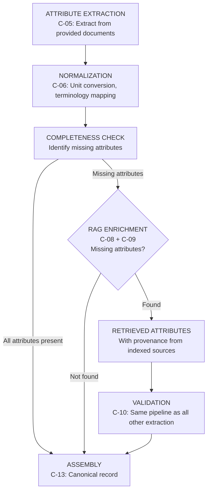
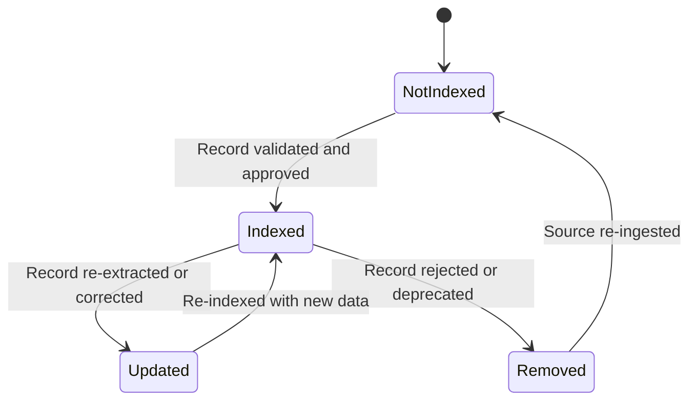
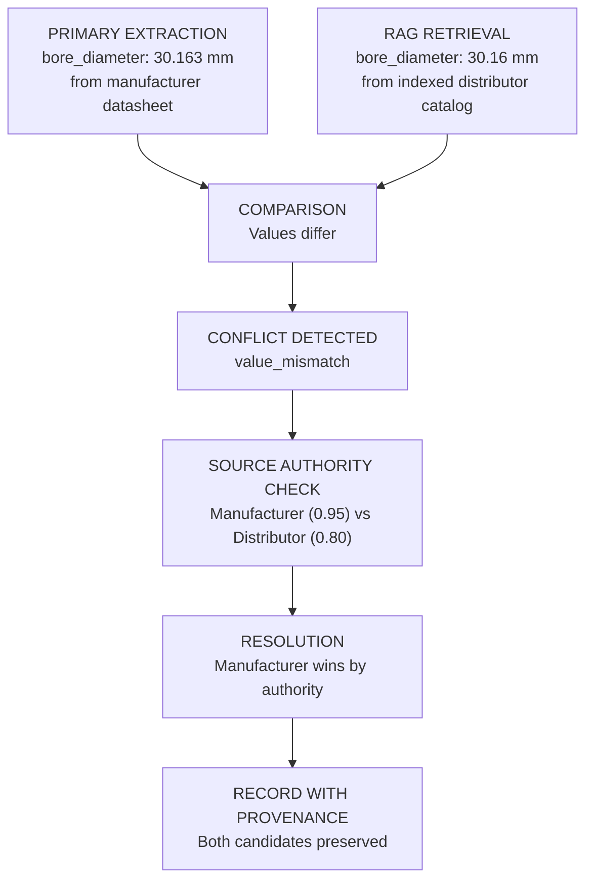
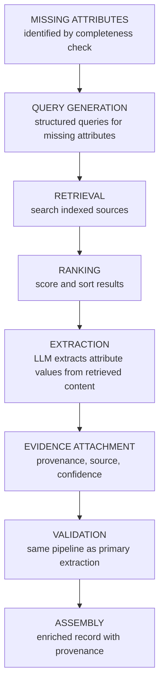
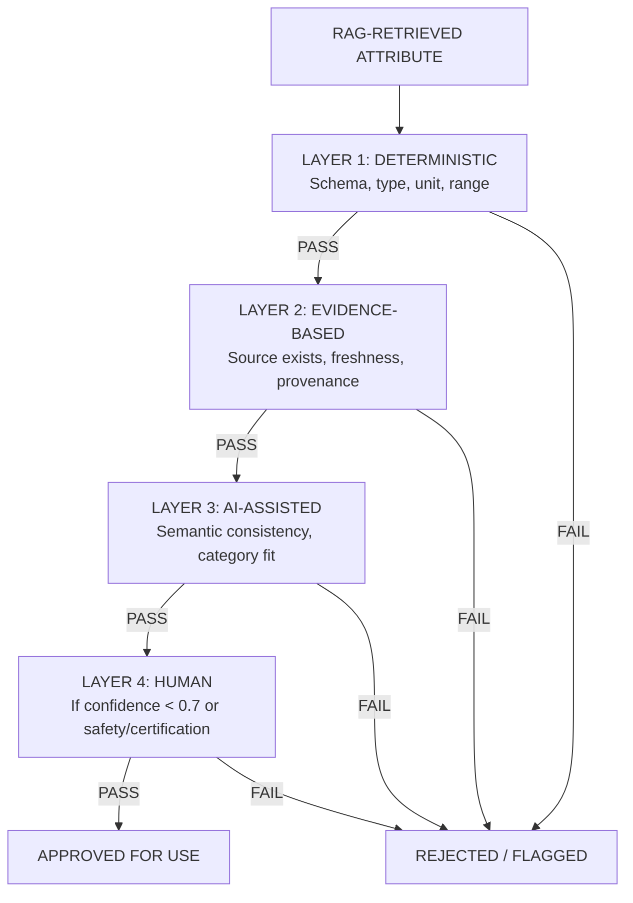
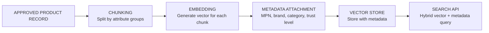

# RAG Strategy

> **Status:** Complete  
> **Module:** 3 — System Architecture & AI Strategy  
> **Purpose:** Define scope, indexing, retrieval, ranking, source authority, contradiction handling, and validation for Retrieval-Augmented Generation.  
> **Depends on:** `module-03-architecture.md`, `provenance-and-evidence-model.md`, `validation-and-lifecycle-model.md`, `attribute-taxonomy.md`

---

## 1. RAG Scope

### 1.1 What RAG Is Used For

RAG fills **missing attributes** when input is minimal. It is an enrichment mechanism, not the primary extraction path.

**RAG IS used for:**

| Use Case | Example |
|----------|---------|
| Filling missing attributes when input is minimal | Input is only MPN + brand; RAG retrieves specs from indexed datasheets |
| Cross-referencing extracted values against known product data | Extracted bore diameter is 30.163 mm; RAG retrieves manufacturer spec to confirm |
| Taxonomy code lookup | Product classified as "pillow block bearing"; RAG retrieves ETIM code from indexed taxonomy data |
| Material or certification lookup | Housing material not in source document; RAG retrieves from manufacturer catalog |

**RAG is NOT used for:**

| Anti-Pattern | Why Not |
|--------------|---------|
| Primary extraction from provided documents | Provided documents are parsed and extracted via C-02/C-05 directly. RAG adds no value when source content is already available. |
| Validation of extracted values | Validation is deterministic (Layer 1) or evidence-based (Layer 2). RAG retrieval is not authoritative enough to serve as validation. |
| Conflict resolution | Conflicts are resolved via source authority rules or human review. RAG retrieval is another source, not a resolution mechanism. |
| Replacing human review | RAG does not make trust decisions. It provides additional evidence for humans or automated systems to evaluate. |
| Generating product descriptions | Descriptions are extracted from source documents or generated by LLM with provenance, not retrieved from indexed corpora. |

### 1.2 Position in the Pipeline



RAG operates **after** primary extraction and normalization, **before** validation. Retrieved attributes enter the same validation pipeline as all other extracted values.

---

## 2. What Is Indexed

### 2.1 Indexed Content Types

| Content Type | Description | Chunking Strategy | When Indexed |
|-------------|-------------|-------------------|--------------|
| **Source documents** | PDFs, CSVs, web pages already ingested by the system | By product section or table row | After ingestion and extraction |
| **Extracted chunks** | Parsed text segments with product associations | Per product attribute group | After content extraction |
| **Product records** | Existing canonical product records in the system | Whole record with metadata | After assembly and approval |
| **Taxonomy data** | ETIM, UNSPSC, eCl@ss code tables | Per code entry | Pre-loaded, updated periodically |
| **Manufacturer catalogs** | External manufacturer data feeds | Per product entry | Ingested as source documents |

### 2.2 What Is NOT Indexed

| Content Type | Reason |
|-------------|--------|
| Raw source files (PDFs, images) | Too large, no structure. Indexed content is parsed and structured. |
| Unvalidated extractions | Only validated or approved records are indexed for retrieval. Unvalidated data could pollute results. |
| Conflicting values | Only the highest-authority candidate per attribute is indexed. Conflicts are resolved before indexing. |
| Inferred values without evidence | Values without source provenance are not indexed. |

### 2.3 Indexing Schema

Each indexed record contains:

```json
{
  "record_id": "uuid",
  "record_type": "product_record | extracted_chunk | taxonomy_entry",
  "product_identity": {
    "mpn": "UCF209-28",
    "brand": "IPTCI",
    "manufacturer_name": "IPTCI Bearings"
  },
  "category": "Mounted Bearings > Pillow Block",
  "attributes": [
    {
      "name": "bore_diameter",
      "value": { "value": 30.163, "unit": "mm" },
      "value_type": "measurement",
      "information_category": "technical_specification"
    }
  ],
  "source_reference": {
    "source_id": "uuid",
    "trust_level": "manufacturer_official",
    "freshness": "current",
    "last_verified": "2026-08-01"
  },
  "embedding": [0.12, -0.34, ...],
  "indexed_at": "2026-08-15T10:00:00Z"
}
```

### 2.4 Indexing Lifecycle



Records are only indexed after passing validation. This prevents unvalidated data from polluting retrieval results.

---

## 3. When RAG Is Invoked

### 3.1 Trigger Conditions

RAG is invoked **only** when the completeness check identifies missing attributes that cannot be filled from provided sources.

| Condition | Action | Example |
|-----------|--------|---------|
| Attribute has `missing_status: NOT_PROVIDED` | Query RAG for value | Bore diameter not in source CSV |
| Attribute has `missing_status: NOT_DISCOVERED` | Query RAG for value | Material not mentioned in document |
| Attribute has confidence < 0.5 | Query RAG for cross-reference | Extraction confidence too low; RAG provides secondary source |
| Category requires attribute not yet populated | Query RAG for category-required attribute | Pillow block requires bolt pattern; not in source |

### 3.2 Trigger Conditions — RAG Is NOT Invoked

| Condition | Reason |
|-----------|--------|
| All required attributes are populated with confidence ≥ 0.7 | No enrichment needed |
| Attribute has `missing_status: NOT_APPLICABLE` | Attribute does not apply to this product |
| Attribute already has ≥ 2 corroborating sources | Sufficient evidence already exists |
| Product record is fully validated | No gaps to fill |
| Input documents contain the information | Primary extraction should handle it |

---

## 4. Query Generation

### 4.1 Query Types

| Query Type | When Used | Example |
|-----------|-----------|---------|
| **Identity query** | Always — find the product by MPN/brand | `"UCF209-28" AND "IPTCI"` |
| **Attribute query** | When specific attribute is missing | `"UCF209-28" bore diameter specifications` |
| **Category query** | When category context is needed | `"pillow block bearing" specifications required attributes` |
| **Taxonomy query** | When taxonomy code is needed | `"pillow block bearing" ETIM classification code` |
| **Cross-reference query** | When extraction confidence is low | `"UCF209-28" load rating specifications` |

### 4.2 Query Construction Rules

| Rule | Description |
|------|-------------|
| **MPN is primary key** | All product queries include MPN as the primary search term |
| **Brand narrows scope** | Brand name is used as a filter, not a search term |
| **Attribute name is specific** | Use the attribute name from the taxonomy (e.g., `bore_diameter`, not "hole size") |
| **Category provides context** | Include category to disambiguate products with similar names |
| **No natural language queries** | Queries are structured, not conversational. "bore_diameter" not "what is the bore?" |
| **Bounded scope** | Query for specific missing attributes, not entire product specs |

### 4.3 Query Example

Given a product with MPN `UCF209-28`, brand `IPTCI`, category `Mounted Bearings > Pillow Block`, and missing `bolt_pattern` attribute:

```json
{
  "query_type": "attribute_query",
  "identity": {
    "mpn": "UCF209-28",
    "brand": "IPTCI"
  },
  "target_attribute": "bolt_pattern",
  "category": "Mounted Bearings > Pillow Block",
  "value_type": "compound",
  "expected_structure": {
    "bolt_size": "string",
    "bolt_count": "number",
    "bolt_spacing": "measurement"
  }
}
```

---

## 5. Retrieval Ranking

### 5.1 Ranking Factors

| Factor | Weight | Description |
|--------|--------|-------------|
| **Identity match** | 0.35 | Exact MPN match > partial match > category match |
| **Source authority** | 0.25 | Manufacturer official > authorized distributor > third-party verified > unverified |
| **Freshness** | 0.20 | Current > outdated > unknown |
| **Attribute specificity** | 0.15 | Product-specific data > series-level data > category-level data |
| **Extraction confidence** | 0.05 | High-confidence extraction > low-confidence extraction |

### 5.2 Ranking Formula

```
retrieval_score = (0.35 × identity_score)
                + (0.25 × authority_score)
                + (0.20 × freshness_score)
                + (0.15 × specificity_score)
                + (0.05 × extraction_confidence)
```

Where:
- `identity_score` = 1.0 for exact MPN match, 0.5 for brand-only match, 0.2 for category-only match
- `authority_score` = trust level mapped to 0.0–1.0 (manufacturer_official: 1.0, authorized_distributor: 0.8, third_party_verified: 0.6, third_party_unverified: 0.3, unknown: 0.1)
- `freshness_score` = 1.0 if current, 0.5 if outdated, 0.2 if unknown
- `specificity_score` = 1.0 if product-specific, 0.5 if series-level, 0.2 if category-level
- `extraction_confidence` = confidence of the extraction that produced the indexed value

### 5.3 Ranking Behavior

| Scenario | Expected Result |
|----------|----------------|
| Exact MPN match from manufacturer datasheet, current | Highest rank — likely used directly |
| Exact MPN match from distributor, current | High rank — used if manufacturer data unavailable |
| Brand match, different MPN, category match | Low rank — may be a related product, not the same |
| No identity match, category match only | Very low rank — used only as category-level reference |

---

## 6. Source Authority for Retrieved Data

### 6.1 Authority Model (Consistent with Module 3)

Retrieved data uses the same source authority model as all other data in the system (Section 8 of `module-03-architecture.md`).

| Factor | Weight | Description |
|--------|--------|-------------|
| **Source type** | 0.35 | Manufacturer official > authorized distributor > third-party verified > unverified |
| **Source freshness** | 0.25 | Current > outdated > unknown |
| **Specificity** | 0.20 | Product-specific > category-level > generic |
| **Consistency** | 0.15 | Agrees with other sources > single source > contradicts other sources |
| **Extraction confidence** | 0.05 | High extraction confidence > low extraction confidence |

### 6.2 Retrieved Data Is NOT Automatically Authoritative

Retrieved data is treated as **another source**, not as ground truth. It must:

1. Pass the same validation pipeline as primary extraction
2. Be assigned provenance with `extraction_method: "rag_retrieval"`
3. Be subject to conflict detection if it contradicts primary extraction
4. Be flagged for human review if confidence is low

### 6.3 Provenance for RAG-Retrieved Values

```json
{
  "extraction_method": "rag_retrieval",
  "source_document": "indexed-product-record:uuid-of-indexed-record",
  "source_location": {
    "record_id": "uuid-of-indexed-record",
    "attribute_name": "bore_diameter",
    "context": "retrieved from indexed manufacturer catalog"
  },
  "extraction_confidence": 0.85,
  "freshness": {
    "status": "current",
    "source_date": "2026-06-01",
    "retrieval_date": "2026-08-15"
  },
  "source_trust_score": 0.90,
  "enrichment_context": {
    "trigger": "missing_attribute",
    "missing_attribute": "bore_diameter",
    "query_type": "attribute_query",
    "retrieval_rank": 1,
    "retrieval_score": 0.87
  }
}
```

---

## 7. Contradiction Surfacing

### 7.1 When Retrieved Data Contradicts Primary Extraction



### 7.2 Contradiction Rules

| Scenario | Action |
|----------|--------|
| Retrieved value matches primary extraction | Increase confidence; add corroborating source |
| Retrieved value differs by < 1% (measurement) | Flag as minor discrepancy; do not create conflict |
| Retrieved value differs by ≥ 1% (measurement) | Create `value_mismatch` conflict |
| Retrieved value has different unit (same physical value) | Normalize; no conflict if convertible |
| Retrieved value explicitly contradicts primary | Create `source_contradiction` conflict; always escalate |
| Retrieved source is less authoritative than primary | Primary wins; retrieved value preserved as alternative candidate |
| Retrieved source is more authoritative than primary | Flag for review; do not silently replace primary |

### 7.3 Contradiction Is Data

Following the Module 2 principle "Contradictions Are Data":

1. Both values are preserved with their sources
2. A conflict record is created
3. The attribute's `conflict_status` is set to `pending_resolution`
4. No candidate is silently overwritten
5. The conflict is visible to human reviewers

---

## 8. How Retrieved Evidence Feeds Enrichment

### 8.1 Enrichment Flow



### 8.2 Evidence Requirements

Every enriched attribute must have:

| Evidence Field | Required? | Description |
|---------------|-----------|-------------|
| `source_document` | Yes | Reference to the indexed record that provided the value |
| `source_location` | Yes | Where in the indexed record the value was found |
| `extraction_method` | Yes | Always `rag_retrieval` |
| `extraction_confidence` | Yes | Confidence of the extraction from retrieved content |
| `freshness` | Yes | When the source was last verified |
| `source_trust_score` | Yes | Authority of the source |
| `enrichment_context` | Yes | Why RAG was invoked, what query was used, what rank the result had |

### 8.3 Enrichment Confidence Penalty

Retrieved values receive a confidence penalty compared to directly extracted values:

```
enrichment_confidence = retrieval_score × extraction_confidence × 0.9
```

The 0.9 factor accounts for the additional uncertainty introduced by retrieval (potential wrong product match, outdated index, etc.).

---

## 9. When RAG Should NOT Be Used

| Situation | Reason | Alternative |
|-----------|--------|-------------|
| Source documents are available | Primary extraction is more reliable than retrieval | Use C-02/C-05 extraction pipeline |
| Attribute is safety-critical | RAG retrieval is not sufficient for safety decisions | Route to human review |
| Attribute is certification-related | Certifications require verified evidence | Route to human review |
| Conflict exists between primary sources | RAG adds another source, not a resolution | Use conflict resolution pipeline |
| Product is not yet indexed | RAG cannot retrieve what isn't indexed | Mark as NOT_DISCOVERED |
| Attribute requires current real-time data | Indexed data may be stale | Use live API lookup (not RAG) |
| Input already provides the information | RAG adds unnecessary latency and cost | Use primary extraction |
| Attribute is derived from other attributes | Derived values are computed, not retrieved | Use derivation rules |

---

## 10. RAG Validation Strategy

### 10.1 Validation Layers for RAG-Retrieved Data

RAG-retrieved data passes through **all four validation layers**, identical to primary extraction:



### 10.2 Specific RAG Validation Checks

| Check | Layer | What It Verifies |
|-------|-------|-----------------|
| **Retrieved value type matches expected type** | 1 | `bore_diameter` is a measurement, not a string |
| **Retrieved value is within physical range** | 1 | Bore diameter > 0 and < 1000 mm for bearings |
| **Source record exists and is accessible** | 2 | Indexed record is still in the index |
| **Source freshness is acceptable** | 2 | Source is not stale (> 2 years old) |
| **Provenance chain is complete** | 2 | All required provenance fields are present |
| **Retrieved value is semantically plausible** | 3 | Bore diameter of 30 mm makes sense for a bearing |
| **Retrieved value fits the product category** | 3 | Pillow block bearings have bolt patterns |
| **Retrieved value does not contradict primary extraction** | 3 | No conflict with existing extracted values |
| **Low-confidence retrieved values routed to human** | 4 | Enrichment confidence < 0.7 → human review |

### 10.3 RAG-Specific Failure Modes

| Failure Mode | Detection | Handling |
|-------------|-----------|----------|
| **Wrong product matched** | Identity mismatch (MPN doesn't match) | Reject retrieved value; mark as `wrong_product_match` |
| **Outdated data retrieved** | Freshness check fails | Flag as `stale_source`; use only if no better source available |
| **Irrelevant retrieval** | Category mismatch or attribute doesn't apply | Discard result; mark as `irrelevant_retrieval` |
| **Hallucinated retrieval** | Source record doesn't exist in index | Detect during source verification; reject value |
| **Duplicate retrieval** | Same value from multiple indexed records | Deduplicate; keep highest-authority source |
| **Index drift** | Indexed data no longer matches source | Re-index on source update; detect via freshness monitoring |

### 10.4 RAG Quality Metrics

| Metric | What It Measures | Target |
|--------|-----------------|--------|
| **Retrieval precision** | % of retrieved results that are relevant | ≥ 80% |
| **Retrieval recall** | % of missing attributes that RAG can fill | ≥ 60% |
| **Wrong product match rate** | % of retrievals that match the wrong product | ≤ 5% |
| **Enrichment accuracy** | % of RAG-retrieved values that match ground truth | ≥ 85% |
| **Stale source rate** | % of retrievals from outdated sources | ≤ 15% |
| **Validation pass rate** | % of RAG-retrieved values that pass all validation layers | ≥ 90% |

---

## 11. RAG Evaluation

### 11.1 Evaluation Procedure

1. **Test set:** 50 products with known complete specifications
2. **Artificial gap creation:** Remove 20% of attributes from each product
3. **RAG enrichment:** Run RAG to fill the gaps
4. **Comparison:** Compare RAG-retrieved values against ground truth
5. **Measurement:** Calculate precision, recall, accuracy, wrong-match rate

### 11.2 Evaluation Dimensions

| Dimension | What It Measures | How |
|-----------|-----------------|-----|
| **Can RAG find the right product?** | Identity match accuracy | % of retrievals with exact MPN match |
| **Can RAG find the right attribute?** | Attribute match accuracy | % of retrievals where the attribute exists |
| **Is the retrieved value correct?** | Value accuracy | % of retrieved values matching ground truth |
| **Does RAG add value over no enrichment?** | Completeness improvement | Completeness score before vs. after RAG |
| **Does RAG introduce errors?** | Error injection rate | % of RAG-retrieved values that are wrong |

---

## 12. Technology Considerations

### 12.1 Vector Store Requirements

| Requirement | Description |
|------------|-------------|
| **Embedding model** | Must produce embeddings that capture product identity and attribute semantics |
| **Metadata filtering** | Must support filtering by MPN, brand, category, source trust level |
| **Similarity search** | Must support cosine similarity for semantic matching |
| **Hybrid search** | Combine vector similarity with structured metadata filters |
| **Scale** | Must handle 100K+ indexed product records |

### 12.2 Indexing Pipeline



### 12.3 Refresh Strategy

| Trigger | Action |
|---------|--------|
| New product record approved | Index the new record |
| Existing record updated | Re-index the updated record |
| Record rejected or deprecated | Remove from index |
| Source document updated | Re-extract and re-index affected records |
| Periodic refresh (monthly) | Re-verify freshness of all indexed records |

---

*This document defines the RAG strategy within the Hybrid Pipeline architecture. RAG is a targeted enrichment tool, not a replacement for primary extraction, validation, or human review. Every RAG-retrieved value must earn its place through the same validation pipeline as all other data in the system.*
