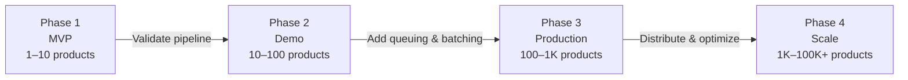
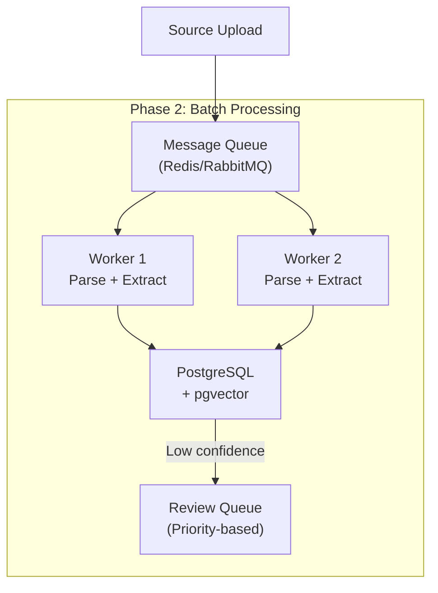
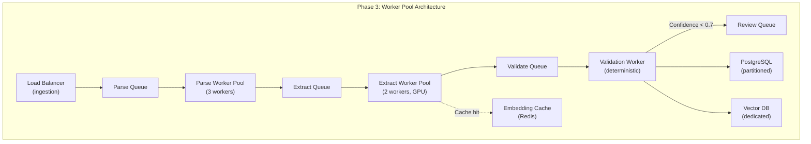
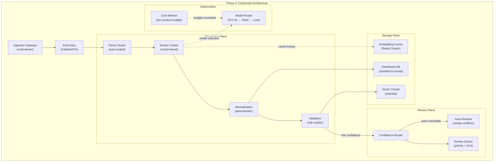
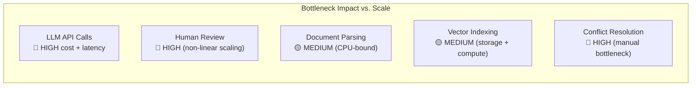
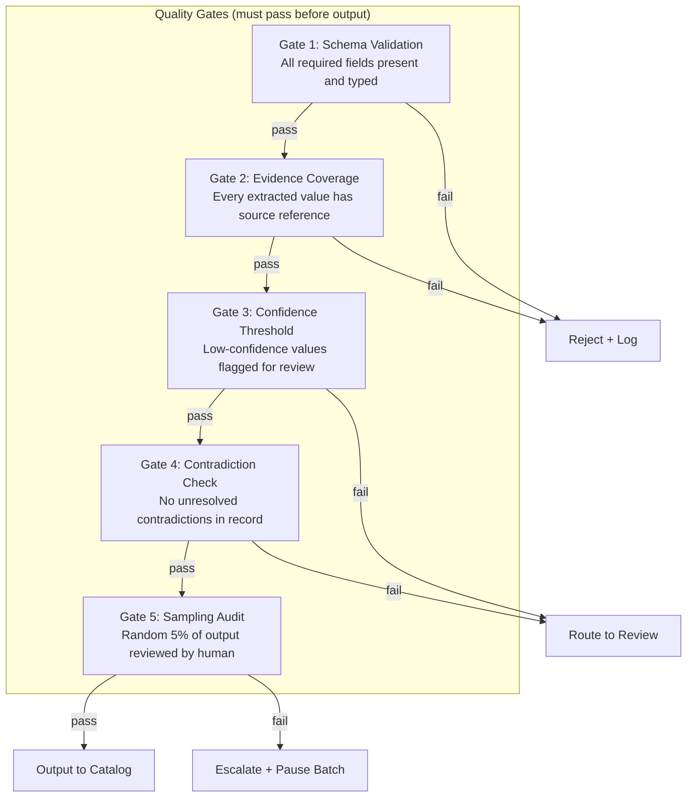
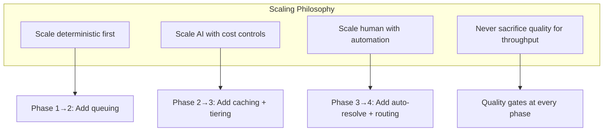

# Scalability Strategy

> **Status:** Complete  
> **Module:** 3 — System Architecture & AI Strategy  
> **Purpose:** Define the scaling path from MVP to production, including phase transitions, bottleneck analysis, cost modeling, and quality preservation under load.  
> **Depends on:** `module-03-architecture.md`, `container-architecture.md`, `ai-pipeline.md`, `risks-and-failure-modes.md`

---

## 1. Scaling Overview

### 1.1 Scaling Dimensions

The system scales across four independent dimensions:

| Dimension | What scales | Primary constraint |
|-----------|-------------|-------------------|
| **Product volume** | Number of distinct products | Storage, indexing, human review throughput |
| **Source volume** | Number of documents per product | Parse CPU, LLM API costs, embedding storage |
| **Attribute density** | Attributes per product record | Schema complexity, validation cost |
| **User concurrency** | Simultaneous queries and reviews | Retrieval latency, review queue contention |

### 1.2 Core Scaling Principle

> **Scale the deterministic path first. Scale the AI path second. Scale the human path last.**

Deterministic components (parsing, normalization, validation) scale predictably with infrastructure. AI components scale with cost and latency constraints. Human components do not scale linearly under any configuration.

---

## 2. Scaling Phases

### 2.1 Phase Overview



---

### 2.2 Phase 1 — MVP (1–10 products)

**Objective:** Prove the pipeline works correctly for a small catalog.

| Aspect | Configuration |
|--------|--------------|
| Processing model | Sequential, single-threaded |
| Infrastructure | Single machine (laptop/dev server) |
| Storage | SQLite or flat files |
| LLM calls | One-at-a-time, synchronous |
| Document parsing | Sequential PDF/text parsing |
| Vector store | Local or in-memory |
| Human review | Manual, ad-hoc |
| Deployment | `docker compose up` on local machine |

**Scaling characteristics:**
- LLM latency dominates. A 10-product pilot with 3 sources each = ~30 LLM calls. At ~5s/call, total pipeline time is ~2.5 minutes.
- No concurrency issues. No queue contention. No cost optimization needed.
- Quality validation is manual. Human review is the bottleneck but volume is low enough that it doesn't matter.

**Exit criteria for Phase 2:**
- Pipeline produces correct output for all 10 products
- Evidence attachment works for all source types
- Validation catches at least the 3 most common error types
- No silent failures in the extraction-to-storage path

---

### 2.3 Phase 2 — Demo (10–100 products)

**Objective:** Demonstrate batch processing capability and initial automation.

| Aspect | Configuration |
|--------|--------------|
| Processing model | Batch with message queue |
| Infrastructure | Single machine or small VM |
| Storage | PostgreSQL + vector extension |
| LLM calls | Batched, rate-limited, retry-aware |
| Document parsing | Parallelized (2–4 workers) |
| Vector store | pgvector or Chroma (local) |
| Human review | Structured review queue |
| Deployment | Docker Compose with service separation |



**Scaling characteristics:**
- 100 products × 3 sources = ~300 LLM calls. At $0.01/call average, cost is ~$3.00 per batch.
- Parallel parsing reduces wall-clock time by ~40–60% on multi-core machines.
- Queue-based processing enables retry and failure isolation.
- Review queue enables prioritization (high-value products first).

**Exit criteria for Phase 3:**
- Batch processing completes without manual intervention
- Queue handles worker failure (retry, dead-letter)
- Cost per product is measurable and within budget
- Review queue sorts by confidence or business priority

---

### 2.4 Phase 3 — Production (100–1,000 products)

**Objective:** Production-grade processing with caching, worker pools, and cost controls.

| Aspect | Configuration |
|--------|--------------|
| Processing model | Worker pools with concurrency limits |
| Infrastructure | Multi-service deployment (VMs or managed containers) |
| Storage | PostgreSQL (partitioned) + dedicated vector DB |
| LLM calls | Cached embeddings, batch prompts, model tiering |
| Document parsing | Dedicated parse workers with CPU limits |
| Vector store | Dedicated instance (Qdrant, Weaviate, or managed) |
| Human review | Confidence-routed, role-based assignment |
| Deployment | Container orchestration (Docker Compose → K3s) |



**Scaling characteristics:**
- Worker pools enable horizontal scaling of CPU-bound stages (parsing) and API-bound stages (extraction) independently.
- Embedding cache prevents redundant LLM calls for similar products. Estimated 20–40% cache hit rate on industrial catalogs with overlapping manufacturers.
- Partitioned PostgreSQL keeps query latency stable as product count grows.
- Confidence-based routing reduces human review load by 50–70% (only low-confidence attributes require review).

**Exit criteria for Phase 4:**
- Worker pools auto-scale based on queue depth
- Cache hit rate exceeds 20%
- Cost per product is under target threshold
- Review queue backlog stays under SLA
- System processes 1,000 products in under 24 hours

---

### 2.5 Phase 4 — Scale (1,000–100,000+ products)

**Objective:** Distributed processing with model cost optimization and minimal human intervention.

| Aspect | Configuration |
|--------|--------------|
| Processing model | Distributed workers, event-driven |
| Infrastructure | Kubernetes or managed serverless |
| Storage | Distributed PostgreSQL (Citus/Aurora) + vector DB cluster |
| LLM calls | Model tiering, prompt compression, fine-tuned fallback |
| Document parsing | Horizontal auto-scaling, format-specific workers |
| Vector store | Distributed cluster with sharding |
| Human review | Exception-based only (top 5–10% of output) |
| Deployment | Kubernetes with horizontal pod autoscaling |



**Scaling characteristics:**
- Event-driven architecture decouples stages. Each stage scales independently based on queue depth.
- Model tiering routes simple extractions to cheaper/faster models (GPT-4o-mini) and complex extractions to stronger models (GPT-4o). Estimated 60–70% cost reduction.
- Prompt compression and few-shot caching reduce token usage per call by 30–50%.
- Sharded storage keeps query latency under 200ms at 100K+ products.
- Auto-resolve handles simple conflicts (duplicate sources, minor unit variations) without human review.

---

## 3. Bottleneck Analysis

### 3.1 Bottleneck Matrix



### 3.2 Bottleneck Detail

| Bottleneck | Phase it bites | Why it's a bottleneck | Scaling behavior |
|------------|---------------|----------------------|-----------------|
| **LLM API calls** | All phases | Cost scales linearly with product count. Latency per call is ~2–8s. Rate limits impose hard ceilings. | O(n × sources × attributes) |
| **Human review** | Phase 2+ | Does not scale with infrastructure. Each reviewed attribute requires domain expertise and judgment. | O(n) but with high constant factor and fatigue |
| **Document parsing** | Phase 3+ | CPU-bound for large PDFs (50+ pages). Memory-intensive for image-heavy documents. | Linear with document count, superlinear with document complexity |
| **Vector indexing** | Phase 3+ | Embedding storage grows with product × attribute count. Index rebuild time grows with total vectors. | O(n × attributes) for storage, O(log n) for query |
| **Conflict resolution** | Phase 3+ | Manual resolution requires domain knowledge. Automated resolution handles only simple cases. | Sublinear (most conflicts are duplicates), but edge cases are expensive |

### 3.3 Cost Scaling Model

```
Total Cost = Parsing Cost + LLM Cost + Storage Cost + Human Cost

Where:
  Parsing Cost    = documents × avg_parse_time × compute_rate
  LLM Cost        = (products × sources × calls_per_source) × cost_per_call
  Storage Cost    = (products × attributes × 4KB) + (embeddings × 768 × 4B)
  Human Cost      = review_queue × time_per_review × reviewer_rate
```

**Example at scale:**

| Scale | Products | Sources | LLM Calls | LLM Cost | Parse Time | Human Reviews | Human Cost |
|-------|----------|---------|-----------|----------|------------|--------------|------------|
| MVP | 10 | 30 | 300 | $3 | 30 min | 50 | $50 |
| Demo | 100 | 300 | 3,000 | $30 | 5 hrs | 500 | $500 |
| Production | 1,000 | 3,000 | 30,000 | $150 | 50 hrs | 3,000 | $3,000 |
| Scale | 100,000 | 300,000 | 1,500,000 | $3,000 | 2,000 hrs | 50,000 | $50,000 |

*Note: Phase 4 costs assume model tiering (50% reduction) and caching (20% reduction). Human reviews assume confidence routing (reduces to top 5%).*

---

## 4. Mitigation Strategies

### 4.1 LLM API Cost Mitigation

| Strategy | Impact | Phase |
|----------|--------|-------|
| **Embedding cache** — Reuse embeddings for duplicate/near-duplicate products | 20–40% call reduction | Phase 2+ |
| **Batch prompts** — Extract multiple attributes in a single prompt | 30–50% token reduction | Phase 2+ |
| **Model tiering** — Route simple extractions to cheaper models | 50–60% cost reduction | Phase 3+ |
| **Prompt compression** — Remove redundant context from prompts | 20–30% token reduction | Phase 3+ |
| **Fine-tuned fallback** — Use fine-tuned models for common product categories | 40–60% cost reduction for repeat categories | Phase 4 |
| **Rate limit management** — Token bucket with backoff, not burst | Prevents cost spikes | All phases |

### 4.2 Human Review Mitigation

| Strategy | Impact | Phase |
|----------|--------|-------|
| **Confidence routing** — Only route low-confidence attributes to review | 50–70% review reduction | Phase 2+ |
| **Priority queue** — High-value products reviewed first | Better time allocation | Phase 2+ |
| **Bulk approve** — Reviewer approves/disapproves entire confidence bands | 3–5× throughput | Phase 3+ |
| **Auto-resolve simple conflicts** — Duplicate sources, minor unit variations | 20–30% conflict reduction | Phase 3+ |
| **Active learning** — Feed review decisions back to improve confidence model | Reduces future review load | Phase 4 |

### 4.3 Document Parsing Mitigation

| Strategy | Impact | Phase |
|----------|--------|-------|
| **Parallel parsing** — Parse multiple documents concurrently | 2–4× throughput on multi-core | Phase 2+ |
| **Format-specific workers** — Dedicated parsers for PDF, HTML, CSV, images | Better resource utilization | Phase 3+ |
| **Streaming parse** — Process large PDFs page-by-page without loading entirely | Reduced memory, lower OOM risk | Phase 3+ |
| **Pre-filtering** — Skip already-parsed documents, detect duplicates early | Avoids redundant work | Phase 2+ |

### 4.4 Vector Indexing Mitigation

| Strategy | Impact | Phase |
|----------|--------|-------|
| **Incremental indexing** — Index only new/changed vectors, not full rebuild | 90%+ index time reduction | Phase 3+ |
| **Sharding** — Partition vectors by brand/category | Horizontal scaling | Phase 4 |
| **Quantization** — Reduce embedding precision (float32 → int8) | 75% storage reduction | Phase 4 |
| **Hybrid search** — Combine vector + keyword search to reduce vector dependency | Lower recall latency | Phase 3+ |

### 4.5 Conflict Resolution Mitigation

| Strategy | Impact | Phase |
|----------|--------|-------|
| **Rule-based auto-resolve** — Handle known conflict patterns automatically | 20–30% conflict reduction | Phase 2+ |
| **Source priority** — Prefer manufacturer > distributor > aggregator | Reduces ambiguity | Phase 2+ |
| **Temporal priority** — Prefer newer sources | Reduces staleness conflicts | Phase 3+ |
| **Majority voting** — When 3+ sources agree, auto-resolve | 40–60% conflict reduction | Phase 3+ |
| **Confidence-weighted merge** — Weight sources by extraction confidence | Higher quality auto-resolve | Phase 4 |

---

## 5. Quality Degradation Prevention

### 5.1 Quality Risk Under Scale

Scaling introduces quality risks that don't exist at MVP scale:

| Risk | Why it appears at scale | Mitigation |
|------|------------------------|------------|
| **Drift** — Model behavior changes subtly as prompts accumulate variations | Prompt versioning, eval regression tests |
| **Throughput over correctness** — Pressure to process faster reduces validation rigor | Hard validation gates, never skip validation for speed |
| **Reviewer fatigue** — High queue volumes reduce review quality | Rotation, batch size limits, confidence-based filtering |
| **Cache staleness** — Cached embeddings used after source content changes | TTL-based cache invalidation, source-changed events |
| **Model inconsistency** — Different models (tiering) produce different extraction styles | Per-model validation rules, model-specific prompts |

### 5.2 Quality Gates



### 5.3 Regression Testing

At scale, regression testing prevents quality degradation:

- **Golden dataset** — Fixed set of 50 products with known-correct output. Run after every pipeline change.
- **Adversarial inputs** — Documents designed to trigger common failure modes (ambiguous specs, conflicting units, missing data).
- **Cost regression** — Track cost-per-product over time. Alert if cost increases >10% without volume explanation.
- **Latency regression** — Track p50/p95/p99 latency per stage. Alert if p95 exceeds SLA.

---

## 6. Phase Transition Triggers

| Trigger | From → To | Condition |
|---------|-----------|-----------|
| Pipeline correctness validated | Phase 1 → Phase 2 | All 10 products process correctly with evidence |
| Batch processing stable | Phase 2 → Phase 3 | Queue handles failures, cost is measurable |
| Worker pools auto-scale | Phase 3 → Phase 4 | Queue depth triggers scaling, cache hit rate >20% |
| Review backlog exceeds SLA | Any phase | Pause ingestion, prioritize review, consider additional reviewers |
| Cost per product exceeds budget | Any phase | Switch to cheaper model tier, increase cache TTL, reduce source count |

---

## 7. Monitoring & Alerting

### 7.1 Metrics per Phase

| Metric | MVP | Demo | Production | Scale |
|--------|-----|------|------------|-------|
| Products processed/hour | Manual | 10–20 | 50–100 | 500+ |
| LLM cost/product | $0.30 | $0.30 | $0.15 | $0.05 |
| Review queue depth | N/A | <50 | <200 | <1,000 |
| Pipeline error rate | <5% | <2% | <1% | <0.5% |
| Cache hit rate | N/A | N/A | >20% | >40% |
| p95 extraction latency | N/A | <30s | <15s | <10s |

### 7.2 Alert Thresholds

| Alert | Threshold | Action |
|-------|-----------|--------|
| Cost spike | >2× daily average | Pause non-critical extractions |
| Review backlog | >500 items | Escalate to additional reviewers |
| Parse failure rate | >5% in 1 hour | Investigate source format changes |
| Cache miss rate | >80% over 24 hours | Review cache invalidation logic |
| Worker pool saturation | >90% utilization for 10 min | Scale workers or throttle ingestion |

---

## 8. Assumptions and Risks

### 8.1 Assumptions

- LLM API pricing remains roughly stable (±30%) over the project timeline
- Industrial product catalogs have moderate deduplication potential (20–40% overlap across manufacturers)
- Confidence-based routing correctly identifies 50–70% of review-worthy attributes
- Simple conflicts (duplicates, minor variations) represent at least 40% of all conflicts

### 8.2 Risks

| Risk | Impact | Likelihood | Mitigation |
|------|--------|------------|------------|
| LLM API rate limits block batch processing | High | Medium | Implement token bucket, retry with backoff, multi-provider fallback |
| Human review becomes bottleneck before automation catches up | High | High | Front-load confidence routing development, invest in auto-resolve early |
| Embedding cache invalidation is too aggressive | Medium | Medium | Source-changed events, not time-based TTL |
| Model tiering introduces inconsistent extraction quality | Medium | Medium | Per-model eval suite, model-specific validation rules |
| Cost model assumptions are wrong | Medium | Low | Track actual cost from Phase 2, adjust projections quarterly |

---

## 9. Summary



The system is designed to scale from 1 to 100,000+ products without architectural rewrites. Each phase transition adds infrastructure complexity only when the current phase's limitations are validated and measured — not preemptively.

The primary scaling constraint is human review. Every mitigation strategy should prioritize reducing the volume of attributes that require human judgment, rather than adding more reviewers.
