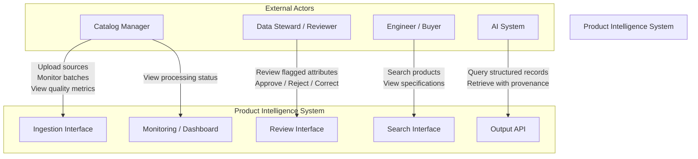
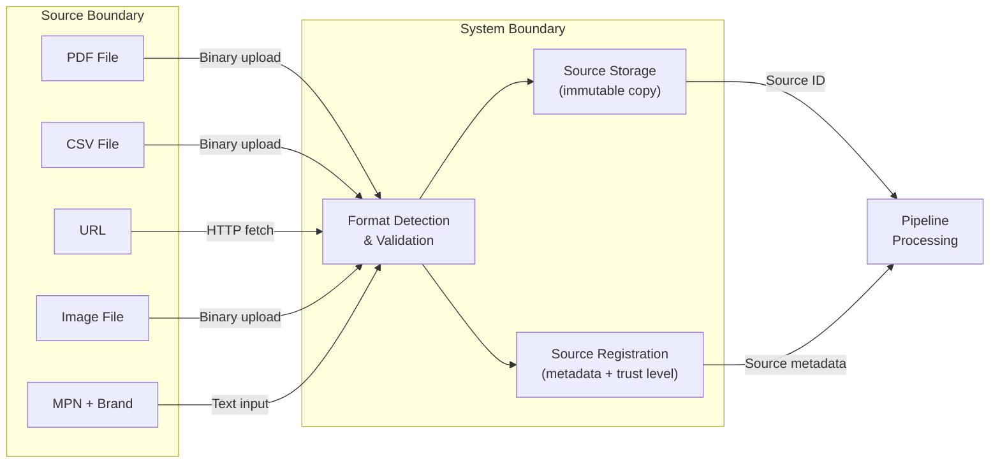
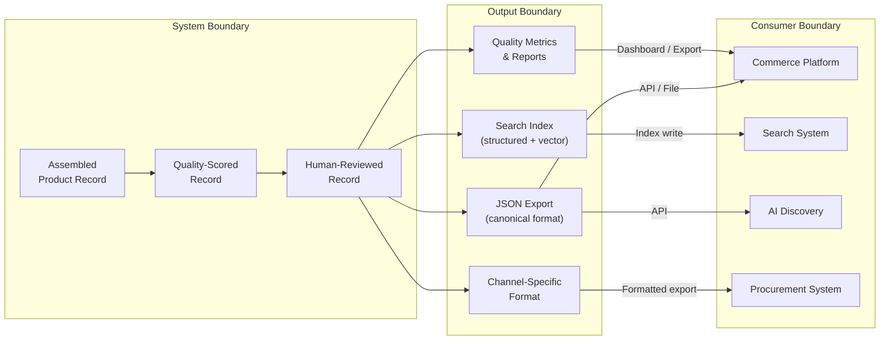
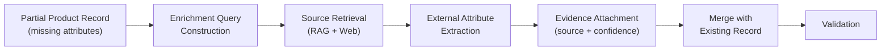
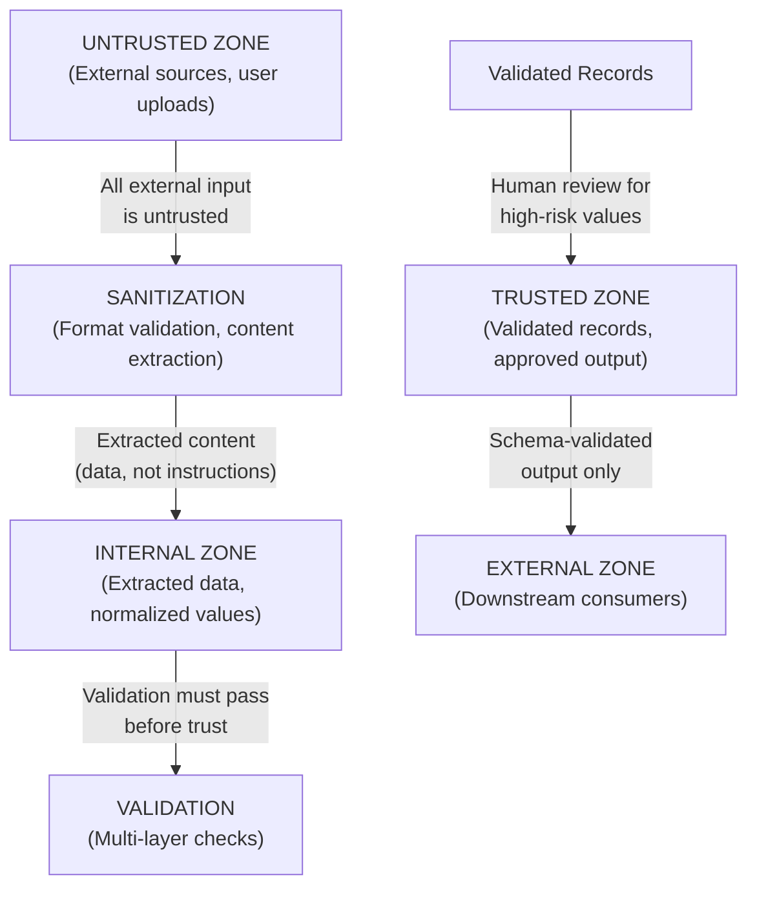

# System Context

> **Status:** Complete  
> **Module:** 3 — System Architecture & AI Strategy  
> **Purpose:** Define system boundaries, actors, external interfaces, and boundary-level data flow.  
> **Depends on:** All Module 1 and Module 2 documents, `module-03-architecture.md`

---

## 1. System Purpose

The Product Intelligence System transforms fragmented, incomplete, multimodal industrial product information into structured, validated, provenance-tracked, commerce-ready product intelligence.

It is **not** a document-to-JSON converter. It is an intelligence pipeline that:

- Ingests heterogeneous source material (PDFs, CSVs, web pages, images, ERP exports)
- Extracts and normalizes structured attributes with full provenance
- Validates extracted data through multiple layers
- Detects and resolves conflicts across sources
- Enriches incomplete records from external sources
- Routes uncertain values to human review
- Produces commerce-ready output with quality scores and traceability

---

## 2. System Boundaries

### 2.1 What Is Inside the System

| Boundary | Scope |
|----------|-------|
| **Ingestion** | Source document acceptance, format detection, storage |
| **Extraction** | Content parsing, product isolation, attribute extraction |
| **Normalization** | Unit conversion, terminology mapping, format standardization |
| **Evidence** | Provenance tracking, source location, confidence scoring |
| **Enrichment** | Retrieval, external source lookup, missing attribute filling |
| **Validation** | Schema, type, range, cross-field, cross-source checks |
| **Conflict** | Detection, classification, resolution, escalation |
| **Assembly** | Canonical record construction, quality scoring |
| **Human Review** | Evidence-based review interface, decision recording |
| **Output** | Structured export, search indexing, channel formatting |

### 2.2 What Is Outside the System

| External Element | Relationship |
|-----------------|--------------|
| Source document repositories | Upstream — files are provided to the system |
| Manufacturer websites | Upstream — web content fetched during enrichment |
| External databases (ETIM, UNSPSC, eCl@ss) | Upstream — taxonomy lookups during classification |
| Commerce platforms | Downstream — consume structured product data |
| Search engines | Downstream — index product records |
| Procurement systems | Downstream — query product specifications |
| AI discovery engines | Downstream — consume machine-readable attributes |

---

## 3. Actors (Users and Roles)

### 3.1 Actor Definitions

| Actor | Description | Primary Concern | Access Scope |
|-------|-------------|----------------|-------------|
| **Catalog Manager** | Owns the product catalog end-to-end | Batch processing status, quality metrics, catalog completeness | Ingestion, monitoring, reporting |
| **Data Steward / Reviewer** | Reviews and approves AI-generated product data | Evidence quality, correctness, conflict resolution | Review queue, evidence view, approve/reject/correct |
| **Engineer / Buyer** | End consumer of product intelligence | Accurate specs, provenance, searchability | Search, browse, view product records |
| **AI System** | Automated consumer of structured output | Machine-readable attributes with units and provenance | API access to structured records |

### 3.2 Actor-System Interactions

### 3.3 Actor Responsibilities

#### Catalog Manager

- Uploads source documents (PDFs, CSVs, images, URLs)
- Initiates batch processing jobs
- Monitors processing progress and throughput
- Reviews quality dashboards (completeness, confidence, conflict rates)
- Manages source document lifecycle (add, update, deprecate)
- Escalates systemic issues to Data Stewards

#### Data Steward / Reviewer

- Reviews attributes flagged for human review
- Evaluates evidence chain (source, location, confidence, conflicting sources)
- Approves, rejects, or corrects attribute values
- Resolves conflicts that automated resolution cannot handle
- Validates high-risk attributes (safety, certification, compliance)
- Provides feedback that calibrates future confidence scoring

#### Engineer / Buyer

- Searches products by MPN, brand, category, or specifications
- Filters by technical attributes (dimensions, materials, ratings)
- Views full product records including provenance and confidence
- Exports product data for procurement or design use
- Reports data quality issues for steward review

#### AI System (Downstream Consumer)

- Queries product records via structured API
- Consumes machine-readable attributes with units
- Uses provenance data to assess trustworthiness
- Integrates product intelligence into recommendation or procurement workflows

---

## 4. External Systems and Interfaces

### 4.1 Upstream Sources (Input Boundary)

| Source Type | Format | Interface | Content | Priority |
|------------|--------|-----------|---------|----------|
| **PDF Datasheets** | PDF | File upload / filesystem | Product specifications, tables, diagrams | P0 |
| **CSV/Excel Supplier Feeds** | CSV, XLSX | File upload / filesystem | Tabular product data with varying schemas | P0 |
| **Web Pages** | HTML | URL fetch (HTTP) | Manufacturer product pages, distributor listings | P1 |
| **Product Images** | PNG, JPG, TIFF | File upload / filesystem | Labels, nameplates, technical drawings | P1 |
| **Scanned Documents** | PDF (image-based) | File upload / filesystem | Legacy catalogs, paper datasheets | P1 |
| **ERP Exports** | CSV, XML, JSON | File upload / API | Internal product master data | P2 |
| **MPN + Brand (Minimal Input)** | Text | API / manual entry | Product identity only — triggers enrichment | P0 |

### 4.2 External Data Sources (Enrichment Boundary)

| Source | Purpose | Interface | Trust Level |
|--------|---------|-----------|-------------|
| **Manufacturer Websites** | Official specifications, datasheets | Web fetch (HTTP/HTTPS) | High (when official) |
| **Taxonomy Databases (ETIM, UNSPSC, eCl@ss, GS1 GPC)** | Category codes, attribute schemas | API / offline index | High (authoritative) |
| **Distributor Catalogs** | Cross-reference, availability, pricing signals | Web fetch / API | Medium |
| **Indexed Knowledge Base** | Previously ingested product data | Internal retrieval (RAG) | Variable (depends on original source) |

### 4.3 Downstream Consumers (Output Boundary)

| Consumer | Data Need | Interface | Format |
|----------|-----------|-----------|--------|
| **Commerce Platforms** | Product listings with attributes, images, descriptions | API export / file export | JSON, CSV, channel-specific |
| **Search Systems** | Indexed product records for search and filtering | Search index write | Structured index |
| **AI Discovery Engines** | Machine-readable attributes with provenance | API (JSON) | Canonical JSON with metadata |
| **Procurement Systems** | Specifications, compliance data, sourcing info | API export / file export | JSON, CSV |
| **Analytics / BI** | Quality metrics, processing stats, catalog health | Analytics export | Aggregated metrics |

---

## 5. System Context Diagram

```mermaid
graph TB
    subgraph "UPSTREAM SOURCES"
        PDF["PDF Datasheets<br/>(P0)"]
        CSV["CSV / Excel Feeds<br/>(P0)"]
        WEB["Web Pages<br/>(P1)"]
        IMG["Images / Scans<br/>(P1)"]
        ERP["ERP Exports<br/>(P2)"]
        MPN["MPN + Brand<br/>(Minimal Input)"]
    end

    subgraph "ACTORS"
        CM["Catalog Manager<br/>Upload • Monitor • Manage"]
        DS["Data Steward<br/>Review • Approve • Correct"]
        EB["Engineer / Buyer<br/>Search • View • Export"]
    end

    subgraph "PRODUCT INTELLIGENCE SYSTEM"
        INGEST["Ingestion"]
        EXTRACT["Extraction"]
        NORMALIZE["Normalization"]
        EVIDENCE["Evidence & Provenance"]
        ENRICH["Enrichment"]
        VALIDATE["Validation"]
        CONFLICT["Conflict Detection & Resolution"]
        ASSEMBLE["Assembly & Quality Scoring"]
        REVIEW["Human Review"]
        OUTPUT["Output & Publishing"]
    end

    subgraph "EXTERNAL DATA SOURCES"
        MFR["Manufacturer Websites"]
        TAX["Taxonomy Databases<br/>(ETIM, UNSPSC, eCl@ss)"]
        DIST["Distributor Catalogs"]
        KB["Indexed Knowledge Base"]
    end

    subgraph "DOWNSTREAM CONSUMERS"
        COMMERCE["Commerce Platforms"]
        SEARCH["Search Systems"]
        AIDISCOVER["AI Discovery Engines"]
        PROCURE["Procurement Systems"]
        ANALYTICS["Analytics / BI"]
    end

    PDF --> INGEST
    CSV --> INGEST
    WEB --> INGEST
    IMG --> INGEST
    ERP --> INGEST
    MPN --> INGEST

    CM -->|"Upload sources<br/>Monitor batches"| INGEST
    CM -->|"View quality metrics"| ASSEMBLE
    DS -->|"Review flagged items"| REVIEW
    DS -->|"Approve / Reject / Correct"| REVIEW
    EB -->|"Search products"| OUTPUT
    EB -->|"View specs + provenance"| OUTPUT

    ENRICH -->|"Fetch specs"| MFR
    ENRICH -->|"Lookup codes"| TAX
    ENRICH -->|"Cross-reference"| DIST
    ENRICH -->|"Retrieve similar"| KB

    OUTPUT -->|"Structured records"| COMMERCE
    OUTPUT -->|"Indexed records"| SEARCH
    OUTPUT -->|"API responses"| AIDISCOVER
    OUTPUT -->|"Export files"| PROCURE
    OUTPUT -->|"Metrics + stats"| ANALYTICS

    REVIEW -->|"Corrections"| ASSEMBLE
```

---

## 6. Boundary-Level Data Flow

### 6.1 Inbound Data Flow

**Key invariant:** Raw source files are stored immutably. All transformations are recorded separately. The original is never modified.

### 6.2 Outbound Data Flow

### 6.3 Enrichment Data Flow

---

## 7. Integration Points

### 7.1 Integration Summary

| # | Integration | Direction | Protocol | Data Format | Frequency | Criticality |
|---|------------|-----------|----------|-------------|-----------|-------------|
| I-01 | Source file upload | Inbound | Filesystem / HTTP multipart | Binary (PDF, CSV, image) | On-demand | Core |
| I-02 | URL content fetch | Inbound | HTTP/HTTPS | HTML | On-demand (enrichment) | Important |
| I-03 | Manufacturer web scraping | Inbound | HTTP/HTTPS | HTML | On-demand (enrichment) | Important |
| I-04 | LLM API (extraction) | Internal | HTTPS API | JSON (prompt/response) | Per extraction batch | Core |
| I-05 | VLM API (multimodal) | Internal | HTTPS API | JSON + image (prompt/response) | Per image batch | Important |
| I-06 | Embedding API | Internal | HTTPS API | JSON (text → vector) | Per record | Important |
| I-07 | Taxonomy database lookup | Internal | API / offline index | JSON / XML | On-demand | Core |
| I-08 | Product record export | Outbound | Filesystem / HTTP API | JSON, CSV | On-demand / batch | Core |
| I-09 | Search index write | Outbound | Index API | Structured document | Per record | Important |
| I-10 | Human review interface | Bidirectional | Web UI | HTML / JSON | Event-driven | Core |

### 7.2 Integration Constraints

| Constraint | Description | Impact |
|-----------|-------------|--------|
| **LLM API rate limits** | External LLM providers impose RPM/TPM limits | Batching required; queue-based processing |
| **LLM API cost** | Per-token pricing scales with document size | Cost monitoring; prompt optimization; caching |
| **Network dependency** | Web enrichment requires internet access | Offline mode: skip enrichment; mark as NOT_DISCOVERED |
| **Source format variability** | No two CSV suppliers use the same schema | Schema mapping required per supplier |
| **PDF complexity** | Industrial PDFs have complex layouts, merged cells, multi-column text | Document intelligence + LLM hybrid extraction |
| **Image quality variance** | Scanned documents vary in resolution, angle, lighting | VLM confidence scoring; fallback to manual |

### 7.3 Data Contracts at Boundaries

| Boundary | Contract | Enforcement |
|----------|----------|-------------|
| **Ingestion input** | File type validation; size limits; format detection | Reject invalid uploads with clear error |
| **Enrichment output** | Every enriched value must have source + confidence | Reject enrichment without provenance |
| **Review input** | Every flagged item must include evidence chain | System cannot present review without evidence |
| **Review output** | Every decision must be audit-logged with timestamp and rationale | Append-only audit log |
| **Export output** | JSON schema validation; required fields enforced | Reject non-conforming records |
| **API response** | Canonical JSON format; provenance included | Schema validation on output |

---

## 8. Trust Boundaries

The system crosses several trust boundaries. Data crossing these boundaries requires additional validation.

**Key security principle:** All external input (PDFs, web pages, CSVs, images) is treated as untrusted data, not as instructions. Extracted text is sanitized before LLM processing to prevent prompt injection via document content.

---

## 9. Scope Exclusions

The following are explicitly **out of scope** for this system:

| Exclusion | Reason |
|-----------|--------|
| Real-time pricing updates | Pricing is volatile and changes faster than product specs; belongs in a pricing system |
| Inventory management | Inventory is an operational concern, not an intelligence concern |
| Order processing | Transactional; belongs in an ERP or commerce platform |
| User authentication / authorization | Assumed handled by the deployment platform; not a core system capability |
| Multi-tenancy isolation | Not required for hackathon scope; future enterprise concern |
| Knowledge graph storage | Product relationships stored as structured data; graph added later if needed |
| Real-time web monitoring | Source freshness monitoring is a future capability |

---

*This system context document establishes the boundaries within which the detailed architecture operates. See `module-03-architecture.md` for pipeline details, capability mapping, and technology placement.*
