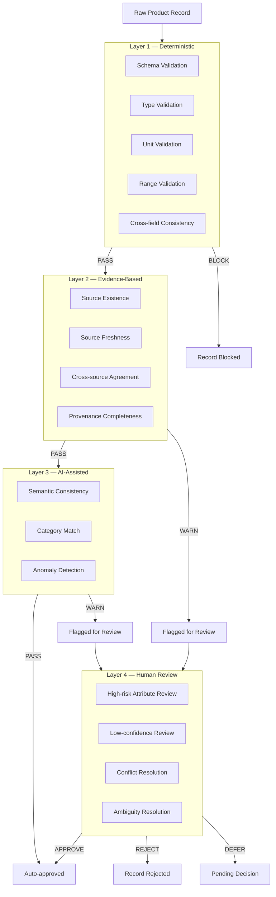
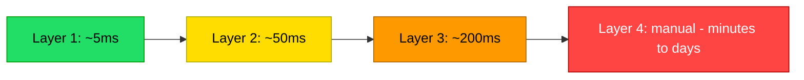
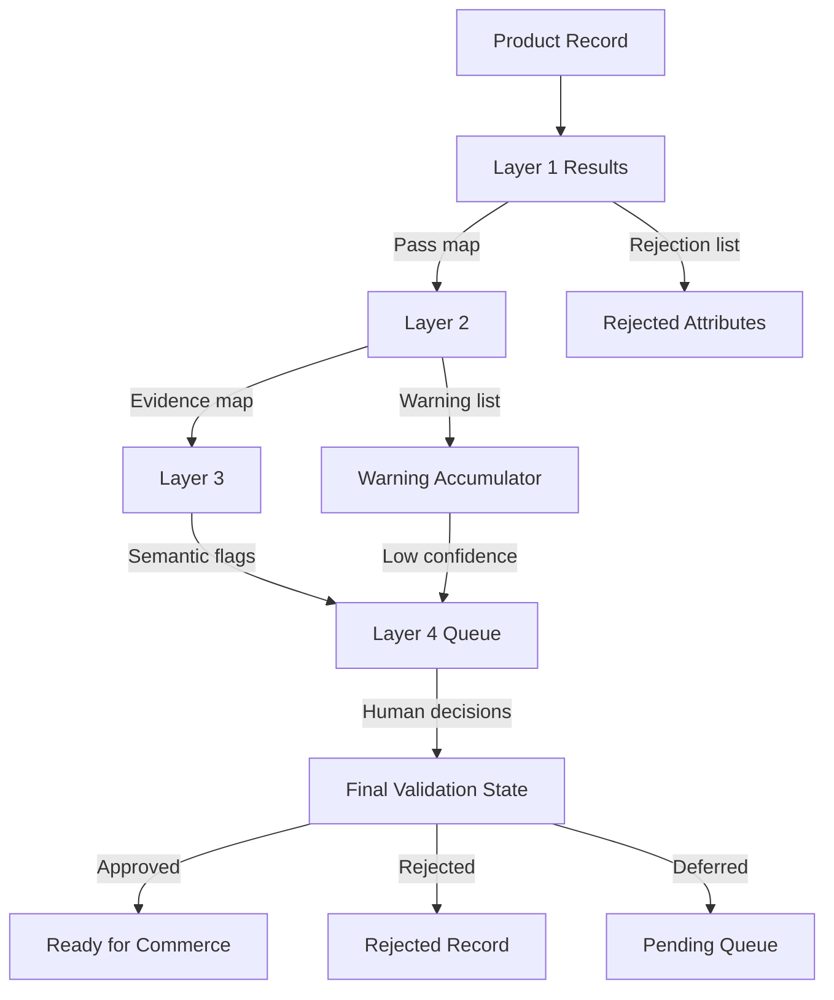
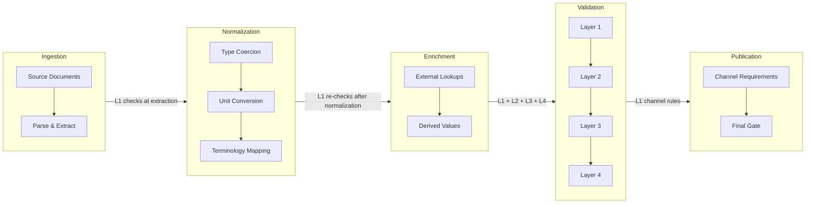

# Validation Architecture

> **Module:** 3 — Architecture  
> **Purpose:** Define the four-layer validation model that enforces correctness, traceability, and trustworthiness of product intelligence records before they reach commerce channels.  
> **Depends on:** `validation-and-lifecycle-model.md`, `provenance-and-evidence-model.md`, `canonical-product-model.md`, `attribute-taxonomy.md`

---

## 1. Design Principles

1. **Fail fast, fail cheap.** Deterministic checks run first — reject structurally invalid data before invoking expensive AI or human review.
2. **Every layer has a job.** No layer duplicates another. Each adds a distinct quality guarantee.
3. **Blocking vs. non-blocking is explicit.** The system never silently passes a known violation.
4. **Validation is per-attribute, aggregated to product.** A product-level verdict is derived from attribute-level results.
5. **Evidence is required.** A value without provenance is an unsupported claim, not product data.

---

## 2. Four-Layer Validation Model



### Layer Execution Order

Layers execute sequentially. A blocking failure in any layer halts further processing. Warning-level results do not halt processing but accumulate for downstream consumption.



---

## 3. Layer 1 — Deterministic Validation

**What it is:** Rule-based checks with no ambiguity. Every rule either passes or fails. No inference, no judgment.

**Why it matters:** These checks catch structural and data-type errors that would poison all downstream processing. They are fast, cheap, and absolute.

**Execution:** Fully automated. No human involvement.

### 3.1 Rules

| Rule ID | Check | Condition | Severity | Example |
|---------|-------|-----------|----------|---------|
| D-01 | Required fields present | `id`, `mpn`, `brand`, `primary_category`, `manufacturer_name` are non-empty | **BLOCK** | Missing `brand` |
| D-02 | String type correct | String fields contain string values, not numbers or objects | **BLOCK** | `mpn: 12345` instead of `"12345"` |
| D-03 | Number type correct | Numeric fields contain numeric values | **BLOCK** | `weight: "5.2 kg"` instead of `{value: 5.2, unit: "kg"}` |
| D-04 | Enum value valid | Enum fields match defined allowed values | **BLOCK** | `lifecycle_status: "retired"` (not in enum) |
| D-05 | Unit in allowed set | Measurement unit is in the controlled vocabulary for that attribute type | **BLOCK** | `weight.unit: "stones"` (not in allowed mass units) |
| D-06 | Unit matches type | Percentage fields use `%`, temperature fields use `°C` or `°F`, etc. | **BLOCK** | `efficiency: {value: 85, unit: "kW"}` |
| D-07 | Numeric range valid | Values fall within physically possible bounds for the attribute type | **BLOCK** | `weight: {value: -5, unit: "kg"}` |
| D-08 | Dimension positive | All dimension components (`length`, `width`, `height`) are > 0 | **BLOCK** | `length: 0` |
| D-09 | Range min <= max | Range attributes have `min <= max` | **BLOCK** | `operating_temperature: {min: 80, max: -20}` |
| D-10 | Confidence in bounds | Confidence values are in [0.0, 1.0] | **BLOCK** | `confidence: 1.5` |
| D-11 | UUID format valid | IDs are valid UUID v4 format | **BLOCK** | `id: "not-a-uuid"` |
| D-12 | Cross-field: bore <-> housing | If `housing_type = pillow_block`, `bore_diameter` must be present | **BLOCK** | Pillow block with no bore |
| D-13 | Cross-field: voltage <-> motor | If `product_category` includes "Motor", `voltage` must be present | **BLOCK** | Motor with no voltage |
| D-14 | Cross-field: min/max domain | Range attributes have units matching the attribute domain | **BLOCK** | Temperature range with pressure units |
| D-15 | Category schema satisfied | All required attributes for the product's category are present | **BLOCK** | Bearing missing `bore_diameter` |

### 3.2 Deterministic Validation Result Schema

```json
{
  "layer": "deterministic",
  "rule_id": "D-07",
  "passed": false,
  "severity": "blocking",
  "attribute_id": "a3f1b2c4-...",
  "attribute_name": "weight",
  "message": "Negative weight value: -5.0 kg",
  "actual_value": { "value": -5.0, "unit": "kg" },
  "expected_range": { "min": 0.001, "max": 100000, "unit": "kg" }
}
```

### 3.3 Deterministic Failure Disposition

| Severity | Behavior |
|----------|----------|
| **BLOCK** | Processing halts for this attribute. Product record set to `validation_status: rejected`. No further layers execute for this attribute. |

All Layer 1 rules are blocking. There are no warning-level outcomes at this layer.

---

## 4. Layer 2 — Evidence-Based Validation

**What it is:** Checks that verify the provenance chain — whether sources exist, are current, agree with each other, and provide adequate evidence.

**Why it matters:** A structurally valid value with no verifiable source is an unsupported claim. Evidence-based validation ensures every value has a traceable origin.

**Execution:** Automated. Results are warnings, not blocks — they degrade the confidence score but do not halt processing.

### 4.1 Rules

| Rule ID | Check | Condition | Severity | Example |
|---------|-------|-----------|----------|---------|
| E-01 | Source accessible | Referenced source document exists and is readable | **WARNING** | Source PDF deleted from server |
| E-02 | Source trust known | Source has a non-`unknown` trust level | **WARNING** | New unclassified source |
| E-03 | Source freshness | Source date is within the freshness threshold for the attribute type | **WARNING** | 2018 datasheet for pricing attribute |
| E-04 | Cross-source agreement | When >= 2 sources provide the same attribute, values agree within tolerance | **WARNING** | Source A: 12 kg, Source B: 12.1 kg |
| E-05 | Cross-source contradiction | Sources explicitly contradict each other | **WARNING** | Source A: "CE marked", Source B: "No CE" |
| E-06 | Provenance completeness | Evidence chain has source -> location -> extraction_method -> confidence | **WARNING** | Value with no extraction method |
| E-07 | Extraction confidence minimum | Extraction confidence is >= 0.3 (below this, the extraction is unreliable) | **WARNING** | Confidence: 0.15 |
| E-08 | Transformation traceable | If value is normalized, transformation record exists | **WARNING** | Unit converted but no transformation log |
| E-09 | Source-to-attribute fit | Source type is appropriate for the attribute (e.g., datasheet for specs, not for pricing) | **WARNING** | Pricing extracted from a technical drawing |
| E-10 | Staleness vs priority | When stale and current sources conflict, flag the staleness | **WARNING** | 2020 and 2025 sources give different weight |

### 4.2 Freshness Thresholds by Attribute Domain

| Domain | Max Age | Reason |
|--------|---------|--------|
| Physical dimensions | 5 years | Dimensions rarely change |
| Electrical specifications | 3 years | Standards evolve |
| Pricing | 6 months | Market-driven |
| Certifications | 2 years | Certifications expire |
| Material composition | 5 years | Stable |
| Availability / stock | 24 hours | Highly dynamic |

### 4.3 Evidence-Based Validation Result Schema

```json
{
  "layer": "evidence_based",
  "rule_id": "E-03",
  "passed": true,
  "severity": "warning",
  "attribute_id": "a3f1b2c4-...",
  "attribute_name": "price",
  "message": "Source freshness warning: source dated 2023-01-15, exceeds 6-month threshold for pricing attributes",
  "source_id": "s7d8e9f0-...",
  "source_date": "2023-01-15",
  "freshness_threshold_days": 182,
  "days_since_source": 1220,
  "confidence_impact": -0.15
}
```

### 4.4 Evidence-Based Failure Disposition

| Severity | Behavior |
|----------|----------|
| **WARNING** | Processing continues. Warning recorded. Confidence score penalized by the rule's `confidence_impact`. Accumulated warnings may trigger human review if total penalty pushes confidence below 0.7. |

---

## 5. Layer 3 — AI-Assisted Validation

**What it is:** Semantic and statistical checks that require reasoning beyond rule evaluation. Uses language models or statistical models to detect anomalies, inconsistencies, and mismatches that deterministic rules cannot catch.

**Why it matters:** Industrial product data often contains subtle semantic issues — a value that is technically valid but contextually wrong. A 220V motor listed in a catalog of 12V motors is technically valid but semantically suspicious.

**Execution:** Automated. Results are warnings. Requires model access (local or API).

### 5.1 Rules

| Rule ID | Check | Method | Severity | Example |
|---------|-------|--------|----------|---------|
| A-01 | Semantic consistency | LLM evaluates whether attribute values make sense together | **WARNING** | "Stainless steel" material + "magnetic" property (mostly non-magnetic) |
| A-02 | Category-attribute fit | Embedding similarity between attribute values and category context | **WARNING** | Bore diameter of 500 mm in a "Miniature Bearing" category |
| A-03 | Value anomaly | Statistical outlier detection against category-normal distributions | **WARNING** | A bearing rated for 1,000,000 N load when typical is 1,000-50,000 N |
| A-04 | Description-value alignment | LLM compares description text against extracted attribute values | **WARNING** | Description says "heavy duty" but weight is below category median |
| A-05 | Duplicate detection | Embedding similarity between product records | **WARNING** | Two records with 98% similarity suggesting duplicate |
| A-06 | Plausibility check | LLM evaluates whether a value is physically plausible in context | **WARNING** | Operating temperature of -200 C for a standard bearing |
| A-07 | Unit-context fit | LLM checks if the unit is plausible for the attribute in the given product context | **WARNING** | Power rating in "liters" instead of "kW" |

### 5.2 AI-Assisted Validation Result Schema

```json
{
  "layer": "ai_assisted",
  "rule_id": "A-01",
  "passed": true,
  "severity": "warning",
  "attribute_id": "b2c3d4e5-...",
  "attribute_name": "material",
  "message": "Semantic inconsistency: material '316 Stainless Steel' listed with magnetic_permeability 'high' - 316SS is typically non-magnetic",
  "model": "gpt-4o-mini",
  "model_version": "2024-07-18",
  "confidence": 0.82,
  "reasoning": "316 stainless steel is austenitic and generally non-magnetic. High magnetic permeability is more consistent with 400-series stainless or carbon steel.",
  "suggested_action": "Review material vs. magnetic property pair"
}
```

### 5.3 AI-Assisted Failure Disposition

| Severity | Behavior |
|----------|----------|
| **WARNING** | Processing continues. Warning recorded. If AI confidence is < 0.6, the warning is escalated to human review. |

### 5.4 AI Validation Guardrails

| Guardrail | Rule |
|-----------|------|
| Never block automatically | AI layer never produces `blocking` severity |
| Always show reasoning | Every AI result must include a `reasoning` field |
| Track model version | Every result logs the model ID and version used |
| Confidence threshold | AI warnings with confidence < 0.6 are escalated to Layer 4 |
| Cost control | AI validation runs on a per-attribute basis; skip for attributes already at high confidence from prior layers |

---

## 6. Layer 4 — Human Review

**What it is:** Manual review by a qualified human reviewer. The system presents evidence, context, and AI analysis to support informed human decisions.

**Why it matters:** Some decisions require human judgment — safety claims, certification verification, conflict resolution where automated methods are insufficient. Human review is the final trust boundary.

**Execution:** Manual. The system queues, presents, and records. Reviewers are routed based on domain expertise.

### 6.1 Routing Rules

| Condition | Routing | Priority |
|-----------|---------|----------|
| High-risk attribute (safety, certification) | Domain specialist | P0 — immediate |
| Confidence < 0.7 after Layers 1-3 | General reviewer | P1 — within 24h |
| Conflict detected (value_mismatch, source_contradiction) | Data quality analyst | P1 — within 24h |
| AI-assisted warning with confidence < 0.6 | Domain reviewer | P2 — within 48h |
| Stale source with no current alternative | Data steward | P2 — within 48h |
| Derived or inferred value | Technical reviewer | P2 — within 48h |

### 6.2 High-Risk Attribute List

These attribute domains always require human review regardless of confidence:

| Domain | Reason |
|--------|--------|
| Safety certifications (CE, UL, CSA) | Legal liability |
| Electrical ratings (voltage, current) | Fire / shock hazard |
| Load / pressure ratings | Structural failure risk |
| Chemical composition | Regulatory compliance |
| Operating environment limits | Warranty and safety |
| Material declarations (RoHS, REACH) | Regulatory compliance |

### 6.3 Review Interface Data

When presenting an attribute for review, the system provides:

1. The attribute name, domain, and current value
2. All candidate values with their sources
3. Source locations (page, section, text span)
4. Extraction confidence for each candidate
5. Source trust scores for each source
6. Freshness status for each source
7. Validation results from Layers 1-3 (what passed, what warned)
8. Related attributes for context
9. AI reasoning (if Layer 3 flagged the attribute)
10. Conflict details (if sources disagree)

### 6.4 Review Actions

| Action | Description | Effect on Attribute |
|--------|-------------|---------------------|
| `approve` | Approve the selected value | State: `reviewed` -> `approved` |
| `reject` | Reject the value as incorrect | State: `reviewed` -> `rejected` |
| `correct` | Provide a corrected value | New candidate added, marked as human-corrected, state: `reviewed` -> `approved` |
| `defer` | Defer decision pending more information | State remains `reviewed` |
| `merge` | Combine values from multiple sources | New candidate created from merged values |

### 6.5 Human Review Result Schema

```json
{
  "layer": "human",
  "attribute_id": "b2c3d4e5-...",
  "attribute_name": "material",
  "reviewer_id": "reviewer-042",
  "action": "correct",
  "previous_state": "reviewed",
  "new_state": "approved",
  "original_value": "316 Stainless Steel",
  "corrected_value": "410 Stainless Steel",
  "notes": "Cross-referenced with manufacturer catalog. 410 SS is magnetic. 316 SS was a misextraction.",
  "evidence_consulted": ["manufacturer-catalog-2025.pdf", "cross-reference-source.csv"],
  "timestamp": "2026-08-18T14:32:00Z",
  "duration_seconds": 180
}
```

---

## 7. Validation Results Schema

### 7.1 Unified Validation Result

Every layer produces results conforming to this structure. Layer-specific fields are optional.

```json
{
  "result_id": "vr-uuid",
  "attribute_id": "attr-uuid",
  "product_id": "prod-uuid",
  "layer": "deterministic | evidence_based | ai_assisted | human",
  "rule_id": "D-07",
  "passed": false,
  "severity": "blocking | warning",
  "message": "Human-readable description of the check result",
  "details": {},
  "confidence_impact": 0.0,
  "timestamp": "2026-08-18T10:00:00Z",
  "duration_ms": 5
}
```

### 7.2 Validation Summary (per product)

Aggregated after all layers complete for a product.

```json
{
  "product_id": "prod-uuid",
  "validation_status": "auto_validated",
  "total_attributes": 24,
  "validated_attributes": 22,
  "rejected_attributes": 0,
  "pending_attributes": 2,
  "layers": {
    "deterministic": {
      "total_checks": 180,
      "passed": 178,
      "blocking_failures": 0,
      "duration_ms": 12
    },
    "evidence_based": {
      "total_checks": 96,
      "passed": 88,
      "warnings": 8,
      "duration_ms": 145
    },
    "ai_assisted": {
      "total_checks": 24,
      "passed": 21,
      "warnings": 3,
      "escalated_to_human": 1,
      "duration_ms": 890
    },
    "human": {
      "attributes_reviewed": 2,
      "approved": 1,
      "rejected": 0,
      "deferred": 1,
      "duration_ms": null
    }
  },
  "warnings_by_rule": {
    "E-03": 5,
    "E-05": 2,
    "A-01": 1
  },
  "computed_at": "2026-08-18T10:00:02Z"
}
```

---

## 8. How Layers Cooperate

### 8.1 Information Flow Between Layers



### 8.2 Layer Cooperation Rules

| Rule | Description |
|------|-------------|
| **Fail-fast** | If Layer 1 produces any blocking result, Layers 2-4 are skipped for that attribute. |
| **Warning accumulation** | Warnings from Layers 2 and 3 accumulate. Each warning has a `confidence_impact` value that reduces the attribute's effective confidence. |
| **Threshold escalation** | When accumulated confidence penalty pushes an attribute's effective confidence below 0.7, it is automatically routed to Layer 4. |
| **Source priority** | Layer 2 results inform Layer 3 — attributes from high-trust sources receive less AI scrutiny (cost optimization). |
| **AI context for humans** | Layer 3 results are always presented to Layer 4 reviewers as context, even if Layer 3 did not flag the attribute. |
| **Conflict propagation** | When Layer 2 detects a cross-source contradiction (E-05), the conflict record is created immediately and attached to the attribute. Layer 4 resolves it. |

### 8.3 Confidence Propagation

An attribute's effective confidence is computed as:

```
effective_confidence = base_confidence + sum(confidence_impact_i for all warnings_i)
```

Where:
- `base_confidence` = extraction confidence from the source
- `confidence_impact_i` = negative value from each warning (e.g., -0.10 for freshness, -0.15 for contradiction)
- Floor: 0.0 (confidence cannot go below zero)
- If `effective_confidence < 0.7` after all layers, human review is mandatory

---

## 9. Blocking vs Warning Validation Outcomes

### 9.1 Outcome Matrix

| Layer | Blocking Outcomes | Warning Outcomes |
|-------|-------------------|------------------|
| **Layer 1 — Deterministic** | All rules (D-01 through D-15) | None |
| **Layer 2 — Evidence-Based** | None | All rules (E-01 through E-10) |
| **Layer 3 — AI-Assisted** | None | All rules (A-01 through A-07) |
| **Layer 4 — Human** | Rejection (human decision) | Deferral (human decision) |

### 9.2 Blocking Behavior

When a blocking outcome occurs:

1. The attribute's `validation_status` is set to `rejected`
2. The attribute's `lifecycle_state` is set to `rejected`
3. No further validation layers execute for this attribute
4. The product-level `validation_status` is set to `rejected` (if any attribute is rejected)
5. The record is not eligible for publication
6. An audit trail entry is created with the rejection reason

### 9.3 Warning Behavior

When a warning outcome occurs:

1. The attribute continues through all remaining layers
2. The warning is recorded in the validation results
3. The attribute's effective confidence is reduced by the warning's `confidence_impact`
4. If effective confidence drops below 0.7, the attribute is routed to Layer 4
5. Warnings are visible in the validation summary and available for reporting

### 9.4 Auto-Approval Criteria

An attribute is auto-approved (skips Layer 4) when ALL of these are true:

| Criterion | Threshold |
|-----------|-----------|
| Layer 1 | All deterministic checks passed |
| Layer 2 | No evidence-based warnings |
| Layer 3 | No AI-assisted warnings, or all warnings with confidence >= 0.6 |
| Effective confidence | >= 0.7 |
| Source trust level | >= `authorized_distributor` |
| No conflict | `conflict_status = none` |

---

## 10. Validation Per Pipeline Stage

### 10.1 Pipeline Stages and Validation



### 10.2 Validation at Each Stage

| Pipeline Stage | Layers Applied | What Is Checked | Rationale |
|----------------|----------------|-----------------|-----------|
| **Ingestion / Extraction** | Layer 1 | Schema (D-01), type (D-02, D-03), UUID (D-11) | Reject malformed input immediately |
| **Normalization** | Layer 1 | Unit (D-05, D-06), range (D-07, D-08, D-09), cross-field (D-12-D-15) | Normalization can introduce type/unit errors |
| **Enrichment** | Layer 1 + Layer 2 | Re-run L1 after enrichment. Add provenance completeness (E-06), source trust (E-02) | Enriched values need evidence verification |
| **Validation (main)** | Layer 1 + 2 + 3 + 4 | Full validation stack | Complete quality assessment |
| **Publication Gate** | Layer 1 (channel rules) | Channel-specific required attributes, format compliance | Each channel has different requirements |

### 10.3 Re-Validation Triggers

Validation is re-executed when:

| Trigger | Scope | Layers Re-run |
|---------|-------|---------------|
| New source document ingested | Affected attributes only | L1 + L2 + L3 |
| Attribute corrected by human | Corrected attribute only | L1 + L2 |
| Source document updated | Attributes sourced from that document | L1 + L2 + L3 |
| Category reclassified | All category-dependent attributes | L1 (cross-field rules) |
| Channel added | All attributes | L1 (channel rules) |
| Periodic freshness check | All attributes with source dates | L2 (freshness rules) |

---

## 11. Validation Metrics

### 11.1 System-Level Metrics

| Metric | Definition | Target | Measurement |
|--------|------------|--------|-------------|
| **Validation throughput** | Attributes validated per second | >= 1000 attr/s (L1+L2), >= 50 attr/s (with L3) | Timed batch runs |
| **Blocking rate** | % of attributes rejected at Layer 1 | < 5% (after initial data quality improves) | Daily aggregation |
| **Warning rate** | % of attributes with >= 1 warning after Layer 2+3 | < 15% | Daily aggregation |
| **Escalation rate** | % of attributes escalated to human review | < 10% | Daily aggregation |
| **Human review turnaround** | Median time from queue to decision | P0: < 2h, P1: < 24h, P2: < 48h | Queue timestamps |
| **Auto-approval rate** | % of attributes auto-approved without human | >= 70% | Daily aggregation |
| **Layer 1 false positive rate** | % of Layer 1 rejections later overturned by human | < 1% | Monthly audit |
| **Layer 3 false positive rate** | % of AI warnings later dismissed by human | < 20% | Monthly audit |

### 11.2 Attribute-Level Quality Metrics

| Metric | Definition | Target |
|--------|------------|--------|
| **Validation pass rate** | % of attributes passing all applicable layers | >= 85% |
| **Evidence coverage** | % of attribute values with complete provenance | >= 95% |
| **Source freshness** | % of attribute values with sources within freshness threshold | >= 80% |
| **Cross-source agreement** | % of multi-source attributes where sources agree | >= 90% |
| **Conflict rate** | % of attributes with unresolved conflicts | < 5% |
| **Effective confidence** | Average effective confidence across all attributes | >= 0.80 |

### 11.3 Product-Level Quality Metrics

| Metric | Definition | Target |
|--------|------------|--------|
| **Product validation rate** | % of products reaching `validation_status: auto_validated` or `human_validated` | >= 80% |
| **Publication readiness** | % of products meeting channel requirements | >= 75% |
| **Time to validation** | Median time from ingestion to validated state | < 30 minutes (automated path) |
| **Time to publication** | Median time from ingestion to publication-ready | < 4 hours (including human review) |

### 11.4 Metric Collection

Every validation run produces a metric record:

```json
{
  "run_id": "run-uuid",
  "started_at": "2026-08-18T10:00:00Z",
  "completed_at": "2026-08-18T10:00:03Z",
  "products_processed": 500,
  "attributes_processed": 12000,
  "layer_1": {
    "checks_run": 9600,
    "passed": 9312,
    "blocking_failures": 288,
    "duration_ms": 890
  },
  "layer_2": {
    "checks_run": 5200,
    "passed": 4680,
    "warnings": 520,
    "duration_ms": 4200
  },
  "layer_3": {
    "checks_run": 4800,
    "passed": 4560,
    "warnings": 240,
    "escalated_to_human": 48,
    "duration_ms": 18500
  },
  "layer_4": {
    "queued_for_review": 48,
    "reviewed": 48,
    "approved": 36,
    "rejected": 8,
    "deferred": 4,
    "median_review_time_ms": 120000
  },
  "overall": {
    "auto_approved": 8400,
    "human_approved": 36,
    "rejected": 296,
    "pending": 4
  }
}
```

---

## 12. Conflict Integration

### 12.1 Conflict Types and Layer Mapping

| Conflict Type | Detected By | Resolution Path |
|---------------|-------------|-----------------|
| `value_mismatch` | Layer 2 (E-04, E-05) | Layer 4 (human) or automated (source_priority, newest_wins) |
| `unit_mismatch` | Layer 1 (D-05, D-06) + Layer 2 (E-04) | Layer 1 blocks if units are incompatible. If convertible, Layer 1 normalizes. |
| `source_contradiction` | Layer 2 (E-05) | Layer 4 (always human — explicit contradiction requires judgment) |
| `stale_vs_current` | Layer 2 (E-10) | Layer 4 (human selects which version is authoritative) |

### 12.2 Automated Conflict Resolution

Some conflicts can be resolved without human intervention:

| Scenario | Rule | Automation |
|----------|------|------------|
| Source trust differs by >= 2 levels | `source_priority` | Prefer higher trust source |
| Same attribute, one source has higher extraction confidence by >= 0.3 | `confidence_based` | Prefer higher confidence |
| Same attribute, one source is newer by >= 1 year | `newest_wins` | Prefer newer source |
| Numeric values within 5% tolerance | `tolerance_merge` | Merge to mean value |

All other conflicts require Layer 4 human review.

---

*This validation architecture ensures that every product attribute passes through a structured, layered quality gate before reaching commerce channels. It builds directly on the validation model defined in `validation-and-lifecycle-model.md` and extends it with implementation-specific layer definitions, cooperation rules, and measurable metrics.*
